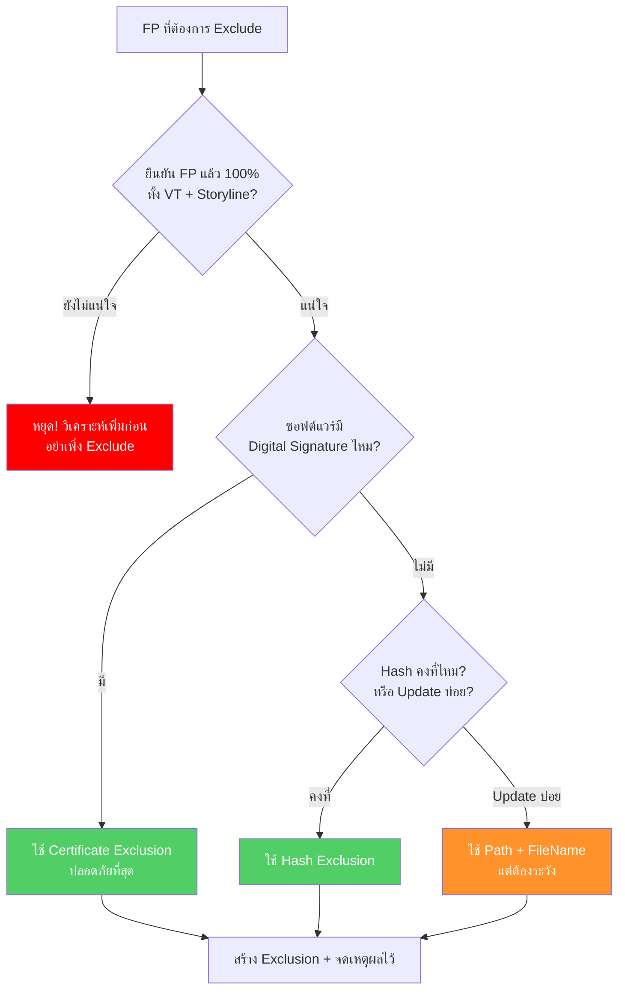

<h1 align="center">🔐 Exclusion Policy Guide</h1>
<h4 align="center">สร้าง Exclusion อย่างไร ไม่ให้เปิดช่องโหว่โดยไม่รู้ตัว</h4>

<p align="center">
  
  
</p>

---

## Exclusion คืออะไร? ทำไมต้องระวัง?

**Exclusion** คือการบอก SentinelOne ว่า *"อย่าตรวจจับสิ่งนี้"* — ใช้เมื่อ Alert เป็น False Positive ที่ยืนยันแล้ว

ฟังดูเรียบง่าย แต่ในทางปฏิบัติ **Exclusion ที่สร้างไม่ดี** เป็นหนึ่งในสาเหตุหลักที่ทำให้มัลแวร์หลุดรอดการตรวจจับ

> [!CAUTION]
> **เคสที่พบบ่อย**: Analyst เจอ FP จาก `C:\Program Files\SomeApp\` แล้ว Exclude ทั้งโฟลเดอร์
> → ผ่านไป 2 สัปดาห์ มัลแวร์วางไฟล์ไว้ใน Path เดียวกัน → SentinelOne มองไม่เห็น → โดนเต็มๆ

---

## ก่อนสร้าง Exclusion — ถามตัวเองก่อน



---

## 4 วิธีสร้าง Exclusion — เรียงจากปลอดภัยสุดไปเสี่ยงสุด

### 🟢 วิธีที่ 1: ใช้ Certificate / Signer — **แนะนำ**

ถ้าซอฟต์แวร์มี Digital Signature ให้ Exclude ด้วย Signer Identity

```
Signer Identity: "Microsoft Corporation"
```

ทำไมปลอดภัย? เพราะมัลแวร์ปลอม Signer ไม่ได้ (ต้องมี Certificate จริง) และครอบคลุมทุก Version โดยอัตโนมัติ ไม่ต้องมาอัปเดตทุกครั้งที่ซอฟต์แวร์ Update

---

### 🟢 วิธีที่ 2: ใช้ SHA256 Hash — **ปลอดภัย**

```
SHA256: a1b2c3d4e5f6...
```

แม่นยำ 100% เพราะ Hash เป็น Fingerprint เฉพาะไฟล์นั้น มัลแวร์ไม่สามารถมี Hash เดียวกันได้

**ข้อเสียเดียว**: พอซอฟต์แวร์ Update → Hash เปลี่ยน → ต้องมาอัปเดต Exclusion ใหม่ ซึ่งบาง App อาจ Update บ่อย

---

### 🟡 วิธีที่ 3: ใช้ Path + File Name — **ต้องระวัง**

```
C:\Program Files\CompanyApp\app.exe
```

ข้อดีคือไม่ต้องอัปเดตตาม Version แต่มีความเสี่ยง — ถ้ามัลแวร์วางไฟล์ชื่อเดียวกันไว้ใน Path เดียวกัน SentinelOne จะมองข้ามไป **ใช้วิธีนี้เฉพาะกรณีที่วิธี 1 และ 2 ทำไม่ได้เท่านั้น**

---

### 🔴 วิธีที่ 4: ใช้ Path อย่างเดียว — **อันตราย ห้ามทำ!**

> [!CAUTION]
> **ห้ามทำเด็ดขาด:**
> ```
> C:\Program Files\CompanyApp\*
> C:\Users\*
> C:\Temp\*
> ```
> เท่ากับบอก SentinelOne ว่า *"อะไรก็ตามที่อยู่ในโฟลเดอร์นี้ ไม่ต้องตรวจ"*
> → มัลแวร์แค่วางไฟล์ไว้ในนั้นก็จบ

---

## วิธีสร้างใน SentinelOne Console

1. เข้า **Sentinels** → **Exclusions** → **New Exclusion**
2. เลือกประเภท (แนะนำ Signer > Hash > Path+File)
3. **ตั้ง Scope** → เลือกเฉพาะ Group ที่จำเป็น อย่าเลือก Global ถ้าไม่จำเป็น
4. ใส่ **Description** → เขียนว่าทำไมถึง Exclude พร้อมอ้างอิง Ticket เช่น `FP - Adobe Reader update agent, Ticket #INC-0042`

---

## สิ่งที่ต้องทำก่อนกด Create ทุกครั้ง

1. ยืนยัน **False Positive 100%** — ดู VT + Storyline แล้วหรือยัง?
2. ใช้ **Signer หรือ Hash ก่อน** — Path เป็นทางเลือกสุดท้าย
3. Scope **เฉพาะ Group** ที่จำเป็น — ไม่ใช่ทุกเครื่อง
4. ใส่ **Description** อ้างอิง Ticket #
5. ได้ **อนุมัติจาก SOC Manager** หรือ Senior แล้วหรือยัง?
6. **บันทึก** ลง Incident Ticket ด้วย

> [!WARNING]
> **กฎเหล็ก**: ถ้าไม่แน่ใจ 100% ว่าเป็น FP → **อย่า Exclude** → ให้ปรึกษา Senior ก่อนเสมอ

---

## อย่าลืม Review — Exclusion ไม่ใช่สร้างแล้วลืม

ทุก 3 เดือนควร Review Exclusion ทั้งหมด:

- ซอฟต์แวร์ตัวนี้ **ยังใช้อยู่ไหม?** ถ้าไม่ใช้แล้ว → ลบ Exclusion ออก
- Hash **ยังตรงอยู่ไหม?** ถ้า Update → อัปเดต Hash
- **ยังจำเป็นอยู่ไหม?** บาง Exclusion อาจไม่จำเป็นแล้วเพราะ SentinelOne อัปเดต Engine

---

## ตัวอย่างจาก Playbook ของเรา

**PB-02 (spoolsv.exe)** — ถ้ายืนยันว่า FP จริงๆ ต้อง Exclude ด้วย **Hash + Path ทั้งคู่** อย่าใช้ Path อย่างเดียว เพราะมัลแวร์ชอบปลอมชื่อเป็น `spoolsv.exe`

**PB-05 (Rufus)** — Exclude ด้วย **Hash จาก rufus.ie เท่านั้น** ถ้า Hash ไม่ตรงกับ Official อย่า Exclude เด็ดขาด

**PB-10 (bwswfcfg)** — ก่อน Exclude ต้องยืนยันว่ามี **Signer ที่รู้จัก** และ VT ไม่พบอะไรผิดปกติ

---

<p align="center">
  <b>SOC Team — TW Site</b><br/>
  <i>อัปเดตล่าสุด: มีนาคม 2026</i>
</p>
