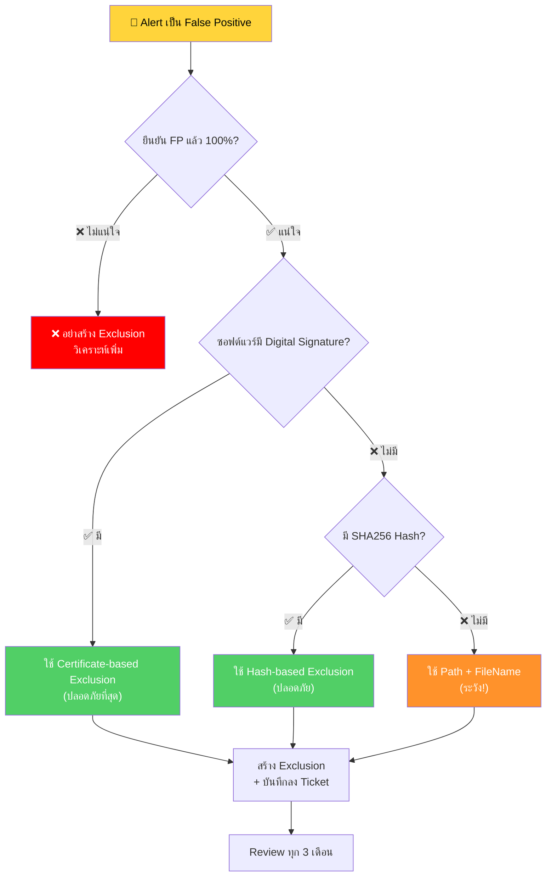

<h1 align="center">🔐 Exclusion Policy Guide</h1>
<h4 align="center">วิธีสร้าง Exclusion ใน SentinelOne อย่างปลอดภัย — ไม่เปิดช่องโหว่</h4>

<p align="center">
  
  
</p>

---

## 🎯 Exclusion คืออะไร?

**Exclusion** = การบอก SentinelOne ว่า **"อย่าตรวจจับสิ่งนี้"**

ใช้เมื่อ: SentinelOne ตรวจจับซอฟต์แวร์ที่ **ถูกต้อง** แต่แจ้งเตือนว่า Malicious (False Positive)

> [!CAUTION]
> **Exclusion ที่สร้างไม่ดี = เปิดประตูให้มัลแวร์!**
> 
> ถ้า Exclude กว้างเกินไป มัลแวร์จะซ่อนตัวใน Path ที่ถูก Exclude แล้ว SentinelOne จะ **มองไม่เห็น**

---

## 📊 Flowchart — ควรสร้าง Exclusion ไหม?



---

## 📋 ประเภท Exclusion (เรียงจากปลอดภัยที่สุด)

### 🟢 1. Certificate / Signer (ปลอดภัยที่สุด)

```
Exclusion Type: Certificate
Signer Identity: "Microsoft Corporation"
```

| ✅ ข้อดี | ❌ ข้อเสีย |
|:--------|:---------|
| ครอบคลุมทุก Version ของซอฟต์แวร์ | ต้องมี Digital Signature |
| มัลแวร์ปลอม Signer ไม่ได้ | — |

---

### 🟢 2. SHA256 Hash (ปลอดภัย)

```
Exclusion Type: Hash
SHA256: a1b2c3d4e5f6...
```

| ✅ ข้อดี | ❌ ข้อเสีย |
|:--------|:---------|
| แม่นยำ 100% — เฉพาะไฟล์นี้เท่านั้น | ต้องอัปเดตเมื่อซอฟต์แวร์ Update (Hash เปลี่ยน) |
| มัลแวร์ไม่สามารถใช้ Hash เดียวกัน | — |

---

### 🟡 3. Path + File Name (ระวัง!)

```
Exclusion Type: Path
Path: C:\Program Files\CompanyApp\app.exe
```

| ✅ ข้อดี | ❌ ข้อเสีย |
|:--------|:---------|
| ไม่ต้องอัปเดตเมื่อ Update | ⚠️ มัลแวร์อาจวางไฟล์ใน Path เดียวกัน |

---

### 🔴 4. Path Only — ไม่มี File Name (อันตราย!)

```
❌ อย่าทำ:   C:\Program Files\CompanyApp\*
❌ อย่าทำ:   C:\Users\*
❌ อย่าทำ:   C:\Temp\*
```

> [!CAUTION]
> **ห้าม Exclude ทั้งโฟลเดอร์!** มัลแวร์จะวางไฟล์ในโฟลเดอร์นั้นแล้ว SentinelOne จะมองไม่เห็น

---

## ✅ วิธีสร้าง Exclusion ที่ถูกต้อง

### ขั้นตอนใน SentinelOne Console

1. ไปที่ **Sentinels** → **Exclusions**
2. กด **"New Exclusion"**
3. เลือกประเภท:

| ลำดับแนะนำ | ประเภท | เมื่อไหร่ใช้ |
|:---------:|:------|:---------|
| 1️⃣ | **Signer Identity** | ซอฟต์แวร์มี Signature |
| 2️⃣ | **Hash** | ไม่มี Signature แต่มี Hash |
| 3️⃣ | **Path + File Name** | ไม่มีทั้ง Signature และ Hash คงที่ |

4. ตั้ง **Scope** → เฉพาะ Group ที่จำเป็น (อย่าตั้ง Global!)
5. ใส่ **Description** → อ้างอิง Incident Ticket #

---

## ❌ สิ่งที่ห้ามทำ

| ❌ ห้ามทำ | ⚠️ เหตุผล |
|:---------|:---------|
| Exclude ด้วย **ชื่อไฟล์อย่างเดียว** (เช่น `app.exe`) | มัลแวร์ตั้งชื่อเดียวกันได้ |
| Exclude **ทั้งโฟลเดอร์** (เช่น `C:\Users\*`) | เปิดประตูให้มัลแวร์ |
| Exclude แบบ **Global** (ทุกเครื่อง) | ควรจำกัดเฉพาะ Group |
| Exclude **ไม่บันทึกเหตุผล** | จำไม่ได้ว่าทำไมถึง Exclude |
| Exclude แล้ว **ไม่ Review** | Exclusion เก่าอาจไม่จำเป็นแล้ว |

---

## ✅ Checklist ก่อนสร้าง Exclusion

| # | ตรวจสอบ |
|:-:|:-------|
| 1 | ✅ ยืนยัน **False Positive 100%** จาก VT + Storyline |
| 2 | ✅ ใช้ **Signer หรือ Hash** ก่อน (ไม่ใช่ Path) |
| 3 | ✅ ตั้ง Scope เฉพาะ **Group ที่จำเป็น** |
| 4 | ✅ ใส่ **Description** อ้างอิง Ticket # |
| 5 | ✅ **ได้รับอนุมัติ** จาก SOC Manager / Senior |
| 6 | ✅ **บันทึก** ลง Incident Ticket |

---

## 🔄 การ Review Exclusion

| ความถี่ | สิ่งที่ทำ |
|:-------|:--------|
| **ทุก 3 เดือน** | Review Exclusion ทั้งหมด |
| ตรวจสอบ | ซอฟต์แวร์ยังใช้อยู่ไหม? ยังจำเป็นไหม? |
| ลบ | Exclusion ที่ไม่ใช้แล้ว → **ลบออก** |
| Update | Hash เปลี่ยนเพราะ Update → อัปเดต Hash |

---

## 📌 ตัวอย่างจาก Playbook

| Playbook | ⚠️ ควรระวัง |
|:---------|:---------|
| **PB-02** spoolsv.exe FP | Exclude ด้วย **Hash + Path** ทั้งคู่ ห้ามใช้ Path อย่างเดียว |
| **PB-05** Rufus FP | Exclude ด้วย **Hash จาก rufus.ie** เท่านั้น |
| **PB-10** bwswfcfg FP | ต้องมี Signer ที่รู้จัก + Hash ก่อน Exclude |

---

<p align="center">
  <b>🛡️ SOC Team — TW Site</b><br/>
  <i>อัปเดตล่าสุด: มีนาคม 2026</i>
</p>
