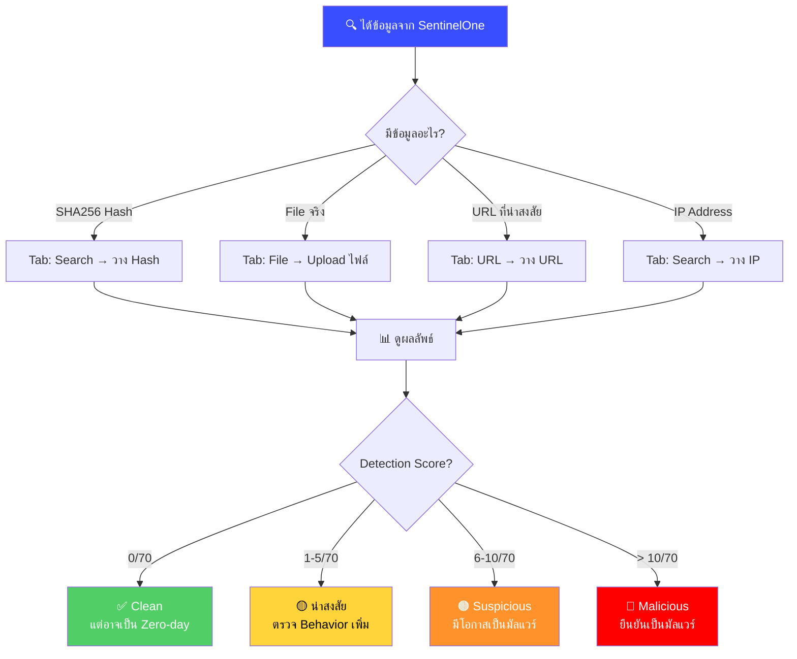

<h1 align="center">📚 VirusTotal Guide สำหรับ SOC Analyst</h1>
<h4 align="center">วิธีใช้ VirusTotal อ่านผลวิเคราะห์ไฟล์ / URL / IP อย่างมืออาชีพ</h4>

<p align="center">
  
  
  
</p>

---

## 🎯 VirusTotal คืออะไร?

**[VirusTotal](https://www.virustotal.com)** คือเว็บไซต์ที่รวม **Antivirus Engine 70+ ตัว** ไว้ในที่เดียว ใช้ตรวจสอบว่าไฟล์ / URL / IP เป็นอันตรายหรือไม่

> [!NOTE]
> VirusTotal ใช้ **ฟรี** ไม่ต้องสมัครสมาชิก (แต่สมัครแล้วจะเห็นข้อมูลเพิ่มเติม)
>
> 🔗 เข้าใช้งาน: **https://www.virustotal.com**

---

## 📊 Flowchart วิธีใช้ VirusTotal



---

## 📋 วิธีใช้ VirusTotal ทีละขั้นตอน

### 🔹 Step 1 — เปิด VirusTotal

1. ไปที่ **https://www.virustotal.com**
2. เลือก Tab ที่ต้องการ:

| Tab | ใช้เมื่อ | วิธีใช้ |
|:---:|:--------|:-------|
| **FILE** | มีไฟล์จริงอยู่ในเครื่อง | ลากไฟล์มาวาง หรือกด Choose File |
| **URL** | มี URL ที่น่าสงสัย | วาง URL แล้วกด Search |
| **SEARCH** | มี **Hash / IP / Domain** | วาง Hash หรือ IP แล้วกด Search |

> [!IMPORTANT]
> ใน SOC เราจะใช้ **SEARCH** บ่อยที่สุด เพราะ Copy Hash จาก SentinelOne มาวาง

---

### 🔹 Step 2 — วาง SHA256 Hash แล้วค้นหา

1. ใน SentinelOne → **Threat Details** → Copy **SHA256 Hash**
2. ไปที่ VirusTotal → Tab **SEARCH** → วาง Hash → กด Enter

---

### 🔹 Step 3 — อ่าน Detection Tab ⭐

นี่คือ Tab แรกที่เห็น — **สำคัญที่สุด!**

#### 📊 Detection Score (ตัวเลขด้านบน)

| Detection Score | 🚦 ความหมาย | ✅ ตัดสินใจ |
|:---------------|:----------|:---------|
| **0 / 70** | ไม่มี Engine ใดตรวจจับ | อาจ Clean หรือ Zero-day |
| **1-5 / 70** | ตรวจจับน้อย (Generic) | 🟡 น่าสงสัย — ตรวจเพิ่มใน Behavior Tab |
| **6-10 / 70** | ตรวจจับปานกลาง | 🟠 Suspicious — มีโอกาสเป็นมัลแวร์ |
| **> 10 / 70** | ตรวจจับหลาย Engine | 🔴 **Malicious** — ยืนยันเป็นมัลแวร์ |

#### 🏷️ Detection Labels (ชื่อที่ AV ตั้ง)

| Label ที่เห็น | ความหมาย | ตัวอย่าง |
|:-------------|:---------|:--------|
| **Trojan** | มัลแวร์ที่ซ่อนตัวในไฟล์ปกติ | Trojan.GenericKD.48xxxxx |
| **Backdoor** | เปิดช่องทาง Remote Access | Backdoor.CobaltStrike |
| **Ransomware** | เข้ารหัสไฟล์เรียกค่าไถ่ | Ransom.WannaCry |
| **Miner / CoinMiner** | ขุด Cryptocurrency | CoinMiner.XMRig |
| **PUP / PUA** | ซอฟต์แวร์ไม่พึงประสงค์ | PUP.Optional.InstallCore |
| **HackTool** | เครื่องมือ Hack (อาจ Legitimate) | HackTool.Mimikatz |
| **Generic** | ตรวจจับจากพฤติกรรม ไม่รู้ชื่อจริง | Malware.Generic |

> [!TIP]
> **ดู Family Name** เพื่อรู้ว่าเป็นมัลแวร์ตระกูลอะไร เช่น:
> - `Emotet` → Banking Trojan + Loader
> - `CobaltStrike` → APT Framework
> - `TrickBot` → Banking Trojan
> - `XMRig` → Cryptominer

---

### 🔹 Step 4 — อ่าน Details Tab

| ข้อมูล | 📝 ที่ต้องดู | ⚡ ช่วยเรื่อง |
|:------|:----------|:-----------|
| **File Name** | ชื่อไฟล์ที่ถูก Upload | ดูว่าใช้ชื่อปลอมหรือเปล่า |
| **File Type** | ประเภทไฟล์จริง (PE, DLL, Script) | ไฟล์ `.doc` ที่จริงเป็น `.exe`? |
| **File Size** | ขนาดไฟล์ | ขนาดผิดปกติ? |
| **First Seen** | วันที่ถูก Upload ครั้งแรก | ไฟล์ใหม่มาก = อาจเป็น Zero-day |
| **Last Submission** | วันที่ถูก Upload ครั้งล่าสุด | มีคนอื่นเจอเหมือนกัน? |
| **Signature** | Digital Signature | `Microsoft` = ถูกต้อง / ไม่มี = น่าสงสัย |

> [!WARNING]
> **First Seen = วันนี้ หรือเมื่อวาน?** → อาจเป็น **Zero-day** หรือ **Targeted Attack** — ต้องระวังเป็นพิเศษ!

---

### 🔹 Step 5 — อ่าน Relations Tab

Tab นี้แสดง **ความสัมพันธ์** ของไฟล์กับ IP / Domain / ไฟล์อื่น

| รายการ | ดูอะไร |
|:------|:------|
| **Contacted IPs** | IP ที่ไฟล์ติดต่อ → สงสัย **C2 Server** |
| **Contacted Domains** | Domain ที่ไฟล์ติดต่อ → สงสัย **C2** |
| **Dropped Files** | ไฟล์ที่ถูกสร้าง → สงสัย **Payload Download** |
| **Bundled Files** | ไฟล์ที่รวมอยู่ข้างใน |

> [!IMPORTANT]
> ถ้าเห็น **Contacted IP/Domain** ที่เป็นสีแดง (Malicious) → **ยืนยัน C2 Communication!**
> Copy IP/Domain นั้นมาใส่ใน SentinelOne Deep Visibility เพื่อค้นหาเครื่องอื่นที่ติดต่อ IP เดียวกัน

---

### 🔹 Step 6 — อ่าน Behavior Tab

> [!NOTE]
> Tab นี้แสดงผลจาก **Sandbox** (เปิดไฟล์ในห้องทดลอง) ดูว่าไฟล์ **ทำอะไรจริงๆ**

| พฤติกรรมที่เห็น | ⚠️ ความหมาย |
|:---------------|:-----------|
| Creates Process: `cmd.exe`, `powershell.exe` | 💀 รันคำสั่ง |
| Modifies Registry (Run Keys) | 💀 สร้าง Persistence |
| Contacts IP: `xxx.xxx.xxx.xxx` | 💀 C2 Communication |
| Drops File: `payload.exe` | 💀 ดาวน์โหลดมัลแวร์เพิ่ม |
| Reads File: `SAM`, `SECURITY` | 💀 ขโมย Credential |
| Modifies File: (จำนวนมาก) | 💀 อาจเป็น Ransomware |
| Accesses USB / Disk Directly | ⚠️ อาจเป็น Legitimate (เช่น Rufus) |

---

### 🔹 Step 7 — อ่าน Community Tab

ดูความเห็นจากนักวิเคราะห์คนอื่นทั่วโลก

| สิ่งที่ดู | ประโยชน์ |
|:---------|:--------|
| Comments จาก Researcher | อาจมีคนเขียนรายงานวิเคราะห์ไว้แล้ว |
| Vote (Harmless / Malicious) | ความเห็นของชุมชน |
| Tags | แท็กที่ช่วยจัดหมวดหมู่ |

---

## ⚡ Quick Decision Guide

```
ค้นหา Hash ใน VirusTotal
        ↓
┌─────────────────────────────┐
│  Detection Score > 10/70?   │
│  มี Family Name ชัดเจน?     │
│  Behavior มี C2/Drop/Cred?  │
├──────────┬──────────────────┤
│  ✅ ใช่   │  ❌ ไม่          │
├──────────┼──────────────────┤
│ 🔴 TP    │  ดู Details +    │
│ ดำเนินการ │  Relations เพิ่ม │
│ ตาม PB   │  + Community     │
└──────────┴──────────────────┘
```

---

## 🔍 ตรวจสอบ IP / Domain

นอกจากไฟล์ยังตรวจ **IP** และ **Domain** ได้ด้วย:

### วิธีตรวจ IP
1. วาง IP ใน **SEARCH** → กด Enter
2. ดู:

| รายการ | ดูอะไร |
|:------|:------|
| **Detection** | มี AV ตรวจจับเป็น Malicious? |
| **Country** | ประเทศอะไร? (เช่น Russia, China = ⚠️) |
| **AS Owner** | เป็นของ Hosting Provider ไหน? |
| **Communicating Files** | มีมัลแวร์ไฟล์ไหนเคยติดต่อ IP นี้? |

### เครื่องมือเสริมสำหรับ IP
| เครื่องมือ | URL | ใช้ทำอะไร |
|:---------|:----|:--------|
| **AbuseIPDB** | https://www.abuseipdb.com | ตรวจ IP ที่ถูก Report |
| **Shodan** | https://www.shodan.io | ดู Open Ports / Services |
| **GreyNoise** | https://viz.greynoise.io | แยก Bot/Scanner vs Targeted Attack |
| **IPVoid** | https://www.ipvoid.com | Blacklist Check |

---

## 🧰 เครื่องมือ Threat Intelligence เพิ่มเติม

นอกจาก VirusTotal ยังมีเครื่องมือ **ฟรี** ที่ใช้ประกอบการวิเคราะห์:

### 🔍 ตรวจสอบ Hash / Malware

| เครื่องมือ | URL | ใช้เมื่อ |
|:---------|:----|:--------|
| **MalwareBazaar** | https://bazaar.abuse.ch | ค้นหา Hash → ได้ข้อมูล Family, Tags, IOC ละเอียดกว่า VT |
| **ThreatFox** | https://threatfox.abuse.ch | ค้นหา IOC (Hash/IP/Domain) ของ Malware Campaign |

> [!TIP]
> **MalwareBazaar** ดีกว่า VT ตรงที่: แสดง **Tag**, **Delivery Method**, และ **Yara Rules** ทำให้เข้าใจ Context ของมัลแวร์ได้ดีกว่า

### 🔗 ตรวจสอบ URL

| เครื่องมือ | URL | ใช้เมื่อ |
|:---------|:----|:--------|
| **URLhaus** | https://urlhaus.abuse.ch | ตรวจ URL ที่แจกจ่ายมัลแวร์ |
| **URLScan.io** | https://urlscan.io | Scan URL → ดู Screenshot + Behavior ของเว็บ |

> [!NOTE]
> **URLScan.io** จะแสดง Screenshot ของหน้าเว็บ → เห็นได้ทันทีว่าเป็น Phishing หรือเปล่า โดยไม่ต้องเปิดเว็บเอง

### 💣 Sandbox (ดูพฤติกรรมไฟล์)

| เครื่องมือ | URL | ใช้เมื่อ |
|:---------|:----|:--------|
| **Any.Run** | https://any.run | Sandbox แบบ Interactive — เปิดไฟล์แล้วดูสดๆ ว่าทำอะไร |
| **Hybrid Analysis** | https://www.hybrid-analysis.com | Sandbox — รายงาน Behavior ละเอียด + MITRE Mapping |

> [!WARNING]
> **อย่า Upload ไฟล์ลับลง Sandbox!** เช่นเดียวกับ VirusTotal — ไฟล์จะถูกเก็บไว้
> ✅ ปลอดภัย: ค้นหาด้วย Hash (ดูรายงานที่คนอื่น Upload ไว้แล้ว)

### 📋 สรุป: เมื่อไหร่ใช้เครื่องมือไหน?

| สถานการณ์ | เครื่องมือที่ใช้ |
|:---------|:--------------|
| มี **Hash** → ตรวจไฟล์ | 1️⃣ VirusTotal → 2️⃣ MalwareBazaar |
| มี **IP** → ตรวจว่า Malicious? | 1️⃣ AbuseIPDB → 2️⃣ VirusTotal → 3️⃣ GreyNoise |
| มี **URL** → ตรวจว่าอันตราย? | 1️⃣ URLhaus → 2️⃣ URLScan.io → 3️⃣ VirusTotal |
| มี **Domain** → ตรวจ C2? | 1️⃣ VirusTotal → 2️⃣ ThreatFox |
| มี **ไฟล์จริง** → ดูพฤติกรรม | 1️⃣ Any.Run → 2️⃣ Hybrid Analysis |
| ไม่แน่ใจว่า IP เป็น Bot? | 1️⃣ GreyNoise |

---

## ⚠️ ข้อควรระวัง

> [!CAUTION]
> **อย่า Upload ไฟล์ที่เป็นความลับขององค์กรขึ้น VirusTotal / Sandbox!**
> 
> VirusTotal เก็บไฟล์ไว้ — ใครก็ดาวน์โหลดได้ (ถ้ามี Premium Account)
> 
> ✅ **ปลอดภัย**: ค้นหาด้วย **Hash** (ไม่ต้อง Upload ไฟล์)
> ❌ **อันตราย**: Upload ไฟล์ที่มีข้อมูลลูกค้า / เอกสารภายใน

> [!WARNING]
> **Detection = 0 ไม่ได้แปลว่าปลอดภัย!**
> - ไฟล์ใหม่มาก (Zero-day) ยังไม่มี Signature
> - มัลแวร์ที่ทำมาดี อาจหลบ AV ได้ทุกตัว
> - ต้องดู **Behavior Tab** ประกอบเสมอ

---

## 📌 สิ่งที่ต้องบันทึกลง Incident Ticket

เมื่อตรวจ VirusTotal เสร็จ ให้บันทึกข้อมูลต่อไปนี้ลง Ticket:

| รายการ | ตัวอย่าง |
|:------|:--------|
| **Detection Score** | `45/70` |
| **Family Name** | `Emotet` |
| **Classification** | `Trojan` |
| **First Seen** | `2026-03-10` |
| **Contacted IPs** | `185.xxx.xxx.xxx (Russia)` |
| **Key Behaviors** | `Drops payload, contacts C2, modifies Registry` |
| **VirusTotal Link** | `https://www.virustotal.com/gui/file/<hash>` |
| **AbuseIPDB Score** | `Confidence 95% — 200 reports` |

---

<p align="center">
  <b>🛡️ SOC Team — TW Site</b><br/>
  <i>อัปเดตล่าสุด: มีนาคม 2026</i>
</p>

