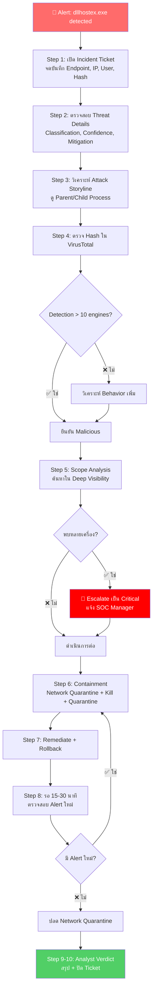

<h1 align="center">🛡️ PB-01: dllhostex.exe detected as malicious</h1>

<p align="center">
  
  
  
</p>

---

## 🎯 Quick Reference

| รายการ | รายละเอียด |
|:------:|:-----------|
| **Alert** | `dllhostex.exe detected as malicious` |
| **ประเภท** | Cryptojacking / Backdoor / Masquerading |
| **True Positive Rate** | สูงมาก — ไฟล์นี้ไม่ใช่ Windows Process จริง |
| **SLA** | ≤ 30 นาที |

> [!CAUTION]
> **dllhostex.exe** ไม่ใช่ไฟล์ปกติของ Windows — ไฟล์ของจริงชื่อ `dllhost.exe`
> มักถูกใช้โดย **CoinMiner** หรือ **Backdoor** ที่ปลอมแปลงชื่อให้คล้ายกับ System Process
> หาก SentinelOne ตรวจพบไฟล์นี้ ถือเป็น **True Positive ที่มีโอกาสสูงมาก**

---

## 📊 Flowchart การตอบสนอง



---

## 📋 ขั้นตอนการตอบสนอง

### 🔹 Step 1 — รับ Alert และเปิด Incident Ticket

1. เข้าสู่ **SentinelOne Console** → ไปที่ **Sentinels** > **Incidents** หรือ **Threats**
2. ค้นหา Alert ที่ชื่อ `dllhostex.exe detected as malicious`
3. จดบันทึกข้อมูลสำคัญ:

| ข้อมูลที่ต้องจด | ตัวอย่าง |
|:----------------|:---------|
| 🖥️ Endpoint Name | `PC-USER01` |
| 🌐 IP Address | `192.168.1.100` |
| 👤 Logged-in User | `john.doe` |
| ⏰ Timestamp | `2026-03-11 14:30:00` |
| 📁 File Path | `C:\Users\john\AppData\...` |
| 🔑 SHA256 Hash | `a1b2c3d4e5...` |

4. เปิด **Incident Ticket** ในระบบ Ticketing (เช่น ServiceNow, Jira)

---

### 🔹 Step 2 — ตรวจสอบ Threat Details ใน SentinelOne

1. คลิกที่ Alert → เข้าหน้า **Threat Details**
2. ตรวจสอบข้อมูลต่อไปนี้:

| รายการตรวจสอบ | สิ่งที่ควรเห็น |
|:-------------|:-------------|
| Threat Classification | Malware หรือ Trojan |
| Confidence Level | Malicious / Suspicious |
| AI Confidence Score | > 0.5 = น่าสงสัยมาก |
| Mitigation Status | Kill, Quarantine, Remediate |

3. คลิก **"Analyst Verdict"** → ยังไม่ต้องเลือก รอวิเคราะห์เพิ่ม

---

### 🔹 Step 3 — วิเคราะห์ Process Tree (Attack Storyline)

1. คลิกที่ **"Attack Storyline"** หรือ **"Process Tree"**
2. ดูว่า `dllhostex.exe` ถูกเรียกจาก Process อะไร:

| Parent Process | 🚦 ระดับความเสี่ยง |
|:--------------|:------------------|
| `powershell.exe`, `cmd.exe`, `wscript.exe` | ⚠️ **น่าสงสัยมาก** |
| `svchost.exe` | ⚠️ **อาจเป็น Lateral Movement** |
| Software ที่รู้จัก | 🔍 ตรวจสอบเพิ่ม |

3. ดู Child Process ว่า `dllhostex.exe` ได้สร้าง Process อะไรต่อ:

| สัญญาณ | ความหมาย |
|:-------|:---------|
| Network Connection ไปยัง IP ภายนอก | ⚠️ สงสัย **C2 Communication** |
| ใช้ CPU สูงผิดปกติ | ⚠️ สงสัย **Cryptojacking** |

4. 📸 **Screenshot** Process Tree เก็บไว้เป็นหลักฐาน

---

### 🔹 Step 4 — ตรวจสอบ Hash ด้วย Threat Intelligence

1. คัดลอก **SHA256 Hash** ของไฟล์ `dllhostex.exe`
2. ไปตรวจสอบที่ **[VirusTotal](https://www.virustotal.com)** → วาง Hash แล้วค้นหา

| ผลลัพธ์ | การตัดสินใจ |
|:--------|:----------|
| Detection > 10/70 engines | ✅ **ยืนยัน Malicious** |
| Detection < 5/70 engines | 🔍 ต้องวิเคราะห์เพิ่มเติม |

3. ดูข้อมูลเพิ่มใน VirusTotal:
   - **Relations Tab** → ดู IP / Domain ที่ไฟล์ติดต่อ
   - **Behavior Tab** → ดู Sandbox Result
   - **Community Tab** → ดูความเห็นจากนักวิเคราะห์ท่านอื่น
4. 📝 บันทึกผลลัพธ์ลง Incident Ticket

---

### 🔹 Step 5 — ตรวจสอบการแพร่กระจาย (Scope Analysis)

1. ใน SentinelOne Console → ไปที่ **Visibility** > **Deep Visibility**
2. ค้นหาด้วย Query:
   ```
   FileName = "dllhostex.exe"
   ```
3. ค้นหาด้วย Hash:
   ```
   FileSHA256 = "<SHA256 Hash ที่ได้จาก Step 2>"
   ```

> [!WARNING]
> ถ้าพบหลายเครื่อง → **ยกระดับเป็น Critical** และแจ้ง SOC Manager ทันที

---

### 🔹 Step 6 — Containment (กักกัน)

| ลำดับ | การดำเนินการ | วิธีทำ |
|:-----:|:------------|:------|
| 1️⃣ | **Isolate เครื่อง** | SentinelOne → Actions → "Disconnect from Network" |
| 2️⃣ | **Kill Process** | SentinelOne → Actions → "Kill" |
| 3️⃣ | **Quarantine ไฟล์** | SentinelOne → Actions → "Quarantine" |
| 4️⃣ | **Block C2 IP ที่ Firewall** | ดู Step 6.1 ด้านล่าง |

#### 🔥 Step 6.1 — Block IOC ที่ Firewall

> [!IMPORTANT]
> ถ้าพบ C2 IP/Domain จาก Storyline หรือ VirusTotal → **Block ที่ Firewall ทันที**

**Fortigate:**
```
config firewall address
    edit "Block_C2_<IP>"
        set subnet <C2_IP> 255.255.255.255
        set comment "SOC Block - Incident #<ticket>"
    next
end
config firewall policy
    edit 0
        set name "Block_C2_<IP>"
        set srcintf "any"
        set dstintf "any"
        set dstaddr "Block_C2_<IP>"
        set action deny
        set schedule "always"
        set logtraffic all
    next
end
```

**Palo Alto:**
```
set address Block_C2_<IP> ip-netmask <C2_IP>/32 description "SOC Block - Incident #<ticket>"
set rulebase security rules Block_C2 from any to any destination Block_C2_<IP> action deny log-end yes
commit
```

> [!NOTE]
> เครื่องที่ถูก Network Quarantine จะยังติดต่อ SentinelOne Console ได้ แต่จะตัดจาก Network ภายใน

---

### 🔹 Step 7 — Remediation (แก้ไข)

1. คลิก **"Actions"** → **"Remediate"**
   - SentinelOne จะ: ลบไฟล์ Malicious, ลบ Registry Key, คืนค่า File
2. คลิก **"Actions"** → **"Rollback"** (ถ้าจำเป็น)
   - ใช้ VSS Snapshot คืนค่าเครื่อง
3. ตรวจสอบ: **Mitigation Status** ควรแสดง `Remediated`

---

### 🔹 Step 8 — ตรวจสอบหลัง Remediation

1. ⏱️ รอ **15-30 นาที** แล้วตรวจสอบว่า:
   - ✅ ไม่มี Alert ใหม่จากเครื่องเดิม
   - ✅ ไม่มี Process `dllhostex.exe` ทำงานอยู่
2. ถ้าไม่มีปัญหา → **ปลด Network Quarantine**:
   - Sentinels → เลือกเครื่อง → Actions → **"Reconnect to Network"**
3. 📞 แจ้ง End User ว่าเครื่องกลับมาใช้งานได้ปกติ

---

### 🔹 Step 9 — อัปเดต Analyst Verdict

| สถานการณ์ | Verdict | การดำเนินการเพิ่ม |
|:---------|:--------|:----------------|
| ยืนยันว่าเป็นภัยจริง | ✅ **True Positive** | — |
| เป็นซอฟต์แวร์ที่ถูกต้อง | ❌ **False Positive** | สร้าง Exclusion |

---

### 🔹 Step 10 — สรุปและปิด Incident

เขียนสรุปใน Incident Ticket:
- ✍️ สาเหตุของ Alert
- ✍️ การดำเนินการที่ทำ
- ✍️ ผลลัพธ์สุดท้าย
- ✍️ IOC ที่ Block ที่ Firewall (IP/Domain/Hash)

---

## 🚨 Escalation Criteria

> เมื่อไหร่ต้องแจ้งหัวหน้า?

| สถานการณ์ | 🎬 ดำเนินการ |
|:---------|:------------|
| พบไฟล์ในหลายเครื่อง (> 3 เครื่อง) | 🔴 แจ้ง SOC Manager **ทันที** |
| มี C2 Communication ยืนยัน | 🔴 แจ้ง SOC Manager + **IR Team** |
| ไม่สามารถ Remediate ได้ | 🟠 แจ้ง SOC Manager เพื่อพิจารณา Reimage |
| ผู้ใช้เป็นระดับ Executive / VIP | 🔴 แจ้ง SOC Manager **ทันที** |

---

## 🛡️ แนวทางป้องกัน

- ✅ ตั้ง SentinelOne Policy เป็น **"Protect"** mode
- ✅ Block hash ของ `dllhostex.exe` ที่ **Fortigate** และ **Palo Alto**
- ✅ ตั้ง **Symantec Email Security** กรองไฟล์แนบ `.exe` ต้องสงสัย
- ✅ ตรวจสอบว่าเครื่องไม่มี Remote Access Tools ที่ไม่ได้รับอนุญาต
- ✅ แจ้งเตือนผู้ใช้ไม่ให้ดาวน์โหลดไฟล์จากแหล่งที่ไม่น่าเชื่อถือ

---

<p align="center"><i>📅 สร้างโดย SOC Team — อัปเดตล่าสุด: มีนาคม 2026</i></p>
