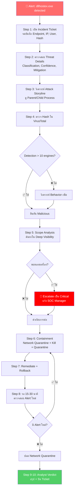

# PB-01: dllhostex.exe detected as malicious

| รายการ | รายละเอียด |
|--------|-----------|
| **Alert Name** | dllhostex.exe detected as malicious |
| **Severity** | 🟠 High |
| **MITRE ATT&CK** | T1055 (Process Injection), T1036 (Masquerading) |
| **Platform** | SentinelOne EDR/XDR |
| **วันที่สร้าง** | มีนาคม 2026 |

---

## 1. ภาพรวมของ Alert

**dllhostex.exe** ไม่ใช่ไฟล์ปกติของ Windows — ไฟล์ Windows ของจริงชื่อ `dllhost.exe`  
ไฟล์ `dllhostex.exe` มักถูกใช้โดย **CoinMiner (Cryptojacking)** หรือ **Backdoor** ที่ปลอมแปลงชื่อให้คล้ายกับ Process ของระบบ  
หาก SentinelOne ตรวจพบไฟล์นี้ ถือเป็น **True Positive ที่มีโอกาสสูง**

---

## 📊 Flowchart การตอบสนอง



---

## 2. ขั้นตอนการตอบสนอง (Response Steps)

### Step 1: รับ Alert และเปิด Incident Ticket
1. เข้าสู่ **SentinelOne Console** → ไปที่ **Sentinels** > **Incidents** หรือ **Threats**
2. ค้นหา Alert ที่ชื่อ `dllhostex.exe detected as malicious`
3. จดบันทึกข้อมูลสำคัญ:
   - **Endpoint Name** (ชื่อเครื่องที่โดน)
   - **IP Address** ของเครื่อง
   - **ผู้ใช้ที่ Login อยู่** (Logged-in User)
   - **เวลาที่เกิด Alert** (Timestamp)
   - **File Path** ของ `dllhostex.exe`
   - **SHA256 Hash** ของไฟล์
4. เปิด **Incident Ticket** ในระบบ Ticketing (เช่น ServiceNow, Jira)

### Step 2: ตรวจสอบ Threat Details ใน SentinelOne
1. คลิกที่ Alert → เข้าหน้า **Threat Details**
2. ตรวจสอบข้อมูลต่อไปนี้:
   - **Threat Classification**: ควรแสดง Malware หรือ Trojan
   - **Confidence Level**: SentinelOne ให้ระดับความมั่นใจเท่าไร (Malicious/Suspicious)
   - **AI Confidence Score**: คะแนนสูงกว่า 0.5 = น่าสงสัยมาก
   - **Mitigation Status**: ดูว่า SentinelOne ได้ดำเนินการอะไรแล้ว (Kill, Quarantine, Remediate)
3. คลิก **"Analyst Verdict"** → ยังไม่ต้องเลือก รอวิเคราะห์เพิ่ม

### Step 3: วิเคราะห์ Process Tree (Attack Storyline)
1. คลิกที่ **"Attack Storyline"** หรือ **"Process Tree"**
2. ดูว่า `dllhostex.exe` ถูกเรียกจาก Process อะไร:
   - ⚠️ ถ้าถูกเรียกจาก `powershell.exe`, `cmd.exe`, `wscript.exe` → **น่าสงสัยมาก**
   - ⚠️ ถ้าถูกเรียกจาก `svchost.exe` → **อาจเป็น Lateral Movement**
   - ✅ ถ้าถูกเรียกจาก Software ที่รู้จัก → ตรวจสอบเพิ่ม
3. ดู Child Process ว่า `dllhostex.exe` ได้สร้าง Process อะไรต่อ:
   - ⚠️ ถ้ามี Network Connection ไปยัง IP ภายนอก → **สงสัย C2 Communication**
   - ⚠️ ถ้ามีการใช้ CPU สูงผิดปกติ → **สงสัย Cryptojacking**
4. **Screenshot** Process Tree เก็บไว้เป็นหลักฐาน

### Step 4: ตรวจสอบ Hash ด้วย Threat Intelligence
1. คัดลอก **SHA256 Hash** ของไฟล์ `dllhostex.exe`
2. ไปตรวจสอบที่:
   - **VirusTotal** (https://www.virustotal.com) → วาง Hash แล้วค้นหา
   - ถ้า Detection > 10/70 engines → **ยืนยัน Malicious**
   - ถ้า Detection < 5/70 engines → ต้องวิเคราะห์เพิ่มเติม
3. ดูข้อมูลเพิ่มใน VirusTotal:
   - **Relations Tab**: ดู IP / Domain ที่ไฟล์ติดต่อ
   - **Behavior Tab**: ดู Sandbox Result ว่าไฟล์ทำอะไรบ้าง
   - **Community Tab**: ดูความเห็นจากนักวิเคราะห์ท่านอื่น
4. บันทึกผลลัพธ์ลง Incident Ticket

### Step 5: ตรวจสอบว่ามีการแพร่กระจายหรือไม่ (Scope Analysis)
1. ใน SentinelOne Console → ไปที่ **Visibility** > **Deep Visibility**
2. ค้นหาด้วย Query:
   ```
   FileName = "dllhostex.exe"
   ```
3. ดูว่ามีเครื่องอื่นที่พบไฟล์นี้หรือไม่
4. ค้นหาด้วย Hash:
   ```
   FileSHA256 = "<SHA256 Hash ที่ได้จาก Step 2>"
   ```
5. ถ้าพบหลายเครื่อง → **ยกระดับเป็น Critical** และแจ้ง SOC Manager ทันที

### Step 6: ดำเนินการ Containment (กักกัน)
1. **Isolate เครื่องจาก Network**:
   - ใน SentinelOne Console → ไปที่ **Sentinels** → เลือกเครื่องที่โดน
   - คลิก **"Actions"** → **"Network Quarantine" (Disconnect from Network)**
   - เครื่องจะยังติดต่อ SentinelOne Console ได้ แต่จะตัดจาก Network ภายใน
2. **ยืนยันว่า Threat ถูก Kill แล้ว**:
   - ดูใน Threat Details → **Mitigation Status**
   - ถ้ายังไม่ได้ Kill → คลิก **"Actions"** → **"Kill"**
3. **Quarantine ไฟล์**:
   - คลิก **"Actions"** → **"Quarantine"**
   - SentinelOne จะย้ายไฟล์ไปเก็บในที่ปลอดภัย

### Step 7: ดำเนินการ Remediation (แก้ไข)
1. ใน SentinelOne → คลิก **"Actions"** → **"Remediate"**
   - SentinelOne จะ:
     - ลบไฟล์ Malicious
     - ลบ Registry Key ที่ถูกแก้ไข
     - คืนค่า File ที่ถูกเปลี่ยนแปลง
2. คลิก **"Actions"** → **"Rollback"** (ถ้าจำเป็น)
   - ใช้ VSS Snapshot คืนค่าเครื่องกลับไปก่อนเกิดเหตุ
3. ตรวจสอบว่า Remediation เสร็จสมบูรณ์:
   - **Mitigation Status** ควรแสดง `Remediated`

### Step 8: ตรวจสอบหลัง Remediation
1. รอ 15-30 นาที แล้วตรวจสอบว่า:
   - ไม่มี Alert ใหม่จากเครื่องเดิม
   - ไม่มี Process `dllhostex.exe` ทำงานอยู่
2. ถ้าไม่มีปัญหา → **ปลด Network Quarantine**:
   - ไปที่ **Sentinels** → เลือกเครื่อง → **"Actions"** → **"Reconnect to Network"**
3. แจ้ง End User ว่าเครื่องกลับมาใช้งานได้ปกติ

### Step 9: อัปเดต Analyst Verdict
1. กลับไปที่ Threat Details
2. คลิก **"Analyst Verdict"**:
   - ถ้ายืนยันว่าเป็นภัยจริง → เลือก **"True Positive"**
   - ถ้าเป็นซอฟต์แวร์ที่ถูกต้อง → เลือก **"False Positive"** แล้วสร้าง Exclusion
3. อัปเดต Incident Ticket พร้อมสรุปผล

### Step 10: สรุปและปิด Incident
1. เขียนสรุปใน Incident Ticket:
   - สาเหตุของ Alert
   - การดำเนินการที่ทำ
   - ผลลัพธ์สุดท้าย
   - คำแนะนำป้องกัน (เช่น Block Hash ที่ Firewall)
2. ปิด Incident Ticket

---

## 3. Escalation Criteria (เมื่อไหร่ต้องแจ้งหัวหน้า)

| สถานการณ์ | ดำเนินการ |
|-----------|----------|
| พบไฟล์ในหลายเครื่อง (> 3 เครื่อง) | แจ้ง SOC Manager ทันที |
| มี C2 Communication ยืนยัน | แจ้ง SOC Manager + Incident Response Team |
| ไม่สามารถ Remediate ได้ | แจ้ง SOC Manager เพื่อพิจารณา Reimage |
| ผู้ใช้เป็นระดับ Executive / VIP | แจ้ง SOC Manager ทันที |

---

## 4. แนวทางป้องกัน (Prevention)

- ตั้ง SentinelOne Policy เป็น **"Protect"** mode (ไม่ใช่ Detect-only)
- Block hash ของ `dllhostex.exe` ที่ Firewall / Proxy
- ตรวจสอบว่าเครื่องไม่มี Remote Access Tools ที่ไม่ได้รับอนุญาต
- แจ้งเตือนผู้ใช้ไม่ให้ดาวน์โหลดไฟล์จากแหล่งที่ไม่น่าเชื่อถือ
