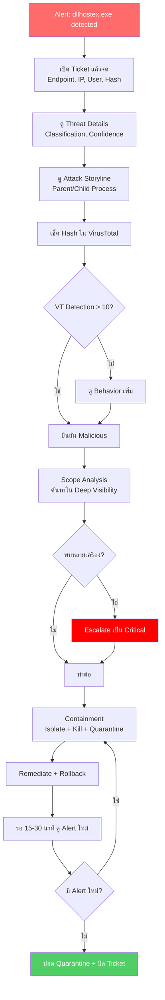

<h1 align="center">🛡️ PB-01: dllhostex.exe detected as malicious</h1>

<p align="center">
  
  
  
</p>

---

## สรุปสั้นๆ

| รายการ | รายละเอียด |
|:------:|:-----------|
| **Alert** | `dllhostex.exe detected as malicious` |
| **ประเภท** | Cryptojacking / Backdoor / ปลอมชื่อ System Process |
| **True Positive Rate** | สูงมาก |
| **SLA** | 30 นาที |

> [!CAUTION]
> ไฟล์ของจริงใน Windows ชื่อ `dllhost.exe` (**ไม่มี "ex"**) ดังนั้น `dllhostex.exe` ไม่ใช่ไฟล์ของระบบ
> ถ้าเจอ Alert นี้ ถือว่า **True Positive เกือบทุกครั้ง** — มักเป็น CoinMiner หรือ Backdoor ที่ตั้งชื่อให้คล้าย System Process

---

## Flowchart ภาพรวม



---

## ขั้นตอนการทำงาน

### Step 1 — เปิด Ticket จดข้อมูล

เข้า SentinelOne Console แล้วหา Alert `dllhostex.exe` จดข้อมูลพวกนี้ไว้:

- Endpoint Name, IP Address, Logged-in User
- **File Path** — อยู่ที่ไหน (เช่น `AppData`, `Temp`)
- **SHA256 Hash** — สำคัญมาก เอาไปเช็ค VT ทีหลัง
- Timestamp ที่เกิด Alert

เปิด Ticket ในระบบ แล้วใส่ข้อมูลพวกนี้เข้าไป

---

### Step 2 — ดู Threat Details

กดเข้า Alert → ดู Threat Details:
- **Classification** — ปกติจะขึ้น Malware หรือ Trojan
- **Confidence Level** — ถ้า Malicious แทบไม่ต้องสงสัย
- **Mitigation Status** — SentinelOne จัดการไปแล้วหรือยัง

ยังไม่ต้องกด Analyst Verdict ตอนนี้ รอวิเคราะห์เพิ่มก่อน

---

### Step 3 — ดู Attack Storyline

ส่วนนี้สำคัญ — เพราะจะบอกได้ว่า `dllhostex.exe` มาจากไหนและทำอะไรบ้าง

**Parent Process ที่ต้องระวัง:**

| Parent Process | ความหมาย |
|:--------------|:---------|
| `powershell.exe` / `cmd.exe` | มีคนสั่งรันมา — น่าสงสัยมาก |
| `svchost.exe` | อาจมาจาก Lateral Movement |
| ซอฟต์แวร์ที่รู้จัก | ตรวจสอบเพิ่มว่าซอฟต์แวร์ถูก Compromise หรือเปล่า |

**Child Process / พฤติกรรมที่ต้องดู:**
- มี Network Connection ออกไปข้างนอก? → อาจเป็น C2 หรือ Mining Pool
- ใช้ CPU สูงผิดปกติ? → เกือบแน่นอนว่าเป็น Cryptominer

อย่าลืม Screenshot Process Tree เก็บไว้ด้วย

---

### Step 4 — เช็ค Hash กับ VirusTotal

Copy SHA256 Hash → เปิด [VirusTotal](https://www.virustotal.com) → วาง Hash แล้วค้นหา

ดู 3 อย่าง:
1. **Detection Score** — มากกว่า 10/70 ก็ยืนยันได้เลย
2. **Relations Tab** — มี IP/Domain ที่ติดต่อไหม (สงสัย C2)
3. **Behavior Tab** — ไฟล์ทำอะไรใน Sandbox

จดผลลัพธ์ลง Ticket

---

### Step 5 — ตรวจการแพร่กระจาย

ไป Deep Visibility แล้วค้นหา:
```
FileName = "dllhostex.exe"
```
หรือ
```
FileSHA256 = "<Hash ที่ได้>"
```

> [!WARNING]
> ถ้าพบหลายเครื่อง **ยกระดับเป็น Critical** แล้วแจ้ง SOC Manager ทันที — อาจเป็นการโจมตีแบบ Campaign

---

### Step 6 — กักกัน (Containment)

| ลำดับ | ทำอะไร | ทำที่ไหน |
|:-----:|:------|:--------|
| 1 | Isolate เครื่อง | SentinelOne → "Disconnect from Network" |
| 2 | Kill Process | Actions → "Kill" |
| 3 | Quarantine ไฟล์ | Actions → "Quarantine" |
| 4 | Block C2 IP ที่ Firewall | ดูด้านล่าง |

**ถ้าพบ C2 IP จาก Storyline หรือ VT — Block ที่ Firewall ด้วย**

Fortigate:
```
config firewall address
    edit "Block_C2_<IP>"
        set subnet <C2_IP> 255.255.255.255
        set comment "SOC Block - Incident #<ticket>"
    next
end
config firewall policy
    edit 0
        set name "Block_C2_<IP>"
        set srcintf "any"
        set dstintf "any"
        set dstaddr "Block_C2_<IP>"
        set action deny
        set schedule "always"
        set logtraffic all
    next
end
```

Palo Alto:
```
set address Block_C2_<IP> ip-netmask <C2_IP>/32 description "SOC Block - Incident #<ticket>"
set rulebase security rules Block_C2 from any to any destination Block_C2_<IP> action deny log-end yes
commit
```

เครื่องที่ถูก Isolate จะยังติดต่อ SentinelOne Console ได้ แต่ตัดจาก Network ภายใน ผู้ใช้จะใช้อินเทอร์เน็ตไม่ได้ชั่วคราว

---

### Step 7 — แก้ไข (Remediate)

1. กด **Remediate** → SentinelOne จะลบไฟล์ ลบ Registry ที่เกี่ยวข้อง
2. กด **Rollback** ถ้าจำเป็น → ใช้ VSS Snapshot คืนค่าเครื่อง
3. ตรวจว่า Mitigation Status ขึ้น `Remediated`

---

### Step 8 — ตรวจซ้ำหลัง Remediate

รอ 15-30 นาที แล้วดู:
- ไม่มี Alert ใหม่จากเครื่องเดิม?
- ไม่มี `dllhostex.exe` โผล่มาอีก?

ถ้าผ่าน → ปลด Network Quarantine แล้วแจ้ง End User ว่าเครื่องกลับมาปกติ

---

### Step 9-10 — ตั้ง Verdict แล้วปิด Ticket

ตั้ง Analyst Verdict เป็น **True Positive** (ส่วนใหญ่จะเป็น TP เกือบทุกครั้ง)

เขียนสรุปใน Ticket:
- สาเหตุ, การดำเนินการที่ทำ, ผลลัพธ์
- IOC ที่ Block แล้ว (IP/Hash)

---

## เมื่อไหร่ต้องแจ้งหัวหน้า

| สถานการณ์ | แจ้งใคร |
|:---------|:--------|
| พบหลายเครื่อง (> 3) | SOC Manager **ทันที** |
| ยืนยัน C2 Communication | SOC Manager + IR Team |
| Remediate ไม่สำเร็จ | SOC Manager — อาจต้อง Reimage |
| ผู้ใช้เป็น Executive / VIP | SOC Manager **ทันที** |

---

## ป้องกันไม่ให้เจออีก

- ตั้ง SentinelOne Policy เป็น **Protect** mode
- Block hash ของ `dllhostex.exe` ที่ **Fortigate** และ **Palo Alto**
- ตั้ง **Symantec Email Security** กรองไฟล์แนบ `.exe` ต้องสงสัย
- ตรวจสอบว่าเครื่องไม่มี Remote Access Tools ที่ไม่ได้รับอนุญาต

---

<p align="center"><i>SOC Team — TW Site | อัปเดตล่าสุด: มีนาคม 2026</i></p>
