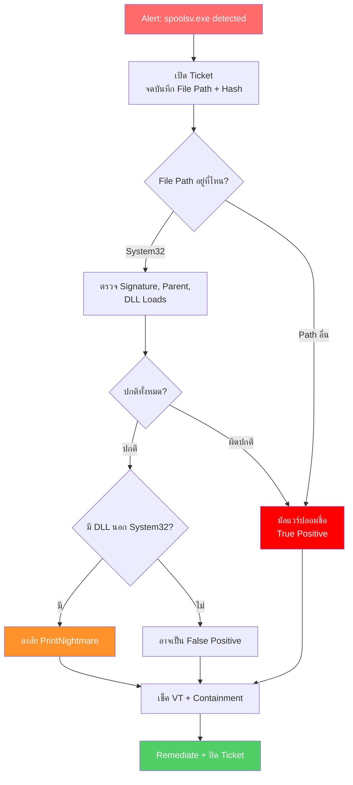

<h1 align="center">🛡️ PB-02: spoolsv.exe detected as Malware</h1>

<p align="center">
  
  
  
</p>

---

## สรุปสั้นๆ

| รายการ | รายละเอียด |
|:------:|:-----------|
| **Alert** | `spoolsv.exe detected as Malware` |
| **ประเภท** | ปลอมชื่อ System Process / PrintNightmare Exploit |
| **True Positive Rate** | ปานกลาง — ต้องดู Path ก่อน |
| **SLA** | 30 นาที |

> [!IMPORTANT]
> `spoolsv.exe` เป็นไฟล์จริงของ Windows (Print Spooler Service) อยู่ที่ `C:\Windows\System32\`
>
> **จุดตัดสินที่สำคัญที่สุดคือ File Path:**
> - อยู่ใน System32 → อาจเป็น FP หรือ PrintNightmare → ต้องตรวจเพิ่ม
> - **อยู่ Path อื่น → มัลแวร์ปลอมชื่อ 100%**

---

## Flowchart ภาพรวม



---

## ขั้นตอนการทำงาน

### Step 1 — เปิด Ticket แล้วจดข้อมูล

เปิด Alert ใน SentinelOne แล้วจด — **File Path สำคัญที่สุด** ของ Alert นี้ เพราะจะบอกได้เลยว่า TP หรือ FP

---

### Step 2 — ดู File Path ก่อนเลย

| File Path | วินิจฉัย | ทำอะไรต่อ |
|:----------|:--------|:---------|
| `C:\Windows\System32\spoolsv.exe` | อาจ FP หรือ PrintNightmare | ไป Step 3 |
| `C:\Users\...\` | **มัลแวร์** | ข้ามไป Step 4 |
| `C:\Temp\` หรือ `C:\ProgramData\` | **มัลแวร์** | ข้ามไป Step 4 |
| ที่อื่นที่ไม่ใช่ System32 | **มัลแวร์** | ข้ามไป Step 4 |

ถ้าอยู่นอก System32 ไม่ต้องสงสัย — เป็นมัลแวร์ที่ตั้งชื่อปลอมให้ดูเหมือน Windows Process

---

### Step 3 — ตรวจสอบ spoolsv.exe ใน System32

ทำขั้นตอนนี้เฉพาะกรณี Path = System32:

| ตรวจอะไร | ปกติ | ผิดปกติ |
|:---------|:-----|:-------|
| Digital Signature | `Microsoft Windows` | ไม่มี Signature |
| File Size | ประมาณ 65-80 KB | ขนาดต่างกันมาก |
| Parent Process | `services.exe` | `cmd.exe` หรือ `powershell.exe` |
| DLL ที่โหลด | ทั้งหมดจาก System32 | มี DLL จากนอก System32 → **PrintNightmare** |

ถ้าพบ DLL จากนอก System32 → สงสัย **PrintNightmare** ต้องแจ้ง IT Patch Team

---

### Step 4 — เช็ค Hash ใน VirusTotal

Copy Hash ไปเช็ค Detection Rate ใน [VirusTotal](https://www.virustotal.com) แล้วจดผลลง Ticket

---

### Step 5 — ดู Storyline + หาเครื่องอื่น

ดู Attack Storyline → Network Connections, File Drops, Registry Changes

ค้นหาเครื่องอื่นใน Deep Visibility:
```
FileName = "spoolsv.exe" AND (NOT FilePath Contains "System32")
```

> [!WARNING]
> พบหลายเครื่อง → Escalate เป็น Critical ทันที

---

### Step 6 — กักกัน

1. **Isolate เครื่อง** → Disconnect from Network
2. **Kill Process** → Actions → Kill
3. **Quarantine File** → Actions → Quarantine

---

### Step 7 — แก้ไข

| กรณี | ทำอย่างไร |
|:-----|:---------|
| **PrintNightmare** | ติดตั้ง Windows Patch + พิจารณา Disable Print Spooler บน Server |
| **มัลแวร์ปลอมชื่อ** | Remediate + Rollback + ตรวจลบ Persistence |

---

### Step 8 — ตรวจซ้ำแล้วปิด Ticket

รอ 15-30 นาที → ไม่มี Alert ใหม่ → ปลด Quarantine → ปิด Ticket

> [!CAUTION]
> ถ้าสร้าง Exclusion สำหรับ FP → **ใช้ Hash + Path ทั้งคู่** อย่า Exclude ด้วยชื่อไฟล์อย่างเดียว เพราะมัลแวร์ชอบปลอมชื่อเป็น `spoolsv.exe`

---

## เมื่อไหร่ต้องแจ้งหัวหน้า

| สถานการณ์ | แจ้งใคร |
|:---------|:--------|
| ยืนยัน PrintNightmare | SOC Manager + IT Patch Team |
| มัลแวร์พบหลายเครื่อง | SOC Manager + IR Team |
| มี Lateral Movement | SOC Manager **ทันที** |

---

## ป้องกันไม่ให้เจออีก

- **ติดตั้ง Patch** สำหรับ Print Spooler Vulnerability ทุกเครื่อง
- **Disable Print Spooler** บน Server ที่ไม่ต้องใช้พิมพ์
- ตั้ง SentinelOne เป็น **Protect** mode
- Monitor ด้วย Deep Visibility หา `spoolsv.exe` นอก System32
- Block C2 IP ที่ **Fortigate** และ **Palo Alto**

---

<p align="center"><i>SOC Team — TW Site | อัปเดตล่าสุด: มีนาคม 2026</i></p>
