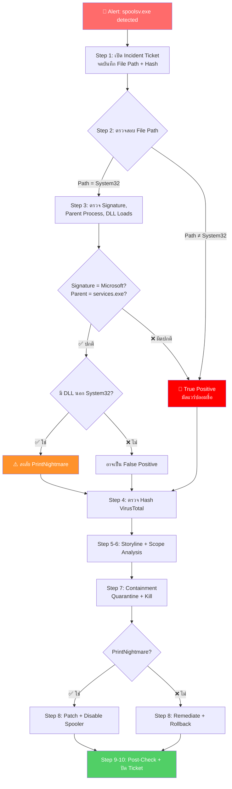

<h1 align="center">🛡️ PB-02: spoolsv.exe detected as Malware</h1>

<p align="center">
  
  
  
</p>

---

## 🎯 Quick Reference

| รายการ | รายละเอียด |
|:------:|:-----------|
| **Alert** | `spoolsv.exe detected as Malware` |
| **ประเภท** | Masquerading / PrintNightmare Exploit |
| **True Positive Rate** | ปานกลาง — ต้องแยกตัวจริง vs ปลอม |
| **SLA** | ≤ 30 นาที |

> [!IMPORTANT]
> **spoolsv.exe** เป็น Windows Print Spooler Service ที่ **เป็นไฟล์ของจริง** อยู่ที่ `C:\Windows\System32\spoolsv.exe`
> 
> **จุดตัดสินสำคัญ:**
> - ✅ `C:\Windows\System32\spoolsv.exe` → อาจเป็น FP หรือ PrintNightmare
> - ❌ อยู่ Path อื่น → **มัลแวร์แน่นอน!**

---

## 📊 Flowchart การตอบสนอง



---

## 📋 ขั้นตอนการตอบสนอง

### 🔹 Step 1 — รับ Alert และเปิด Incident Ticket

1. เข้า **SentinelOne Console** → **Incidents** หรือ **Threats**
2. ค้นหา Alert: `spoolsv.exe detected as Malware`
3. จดบันทึก:

| ข้อมูลที่ต้องจด | ⚡ ความสำคัญ |
|:----------------|:------------|
| 🖥️ Endpoint Name | ปกติ |
| 🌐 IP Address | ปกติ |
| 👤 Logged-in User | ปกติ |
| 📁 **File Path** | ⭐ **สำคัญที่สุด!** |
| 🔑 SHA256 Hash | สูง |

4. เปิด Incident Ticket

---

### 🔹 Step 2 — ตรวจสอบ File Path ⭐ (จุดตัดสินสำคัญ)

| File Path | 🚦 การวินิจฉัย | ➡️ ขั้นตอนถัดไป |
|:----------|:-------------|:--------------|
| `C:\Windows\System32\spoolsv.exe` | อาจเป็น **FP** หรือ PrintNightmare | ไป Step 3 |
| `C:\Users\<username>\...` | 🔴 **True Positive** — มัลแวร์ | ข้ามไป Step 4 |
| `C:\Temp\` หรือ `C:\ProgramData\` | 🔴 **True Positive** — มัลแวร์ | ข้ามไป Step 4 |
| ที่อื่นนอกเหนือจาก System32 | 🔴 **True Positive** — มัลแวร์ | ข้ามไป Step 4 |

---

### 🔹 Step 3 — ตรวจสอบ spoolsv.exe ใน System32

> [!NOTE]
> ทำ Step นี้ **เฉพาะกรณีไฟล์อยู่ใน** `C:\Windows\System32\`

| รายการตรวจสอบ | ✅ ปกติ | ❌ ผิดปกติ |
|:-------------|:-------|:---------|
| Digital Signature | Signer = `Microsoft Windows` | ไม่มี Signature |
| File Size | ประมาณ 65-80 KB | ขนาดต่างมาก |
| Parent Process | `services.exe` | `cmd.exe`, `powershell.exe` |
| DLL ที่โหลด | ทั้งหมดจาก System32 | DLL จากนอก System32 → **PrintNightmare** |

---

### 🔹 Step 4 — ตรวจสอบ Hash ด้วย VirusTotal

1. คัดลอก **SHA256 Hash** → ค้นหาใน **[VirusTotal](https://www.virustotal.com)**
2. ตรวจสอบ Detection Rate, Family Name, First Seen Date
3. 📝 บันทึกผลลง Ticket

---

### 🔹 Step 5 — ตรวจสอบ Attack Storyline

ดูใน **Attack Storyline**: Network Connections, File Drops, Registry Changes, Lateral Movement

📸 **Screenshot** Attack Storyline เก็บไว้

---

### 🔹 Step 6 — Scope Analysis

```
FileName = "spoolsv.exe" AND (NOT FilePath Contains "System32")
```

> [!WARNING]
> ถ้าพบหลายเครื่อง → **Escalate เป็น Critical**

---

### 🔹 Step 7 — Containment

| ลำดับ | การดำเนินการ | วิธีทำ |
|:-----:|:------------|:------|
| 1️⃣ | **Network Quarantine** | Actions → "Disconnect from Network" |
| 2️⃣ | **Kill Process** | Actions → "Kill" |
| 3️⃣ | **Quarantine File** | Actions → "Quarantine" |

---

### 🔹 Step 8 — Remediation

| กรณี | การแก้ไข |
|:-----|:--------|
| **PrintNightmare** | ติดตั้ง Windows Patch + พิจารณา Disable Print Spooler |
| **มัลแวร์ปลอมชื่อ** | Remediate + Rollback + ตรวจ Persistence |

---

### 🔹 Step 9-10 — Post-Check และปิด Incident

1. ⏱️ รอ 15-30 นาที → ตรวจสอบ Alert ใหม่
2. ปลด Network Quarantine → แจ้ง End User
3. ตั้ง Analyst Verdict → สรุปและปิด Ticket

> [!CAUTION]
> ถ้าสร้าง Exclusion สำหรับ FP → **ต้องใช้ Path + Hash ทั้งคู่** อย่า Exclude ด้วย Path อย่างเดียว!

---

## 🚨 Escalation Criteria

| สถานการณ์ | 🎬 ดำเนินการ |
|:---------|:------------|
| ยืนยัน PrintNightmare Exploit | 🔴 แจ้ง SOC Manager + **IT Patch Team** |
| มัลแวร์พบหลายเครื่อง | 🔴 แจ้ง SOC Manager + **IR Team** |
| มี Lateral Movement | 🔴 แจ้ง SOC Manager **ทันที** |

---

## 🛡️ แนวทางป้องกัน

- ✅ **ติดตั้ง Patch** สำหรับ Print Spooler Vulnerability ทุกเครื่อง
- ✅ **Disable Print Spooler** บนเครื่องที่ไม่ต้องใช้พิมพ์ (เช่น Server)
- ✅ ตั้ง SentinelOne Policy เป็น **Protect** mode
- ✅ Monitor ด้วย Deep Visibility Query หา `spoolsv.exe` นอก System32
- ✅ Block C2 IP ที่ **Fortigate** และ **Palo Alto**

---

<p align="center"><i>📅 สร้างโดย SOC Team — อัปเดตล่าสุด: มีนาคม 2026</i></p>
