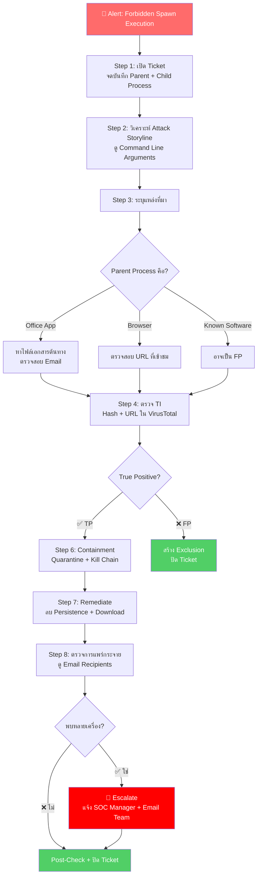

<h1 align="center">🛡️ PB-03: Forbidden Spawn Execution detected</h1>

<p align="center">
  
  
  
</p>

---

## 🎯 Quick Reference

| รายการ | รายละเอียด |
|:------:|:-----------|
| **Alert** | `Forbidden Spawn Execution detected` |
| **ประเภท** | Phishing / Macro Malware / Document Exploit |
| **True Positive Rate** | สูง — Office ไม่ควรสร้าง cmd/powershell |
| **SLA** | ≤ 30 นาที |

> [!CAUTION]
> Alert นี้เกิดเมื่อ **Process สร้าง Child Process ที่ไม่ควรเกิด** เช่น:
> - 📎 `winword.exe` → `powershell.exe` ← **ไม่ปกติ!**
> - 📊 `excel.exe` → `mshta.exe` ← **ไม่ปกติ!**
> - 📧 `outlook.exe` → `wscript.exe` ← **ไม่ปกติ!**
> 
> มักเกี่ยวข้องกับ **Phishing Email + Malicious Document**

---

## 📊 Flowchart การตอบสนอง



---

## 📋 ขั้นตอนการตอบสนอง

### 🔹 Step 1 — รับ Alert และเปิด Incident Ticket

| ข้อมูลที่ต้องจด | ⚡ ความสำคัญ |
|:----------------|:------------|
| 🖥️ Endpoint Name / IP | ปกติ |
| 👤 Logged-in User | ปกติ |
| 👨‍👦 **Parent Process** (เช่น `winword.exe`) | ⭐ สำคัญ |
| 👶 **Child Process** (เช่น `powershell.exe`) | ⭐ สำคัญ |
| 💻 **Command Line** | ⭐⭐ **สำคัญที่สุด!** |

---

### 🔹 Step 2 — วิเคราะห์ Attack Storyline

ตรวจสอบ **Command Line Arguments** ของ Child Process:

| Command Line | ⚠️ ความหมาย |
|:------------|:-----------|
| `powershell.exe -enc <Base64>` | 💀 **Encoded Command** — มัลแวร์ซ่อนคำสั่ง |
| `cmd.exe /c certutil -urlcache ...` | 💀 **ดาวน์โหลดไฟล์จากภายนอก** |
| `mshta.exe http://...` | 💀 **เรียก Script จาก URL** |
| `wscript.exe C:\Users\...\*.vbs` | 💀 **รัน VBScript** |

---

### 🔹 Step 3 — ระบุแหล่งที่มา

| Parent Process | 📎 แหล่งที่มาที่เป็นไปได้ |
|:--------------|:---------------------|
| `winword.exe` | เปิดไฟล์ Word ที่มี Macro |
| `excel.exe` | เปิดไฟล์ Excel ที่มี Macro |
| `outlook.exe` | เปิดไฟล์แนบจาก Email |
| `powerpnt.exe` | เปิด PowerPoint ที่มี Macro |
| `acrobat.exe` | เปิด PDF ที่มี Exploit |
| `msedge.exe` | เยี่ยมชมเว็บไซต์อันตราย |

> [!IMPORTANT]
> **ถ้ามาจาก Email** → ติดต่อ Email Team เพื่อ:
> 1. หา Email ต้นทาง → Block Sender
> 2. ลบ Email จากทุก Mailbox ที่ได้รับ

---

### 🔹 Step 4 — ตรวจสอบ Threat Intelligence

ตรวจสอบ Hash / URL ใน **[VirusTotal](https://www.virustotal.com)** และ **[AbuseIPDB](https://www.abuseipdb.com)**

---

### 🔹 Step 5 — การตัดสินใจ

| เงื่อนไข | 🚦 ผลวินิจฉัย |
|:---------|:-------------|
| Office → `powershell.exe` + Encoded Command | ✅ **True Positive** |
| Office → `cmd.exe` ดาวน์โหลดไฟล์ | ✅ **True Positive** |
| Office → `mshta.exe` + URL | ✅ **True Positive** |
| ซอฟต์แวร์ Update Agent สร้าง Process ปกติ | ❌ Possible **False Positive** |
| Script ของ IT Admin ที่ใช้ประจำ | ❌ Possible **False Positive** |

---

### 🔹 Step 6-7 — Containment + Remediation

| ลำดับ | การดำเนินการ |
|:-----:|:------------|
| 1️⃣ | **Network Quarantine** เครื่อง |
| 2️⃣ | **Kill** ทั้ง Parent + Child Process |
| 3️⃣ | **Quarantine** ไฟล์เอกสาร + ไฟล์ที่ Download |
| 4️⃣ | **Remediate** ผ่าน SentinelOne |
| 5️⃣ | ตรวจสอบ + ลบ **Persistence** (Scheduled Task, Registry, Startup) |
| 6️⃣ | เปลี่ยนรหัสผ่านผู้ใช้ (ถ้า Credential อาจถูกขโมย) |

---

### 🔹 Step 8-9 — Scope + ปิด Incident

```
SrcProcParentName In Contains ("winword","excel","outlook") AND TgtProcName In Contains ("cmd","powershell","mshta","wscript")
```

---

## 🚨 Escalation Criteria

| สถานการณ์ | 🎬 ดำเนินการ |
|:---------|:------------|
| มี C2 Communication ยืนยัน | 🔴 แจ้ง SOC Manager + **IR Team** |
| มีการ Download มัลแวร์เพิ่ม | 🟠 แจ้ง SOC Manager |
| Phishing Campaign พบหลายเครื่อง | 🔴 แจ้ง SOC Manager + **Email Team** |
| ข้อมูลสำคัญอาจถูกขโมย | 🔴 แจ้ง SOC Manager + **Management** |

---

## 🛡️ แนวทางป้องกัน

- ✅ **Disable VBA Macro** ใน Office ผ่าน Group Policy
- ✅ ตั้ง **ASR Rules**: Block Office apps from creating child processes
- ✅ **อบรมผู้ใช้** เรื่อง Phishing Awareness
- ✅ ใช้ **Email Security Gateway** กรอง Malicious Attachments
- ✅ ตั้ง SentinelOne Policy เป็น **Protect** mode

---

<p align="center"><i>📅 สร้างโดย SOC Team — อัปเดตล่าสุด: มีนาคม 2026</i></p>
