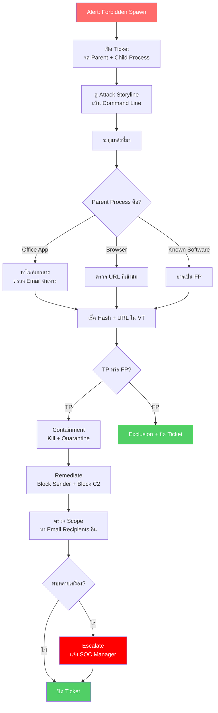

<h1 align="center">🛡️ PB-03: Forbidden Spawn Execution detected</h1>

<p align="center">
  
  
  
</p>

---

## สรุปสั้นๆ

| รายการ | รายละเอียด |
|:------:|:-----------|
| **Alert** | `Forbidden Spawn Execution detected` |
| **ประเภท** | Phishing / Macro Malware / Document Exploit |
| **True Positive Rate** | สูง |
| **SLA** | 30 นาที |

> [!CAUTION]
> Alert นี้เกิดเมื่อ **โปรแกรมสร้าง Child Process ที่ไม่ควรมี** เช่น:
> - Word เปิด PowerShell ← ไม่ปกติ
> - Excel เปิด mshta.exe ← ไม่ปกติ
> - Outlook เปิด wscript.exe ← ไม่ปกติ
>
> ส่วนใหญ่เกี่ยวกับ **Phishing Email ที่แนบเอกสารมี Macro**

---

## Flowchart ภาพรวม



---

## ขั้นตอนการทำงาน

### Step 1 — เปิด Ticket แล้วจดข้อมูล

ข้อมูลที่สำคัญที่สุดของ Alert นี้คือ **Command Line** — เพราะจะบอกได้เลยว่า TP หรือ FP

จดข้อมูลพวกนี้:
- Endpoint Name, IP, User
- **Parent Process** (เช่น `winword.exe`) — บอกว่ามาจาก App อะไร
- **Child Process** (เช่น `powershell.exe`) — บอกว่าถูกสั่งให้ทำอะไร
- **Command Line** — ⭐ **สำคัญที่สุด** ดูรายละเอียดใน Step 2

---

### Step 2 — ดู Command Line ให้ละเอียด

Command Line ของ Child Process จะบอกได้เลยว่ามัลแวร์กำลังทำอะไร:

| ถ้าเห็นแบบนี้ | แปลว่า |
|:-------------|:-------|
| `powershell.exe -enc <ตัวอักษรยาวๆ>` | ซ่อนคำสั่งใน Base64 — **Malicious แน่นอน** |
| `cmd.exe /c certutil -urlcache ...` | ดาวน์โหลดไฟล์จากข้างนอก |
| `mshta.exe http://...` | รัน Script จาก URL ภายนอก |
| `wscript.exe C:\Users\...\*.vbs` | รัน VBScript ที่อาจเป็น Dropper |

ถ้าเห็นอย่างใดอย่างหนึ่งข้างบน → **True Positive ได้เลย** ไม่ต้องสงสัย

---

### Step 3 — หาว่ามาจากไหน

| Parent Process | แหล่งที่มาที่เป็นไปได้ |
|:--------------|:---------------------|
| Word / Excel / PowerPoint | เปิดเอกสารที่มี Macro |
| Outlook | เปิดไฟล์แนบจาก Email โดยตรง |
| Browser | เข้าเว็บไซต์อันตรายแล้วโดนหลอกดาวน์โหลด |

**ถ้ามาจาก Email** → ต้องจัดการที่ **Symantec** ด้วย:
1. หา Email ต้นทาง → ดู Sender, Subject, ใครได้รับบ้าง
2. **Block Sender** → Symantec → Policies → Block Lists
3. **ลบ Email** จากทุก Mailbox → Message Trace → Delete

ขั้นตอนนี้สำคัญมาก เพราะถ้าไม่ลบ Email คนอื่นอาจเปิดแล้วโดนเหมือนกัน

---

### Step 4 — เช็ค Hash กับ VirusTotal

ตรวจ Hash ของไฟล์เอกสารและ Child Process ใน [VirusTotal](https://www.virustotal.com) + [AbuseIPDB](https://www.abuseipdb.com)

---

### Step 5 — ตัดสิน TP หรือ FP

| เงื่อนไข | ผลวินิจฉัย |
|:---------|:----------|
| Office → PowerShell + Encoded Command | **True Positive** |
| Office → cmd ดาวน์โหลดไฟล์ | **True Positive** |
| Office → mshta + URL | **True Positive** |
| Software Update Agent สร้าง Process ปกติ | อาจเป็น **False Positive** |
| Script ของ IT Admin ที่ใช้ประจำ | อาจเป็น **False Positive** |

---

### Step 6-7 — กักกัน + แก้ไข

| ลำดับ | ทำอะไร | ใช้เครื่องมือ |
|:-----:|:------|:-----------|
| 1 | Isolate เครื่อง | SentinelOne |
| 2 | Kill ทั้ง Parent + Child | SentinelOne |
| 3 | Quarantine เอกสาร + ไฟล์ที่ Download | SentinelOne |
| 4 | Remediate | SentinelOne |
| 5 | Block Sender + ลบ Email ทุก Mailbox | Symantec |
| 6 | Block C2 IP/Domain | Fortigate / Palo Alto |
| 7 | ตรวจ + ลบ Persistence | SentinelOne Remote Shell |
| 8 | เปลี่ยนรหัสผ่าน (ถ้าอาจถูกขโมย) | AD / IT Team |

**ถ้าพบ C2 IP → Block ที่ Firewall:**

Fortigate:
```
config firewall address
    edit "Block_Phishing_C2_<IP>"
        set subnet <C2_IP> 255.255.255.255
        set comment "SOC - Phishing C2 - Incident #<ticket>"
    next
end
```

Palo Alto:
```
set address Block_Phishing_C2 ip-netmask <C2_IP>/32
set rulebase security rules Block_Phishing_C2 from any to any destination Block_Phishing_C2 action deny log-end yes
commit
```

---

### Step 8-9 — ตรวจ Scope แล้วปิด Ticket

ใช้ Deep Visibility ตรวจว่ามีเครื่องอื่นโดนไหม:
```
SrcProcParentName In Contains ("winword","excel","outlook") AND TgtProcName In Contains ("cmd","powershell","mshta","wscript")
```

ถ้าพบหลายเครื่อง → อาจเป็น Phishing Campaign → แจ้ง SOC Manager + Symantec Email Team

---

## เมื่อไหร่ต้องแจ้งหัวหน้า

| สถานการณ์ | แจ้งใคร |
|:---------|:--------|
| ยืนยัน C2 Communication | SOC Manager + IR Team |
| มีการ Download มัลแวร์เพิ่มเติม | SOC Manager |
| พบหลายเครื่อง (Phishing Campaign) | SOC Manager + Symantec Email Team |
| ข้อมูลสำคัญอาจถูกขโมย | SOC Manager + Management |

---

## ป้องกันไม่ให้เจออีก

- **Disable VBA Macro** ใน Office ผ่าน Group Policy — ลดความเสี่ยง Phishing ได้มาก
- ตั้ง **ASR Rules** ไม่ให้ Office สร้าง Child Process
- ตั้ง **Symantec** กรองไฟล์ `.doc`, `.docm`, `.xlsm` ที่มี Macro
- **อบรมพนักงาน** เรื่อง Phishing — ให้รู้จักสังเกต Email ต้องสงสัย
- ตั้ง SentinelOne เป็น **Protect** mode
- Block Phishing domains ที่ **Fortigate / Palo Alto URL Filtering**

---

<p align="center"><i>SOC Team — TW Site | อัปเดตล่าสุด: มีนาคม 2026</i></p>
