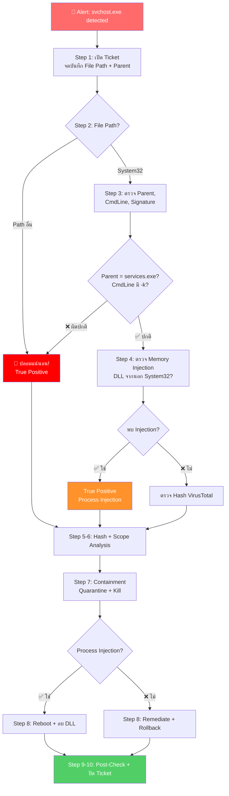

<h1 align="center">🛡️ PB-04: svchost.exe detected as Malware</h1>

  
  
  

---

## 🎯 Quick Reference

| รายการ | รายละเอียด |
|:------:|:-----------|
| **Alert** | `svchost.exe detected as Malware` |
| **ประเภท** | Masquerading / Process Injection |
| **True Positive Rate** | ปานกลาง — ต้องตรวจสอบ Path + Behavior |
| **SLA** | ≤ 30 นาที |

> [!IMPORTANT]
> **svchost.exe** เป็น Process หลักของ Windows — ปกติมีหลายตัวทำงานพร้อมกัน
>
> | คุณสมบัติ | ✅ ตัวจริง | ❌ ของปลอม |
> |:---------|:---------|:---------|
> | **Path** | `C:\Windows\System32\svchost.exe` | ที่อื่น |
> | **Parent** | `services.exe` | อื่นๆ |
> | **Signature** | Microsoft Windows | ไม่มี |
> | **CmdLine** | `-k <ServiceGroup>` | ไม่มี `-k` |

---

## 📊 Flowchart การตอบสนอง

---

## 📋 ขั้นตอนการตอบสนอง

### 🔹 Step 1 — รับ Alert และเปิด Incident Ticket
จดบันทึก **File Path**, SHA256 Hash, Parent Process, Command Line Arguments

### 🔹 Step 2 — ตรวจสอบ File Path ⭐

| ผลตรวจสอบ | ➡️ ขั้นตอนถัดไป |
|:---------|:--------------|
| Path = `C:\Windows\System32\` | ไป Step 3 (ตรวจเพิ่ม) |
| Path ≠ System32 | 🔴 **ปลอมแน่นอน** → ข้ามไป Step 5 |

### 🔹 Step 3 — ตรวจสอบ svchost.exe ใน System32

| รายการ | ✅ ปกติ | ❌ น่าสงสัย |
|:------|:-------|:----------|
| Parent Process | `services.exe` | อื่นๆ |
| Command Line | `-k netsvcs` หรือ `-k LocalService` | ไม่มี `-k` |
| Network | Microsoft Services เท่านั้น | IP ที่ไม่รู้จัก |
| Loaded DLLs | จาก System32 ทั้งหมด | DLL จาก Users/Temp/AppData |

### 🔹 Step 4 — ตรวจสอบ Process Injection

> [!WARNING]
> สัญญาณของ Process Injection:
> - Memory Injection / DLL Injection Alert
> - Memory Usage สูงผิดปกติ
> - Network Traffic ไปยัง IP ที่ไม่ใช่ Microsoft

### 🔹 Step 5-6 — Hash Check + Scope Analysis

ค้นหาใน VirusTotal + Deep Visibility

### 🔹 Step 7 — Containment

| ลำดับ | การดำเนินการ | ⚠️ ข้อควรระวัง |
|:-----:|:------------|:-------------|
| 1️⃣ | Network Quarantine | — |
| 2️⃣ | Kill Process | svchost ปลอม → Kill ปลอดภัย / ตัวจริง → Windows Restart |
| 3️⃣ | Quarantine File | — |

### 🔹 Step 8 — Remediation

| กรณี | การแก้ไข |
|:-----|:--------|
| **ปลอมชื่อ (Path อื่น)** | Remediate + Rollback + ลบ Service/Persistence |
| **Process Injection** | Reboot เคลียร์ Memory + ลบ DLL ที่ Inject |

### 🔹 Step 9-10 — Post-Check + ปิด Ticket

⏱️ รอ 15-30 นาที → ตรวจสอบ → ปลด Quarantine → ปิด Ticket

---

## 🚨 Escalation Criteria

| สถานการณ์ | 🎬 ดำเนินการ |
|:---------|:------------|
| ยืนยัน Process Injection ใน svchost จริง | 🔴 แจ้ง SOC Manager + **IR Team** |
| พบ Cobalt Strike / APT Framework | 🔴 แจ้ง SOC Manager **ทันที** |
| Domain Controller ถูกโจมตี | 🔴 แจ้ง SOC Manager + **IT Team ทันที** |

---

## 🛡️ แนวทางป้องกัน

- ✅ ตั้ง SentinelOne Policy เป็น **Protect** mode
- ✅ Enable **Anti-Tampering**
- ✅ จำกัด Admin Privileges (Least Privilege)
- ✅ Monitor `svchost.exe` นอก System32
- ✅ ติดตั้ง Windows Security Updates สม่ำเสมอ

---

<i>📅 สร้างโดย SOC Team — อัปเดตล่าสุด: มีนาคม 2026</i>

