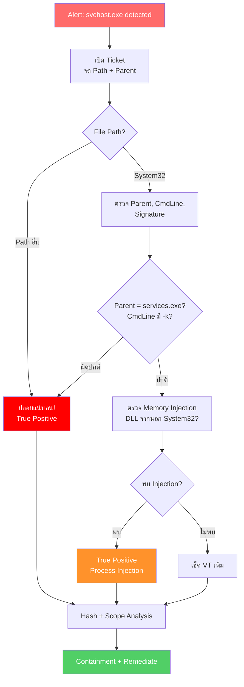

<h1 align="center">🛡️ PB-04: svchost.exe detected as Malware</h1>

  
  
  

---

## สรุปสั้นๆ

| รายการ | รายละเอียด |
|:------:|:-----------|
| **Alert** | `svchost.exe detected as Malware` |
| **ประเภท** | ปลอมชื่อ / Process Injection |
| **True Positive Rate** | ปานกลาง — ต้องดู Path + Parent Process |
| **SLA** | 30 นาที |

> [!IMPORTANT]
> `svchost.exe` เป็น Process หลักของ Windows — ปกติมีรันอยู่หลายสิบตัวพร้อมกัน
>
> วิธีแยกตัวจริงจากของปลอม:
>
> | | ตัวจริง | ของปลอม |
> |:--|:-------|:-------|
> | **Path** | `C:\Windows\System32\svchost.exe` | ที่อื่น |
> | **Parent** | `services.exe` | อื่นๆ |
> | **Signature** | Microsoft Windows | ไม่มี |
> | **CmdLine** | `-k <ServiceGroup>` | ไม่มี `-k` |

---

## Flowchart ภาพรวม

---

## ขั้นตอนการทำงาน

### Step 1 — เปิด Ticket

จด File Path, Hash, Parent Process, Command Line — ข้อมูลพวกนี้จะใช้ตัดสินใจใน Step ถัดไป

---

### Step 2 — ดู File Path ก่อน

เหมือนกับ PB-02 (spoolsv) — **Path คือตัวตัดสินแรก**:

- Path = `System32` → ต้องตรวจเพิ่ม (Step 3)
- Path อื่น → **ปลอมแน่นอน** ไม่ต้องสงสัย → ข้ามไป Step 5

---

### Step 3 — ตรวจสอบ svchost ใน System32

| ตรวจอะไร | ปกติ | น่าสงสัย |
|:---------|:-----|:--------|
| Parent Process | `services.exe` | อื่นๆ |
| Command Line | `-k netsvcs` หรือ `-k LocalService` | ไม่มี `-k` |
| Network | Microsoft Services เท่านั้น | IP ที่ไม่รู้จัก |
| Loaded DLLs | จาก System32 ทั้งหมด | DLL จาก Users/Temp/AppData |

---

### Step 4 — ตรวจหา Process Injection

> [!WARNING]
> ถ้า svchost.exe ตัวจริงถูก Inject จะเห็นสัญญาณเหล่านี้:
> - Memory Usage สูงผิดปกติ
> - Network Traffic ไปยัง IP ที่ไม่ใช่ Microsoft
> - DLL ถูกโหลดจาก Path ที่ไม่ใช่ System
>
> Process Injection เป็นเทคนิคที่มัลแวร์ระดับสูง (เช่น Cobalt Strike) ใช้ — ถ้าพบต้อง Escalate

---

### Step 5-6 — เช็ค VT + หาเครื่องอื่น

ตรวจ Hash ใน VirusTotal แล้วค้นหาใน Deep Visibility

---

### Step 7 — กักกัน

| ทำอะไร | หมายเหตุ |
|:------|:--------|
| Isolate เครื่อง | — |
| Kill Process | svchost ปลอม → Kill ได้เลย / ตัวจริง → Windows อาจ Restart |
| Quarantine File | — |

---

### Step 8 — แก้ไข

| กรณี | ทำอย่างไร |
|:-----|:---------|
| **ปลอมชื่อ** | Remediate + Rollback + ลบ Service/Persistence |
| **Process Injection** | **Reboot** เพื่อเคลียร์ Memory + ลบ DLL ที่ Inject |

---

### Step 9 — ตรวจซ้ำแล้วปิด Ticket

รอ 15-30 นาที → ตรวจ Alert ใหม่ → ปลด Quarantine → ปิด Ticket

---

## เมื่อไหร่ต้องแจ้งหัวหน้า

| สถานการณ์ | แจ้งใคร |
|:---------|:--------|
| ยืนยัน Process Injection ใน svchost จริง | SOC Manager + IR Team |
| พบ Cobalt Strike / APT Framework | SOC Manager **ทันที** |
| Domain Controller ถูกโจมตี | SOC Manager + IT Team **ทันที** |

---

## ป้องกันไม่ให้เจออีก

- ตั้ง SentinelOne เป็น **Protect** mode
- Enable **Anti-Tampering**
- จำกัด Admin Privileges (Least Privilege)
- Monitor `svchost.exe` นอก System32 ด้วย Deep Visibility
- ติดตั้ง Windows Security Updates สม่ำเสมอ
- Block C2 IP/Domain ที่ **Fortigate** และ **Palo Alto**

---

<i>SOC Team — TW Site | อัปเดตล่าสุด: มีนาคม 2026</i>

