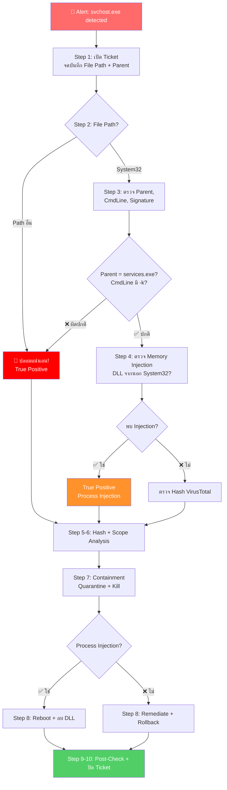

# PB-04: svchost.exe detected as Malware

| รายการ | รายละเอียด |
|--------|-----------|
| **Alert Name** | svchost.exe detected as Malware |
| **Severity** | 🟠 High |
| **MITRE ATT&CK** | T1036.005 (Masquerading), T1055 (Process Injection), T1543.003 (Windows Service) |
| **Platform** | SentinelOne EDR/XDR |
| **วันที่สร้าง** | มีนาคม 2026 |

---

## 1. ภาพรวมของ Alert

**svchost.exe** (Service Host) เป็น Process หลักของ Windows ที่ใช้รัน Windows Services  
โดยปกติจะมี `svchost.exe` ทำงานหลายตัวพร้อมกัน ซึ่งเป็นเรื่องปกติ

**ทำไมถึงอันตราย?**
- มัลแวร์มักจะ **ปลอมชื่อเป็น `svchost.exe`** เพราะเป็น Process ที่พบทั่วไป
- มัลแวร์สามารถ **Inject Code** เข้าไปใน `svchost.exe` ตัวจริง
- ผู้ใช้จะไม่สังเกตเห็นเพราะคิดว่าเป็น Process ปกติ

**การแยกแยะ svchost.exe ตัวจริงกับของปลอม:**

| คุณสมบัติ | svchost.exe ตัวจริง | svchost.exe ปลอม |
|----------|-------------------|-----------------|
| **Path** | `C:\Windows\System32\svchost.exe` | ที่อื่น |
| **Parent Process** | `services.exe` | อื่นๆ |
| **Digital Signature** | Microsoft Windows | ไม่มี / อื่น |
| **Command Line** | `-k <ServiceGroup>` | อื่นๆ หรือไม่มี |

---

## 📊 Flowchart การตอบสนอง



---

## 2. ขั้นตอนการตอบสนอง (Response Steps)

### Step 1: รับ Alert และเปิด Incident Ticket
1. เข้า **SentinelOne Console** → **Incidents / Threats**
2. ค้นหา Alert: `svchost.exe detected as Malware`
3. จดบันทึก:
   - **Endpoint Name**, **IP Address**, **Logged-in User**
   - **File Path** ← **ข้อมูลสำคัญที่สุด**
   - **SHA256 Hash**
   - **Parent Process Name & Path**
   - **Command Line Arguments**
   - **Timestamp**
4. เปิด Incident Ticket

### Step 2: ตรวจสอบ File Path (การตัดสินใจแรก)
1. ดู **File Path** ใน Threat Details:

| File Path | การวินิจฉัย | ขั้นตอนถัดไป |
|-----------|------------|-------------|
| `C:\Windows\System32\svchost.exe` | **Path ของจริง** → ต้องวิเคราะห์เพิ่ม | ไป Step 3 |
| Path อื่นใดก็ตาม | **ปลอมแน่นอน** → True Positive | ข้ามไป Step 5 |

### Step 3: ตรวจสอบ svchost.exe ที่อยู่ใน System32
> ⚠️ ทำ Step นี้เฉพาะกรณีไฟล์อยู่ใน `C:\Windows\System32\`

1. **ตรวจสอบ Parent Process**:
   - ✅ Parent = `services.exe` → ปกติ
   - ❌ Parent ≠ `services.exe` → **น่าสงสัยมาก**
2. **ตรวจสอบ Command Line**:
   - ✅ ปกติ: `svchost.exe -k netsvcs` หรือ `-k LocalService`
   - ❌ ผิดปกติ: ไม่มี `-k` parameter หรือมี parameter แปลกๆ
3. **ตรวจสอบ Network Connections**:
   - ดูใน Attack Storyline ว่ามีการติดต่อ IP ที่น่าสงสัยหรือไม่
   - `svchost.exe` ตัวจริงจะติดต่อเฉพาะ Microsoft Services (Windows Update, etc.)
4. **ตรวจสอบ Loaded DLLs**:
   - ดูว่ามี DLL ที่ถูกโหลดจากนอก `System32` หรือไม่
   - ⚠️ DLL จาก `C:\Users\`, `C:\Temp\`, `AppData` → **Process Injection**

### Step 4: ตรวจสอบว่าเป็น Process Injection หรือไม่
1. ใน Attack Storyline ดู Indicators:
   - **Memory Injection Indicators**: มี Alert เรื่อง DLL Injection หรือไม่
   - **Unusual Memory Usage**: `svchost.exe` ใช้ Memory สูงผิดปกติ
   - **Unusual Network Traffic**: ติดต่อ IP/Port ที่ไม่ใช่ Microsoft
2. ถ้าพบสัญญาณของ Process Injection:
   - นี่เป็น **True Positive** → ไป Step 5
3. ถ้าไม่พบสัญญาณ:
   - อาจเป็น **False Positive** → ยืนยันด้วย Hash ใน Step 5

### Step 5: ตรวจสอบ Hash ด้วย Threat Intelligence
1. คัดลอก **SHA256 Hash** จาก Threat Details
2. ค้นหาใน **VirusTotal**:
   - Detection > 10 engines → **Malicious**
   - ดู Family Name → เช่น Emotet, TrickBot, Cobalt Strike
3. ถ้า Hash ตรงกับ Microsoft Signed File → อาจเป็น FP ส่วน Process Injection
4. บันทึกผล

### Step 6: ตรวจสอบการแพร่กระจาย (Scope)
1. **Deep Visibility** → ค้นหา:
   ```
   FileSHA256 = "<Hash>" OR (FileName = "svchost.exe" AND NOT FilePath = "C:\Windows\System32\svchost.exe")
   ```
2. ถ้าพบหลายเครื่อง → **Escalate ทันที**

### Step 7: Containment
1. **Network Quarantine**:
   - SentinelOne → Sentinels → เลือกเครื่อง → **"Disconnect from Network"**
2. **Kill Process**:
   - ⚠️ **ข้อควรระวัง**: การ Kill `svchost.exe` ตัวจริงอาจทำให้เครื่องมีปัญหา
   - ถ้าเป็น svchost.exe **ปลอม** (Path ไม่ใช่ System32) → Kill ได้ปลอดภัย
   - ถ้าเป็น svchost.exe **ตัวจริง** ที่ถูก Inject → Kill แล้ว Windows จะ Restart Service
3. **Quarantine File**

### Step 8: Remediation
1. **Remediate** ผ่าน SentinelOne → **"Actions"** → **"Remediate"**
2. ตรวจสอบ **Persistence**:
   - ถ้ามัลแวร์ Register เป็น Windows Service → ต้องลบ Service
   - ตรวจสอบ Scheduled Tasks
   - ตรวจสอบ Registry Run Keys
3. ถ้าเป็น Process Injection:
   - **Reboot** เครื่องเพื่อ Clear Memory
   - ตรวจสอบว่า DLL ที่ถูก Inject ถูกลบแล้ว
4. **Rollback** ถ้าจำเป็น

### Step 9: Post-Remediation Check
1. รอ 15-30 นาที
2. ตรวจสอบว่าไม่มี Alert ใหม่
3. ตรวจสอบว่าเครื่องทำงานปกติ
4. ปลด Network Quarantine
5. แจ้ง End User

### Step 10: อัปเดต Verdict และปิด Incident
1. ตั้ง **Analyst Verdict**:
   - True Positive: บันทึกรายละเอียดมัลแวร์ที่พบ
   - False Positive: สร้าง Exclusion อย่างระมัดระวัง
2. สรุปใน Incident Ticket
3. ปิด Ticket

---

## 3. Escalation Criteria

| สถานการณ์ | ดำเนินการ |
|-----------|----------|
| ยืนยัน Process Injection ใน svchost.exe จริง | แจ้ง SOC Manager + IR Team |
| พบ Cobalt Strike / APT Framework | แจ้ง SOC Manager ทันที |
| พบหลายเครื่อง | แจ้ง SOC Manager + IR Team |
| Domain Controller ถูกโจมตี | แจ้ง SOC Manager + IT Team ทันที |

---

## 4. แนวทางป้องกัน

- ตั้ง SentinelOne Policy เป็น **Protect** mode
- Enable **Anti-Tampering** ใน SentinelOne
- จำกัดการใช้ Admin Privileges (Least Privilege Principle)
- Monitor `svchost.exe` ที่ไม่ได้อยู่ใน `C:\Windows\System32\`
- ติดตั้ง Windows Security Updates สม่ำเสมอ
