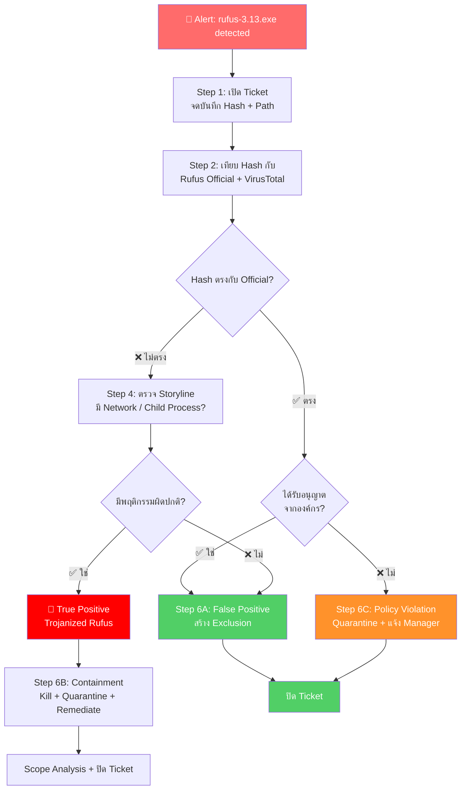

# PB-05: rufus-3.13.exe detected as Malware

| รายการ | รายละเอียด |
|--------|-----------|
| **Alert Name** | rufus-3.13.exe detected as Malware |
| **Severity** | 🟡 Medium |
| **MITRE ATT&CK** | T1588.001 (Obtain Capabilities: Malware), T1036 (Masquerading) |
| **Platform** | SentinelOne EDR/XDR |
| **วันที่สร้าง** | มีนาคม 2026 |

---

## 1. ภาพรวมของ Alert

**Rufus** เป็นซอฟต์แวร์ Open Source ที่ใช้สำหรับ **สร้าง USB Bootable Drive** อย่างถูกต้องตามกฎหมาย  
แต่ SentinelOne อาจตรวจจับว่าเป็น Malware เพราะ:

1. **False Positive**: Rufus มีพฤติกรรมคล้ายมัลแวร์ (เข้าถึง Disk โดยตรง, เปลี่ยน Boot Sector)
2. **True Positive**: มัลแวร์ปลอมตัวเป็นไฟล์ Rufus (ใช้ชื่อคล้ายกัน เช่น `rufus-3.13.exe`)
3. **Trojanized Rufus**: ไฟล์ Rufus ที่ถูกดัดแปลงฝังมัลแวร์

> ⚠️ **สำคัญ**: แม้ Rufus จะเป็นซอฟต์แวร์ที่ถูกต้อง แต่ถ้าไม่ได้รับอนุญาตจากองค์กร ถือเป็น **Policy Violation** (การใช้ซอฟต์แวร์ไม่ได้รับอนุญาต)

---

## 📊 Flowchart การตอบสนอง

---

## 2. ขั้นตอนการตอบสนอง (Response Steps)

### Step 1: รับ Alert และเปิด Incident Ticket
1. เข้า **SentinelOne Console** → **Incidents / Threats**
2. ค้นหา Alert: `rufus-3.13.exe detected as Malware`
3. จดบันทึก:
   - **Endpoint Name**, **IP Address**, **Logged-in User**
   - **File Path** ของ `rufus-3.13.exe` ← ดูว่าดาวน์โหลดมาจากไหน
   - **SHA256 Hash**
   - **File Size**
   - **Timestamp**
4. เปิด Incident Ticket

### Step 2: ตรวจสอบ Hash เทียบกับ Rufus ของจริง
1. คัดลอก **SHA256 Hash** จาก Threat Details
2. ไปที่เว็บไซต์ Rufus อย่างเป็นทางการ: **https://rufus.ie**
   - ดู Hash ของ Rufus version 3.13 ที่ถูกต้อง
3. **เทียบ Hash**:
   - ✅ Hash ตรงกับ Rufus official → **False Positive** (แต่อาจเป็น Policy Violation)
   - ❌ Hash ไม่ตรง → **อาจเป็น Trojanized version หรือมัลแวร์ปลอมตัว**
4. ค้นหา Hash ใน **VirusTotal**:
   - ถ้า Detection ≤ 5 engines และ engines ที่จับเป็น Generic → มีโอกาสเป็น FP
   - ถ้า Detection > 10 engines → **Malicious**
5. บันทึกผลลง Ticket

### Step 3: ตรวจสอบ File Path และแหล่งที่มา
1. ดู **File Path**:

| File Path | ความหมาย |
|-----------|---------|
| `C:\Users\<user>\Downloads\` | ดาวน์โหลดจาก Internet |
| `C:\Users\<user>\Desktop\` | อาจ Copy มา USB หรือ Download |
| USB Drive (เช่น `D:\`, `E:\`) | นำมาจาก USB |
| Network Share | อาจแชร์กันภายในองค์กร |

2. ถ้าดาวน์โหลดจาก Internet:
   - ดู Browser History (ถ้ามี) ว่าดาวน์โหลดจากเว็บอะไร
   - ⚠️ ถ้าดาวน์โหลดจากเว็บไม่ใช่ `rufus.ie` → **น่าสงสัย**

### Step 4: ตรวจสอบ Attack Storyline
1. คลิก **"Attack Storyline"**
2. ดูว่า `rufus-3.13.exe` ทำอะไร:
   - ✅ ถ้าเข้าถึง USB Device / Disk → พฤติกรรมปกติของ Rufus
   - ❌ ถ้ามี Network Connection ไปภายนอก → **น่าสงสัย** (Rufus ของจริงไม่จำเป็นต้อง Connect Internet)
   - ❌ ถ้าสร้าง Child Process อื่น (เช่น `cmd.exe`, `powershell.exe`) → **น่าสงสัยมาก**
   - ❌ ถ้ามีการเปลี่ยน Registry → **น่าสงสัย**
3. **Screenshot** Storyline

### Step 5: การตัดสินใจ

| ผลการตรวจสอบ | วินิจฉัย | ขั้นตอนถัดไป |
|-------------|---------|-------------|
| Hash ตรงกับ Rufus official + ไม่มี Network ผิดปกติ | **False Positive** | ไป Step 6A |
| Hash ไม่ตรง + มีพฤติกรรมผิดปกติ | **True Positive** (มัลแวร์) | ไป Step 6B |
| Hash ตรง แต่ไม่ได้รับอนุญาตจากองค์กร | **Policy Violation** | ไป Step 6C |

### Step 6A: กรณี False Positive
1. ตั้ง **Analyst Verdict** → **False Positive**
2. สร้าง **Exclusion** ใน SentinelOne:
   - ไปที่ **Sentinels** > **Exclusions**
   - สร้าง Exclusion ด้วย **SHA256 Hash** ของ Rufus official
   - ⚠️ อย่า Exclude ด้วยชื่อไฟล์อย่างเดียว
3. **Restore** ไฟล์จาก Quarantine (ถ้าจำเป็นและได้รับอนุญาต)
4. ปิด Incident Ticket พร้อมหมายเหตุ "False Positive — Legitimate Rufus"

### Step 6B: กรณี True Positive (มัลแวร์)
1. **Network Quarantine** เครื่องทันที
2. **Kill** Process
3. **Quarantine** ไฟล์
4. **Remediate** ผ่าน SentinelOne
5. ตรวจสอบการแพร่กระจาย (Deep Visibility)
6. ตั้ง Analyst Verdict → **True Positive**
7. ปลด Network Quarantine หลังยืนยันว่าปลอดภัย
8. ปิด Incident Ticket

### Step 6C: กรณี Policy Violation
1. ไฟล์เป็น Rufus ของจริง แต่ **ไม่ได้รับอนุญาตจากองค์กร**
2. **Quarantine** ไฟล์ (ลบออกจากเครื่อง)
3. แจ้ง **IT Manager / Line Manager** ของผู้ใช้
4. แจ้งผู้ใช้ว่า:
   - "ซอฟต์แวร์นี้ไม่ได้รับอนุญาตให้ใช้ในองค์กร"
   - "หากต้องการใช้ กรุณาขออนุญาตจาก IT"
5. บันทึกเป็น **Policy Violation** ใน Ticket
6. ปิด Incident Ticket

---

## 3. Escalation Criteria

| สถานการณ์ | ดำเนินการ |
|-----------|----------|
| ยืนยัน Trojanized Rufus | แจ้ง SOC Manager |
| พบ Rufus หลายเครื่อง (อาจมีการแจกจ่าย) | แจ้ง SOC Manager + IT |
| ผู้ใช้ใช้สร้าง Bootable USB ที่งาน | แจ้ง IT Manager |

---

## 4. แนวทางป้องกัน

- ตั้ง **Application Control Policy** ให้ Block ซอฟต์แวร์ที่ไม่ได้รับอนุญาต
- Block การดาวน์โหลดไฟล์ `.exe` จากเว็บไซต์ที่ไม่ได้รับอนุญาต
- แจ้งเตือนผู้ใช้ว่าซอฟต์แวร์ใดที่ได้รับอนุญาตให้ใช้
- ถ้าองค์กรต้องการใช้ Rufus:
  - ดาวน์โหลดจาก **rufus.ie** เท่านั้น
  - Whitelist Hash official ใน SentinelOne
  - จำกัดให้เฉพาะ IT Team ใช้
