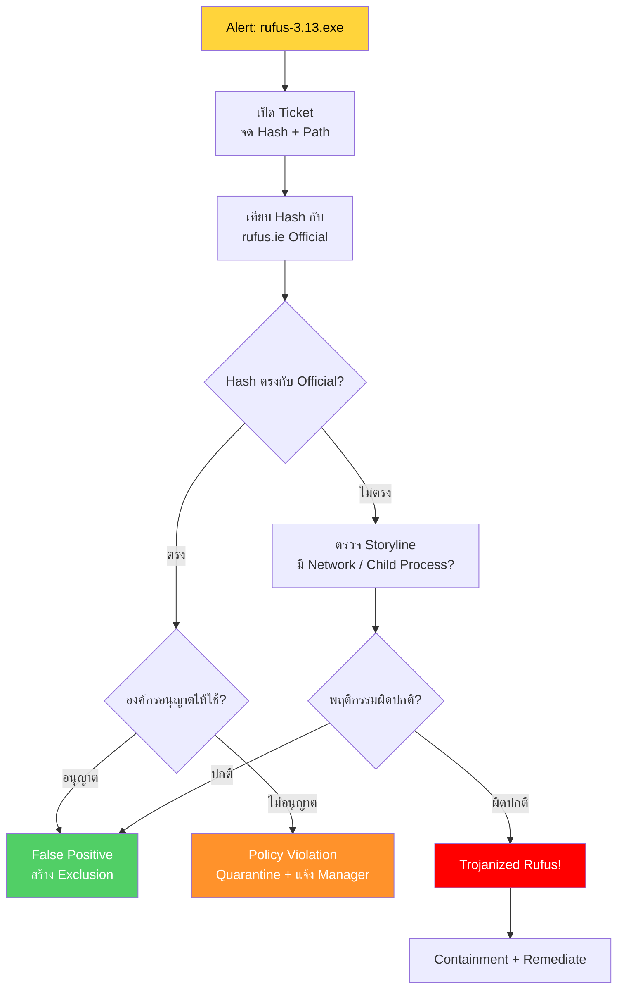

<h1 align="center">🛡️ PB-05: rufus-3.13.exe detected as Malware</h1>

  
  
  

---

## สรุปสั้นๆ

| รายการ | รายละเอียด |
|:------:|:-----------|
| **Alert** | `rufus-3.13.exe detected as Malware` |
| **ประเภท** | อาจเป็น FP / Trojanized Tool / Policy Violation |
| **True Positive Rate** | ต่ำ — Rufus เป็นเครื่องมือที่ถูกต้อง |
| **SLA** | 1 ชั่วโมง |

> [!NOTE]
> **Rufus** เป็นซอฟต์แวร์ Open Source สำหรับสร้าง USB Bootable Drive — เป็นเครื่องมือที่ถูกกฎหมาย
>
> SentinelOne แจ้งเตือนเพราะ Rufus เข้าถึง Disk โดยตรง ซึ่งเป็นพฤติกรรมคล้ายมัลแวร์
> แต่ก็ต้องระวัง — เพราะมัลแวร์อาจ **ปลอมตัวเป็น Rufus** ได้ (Trojanized)

---

## Flowchart ภาพรวม

---

## ขั้นตอนการทำงาน

### Step 1 — เปิด Ticket

จด File Path, SHA256 Hash, File Size, แหล่งที่มา (ดาวน์โหลดจากไหน)

---

### Step 2 — เทียบ Hash กับ Official

ขั้นตอนนี้สำคัญที่สุดของ Alert นี้:

1. เข้า **[rufus.ie](https://rufus.ie)** → ดู Hash ของ version 3.13
2. เทียบ Hash จาก SentinelOne กับ Hash บนเว็บ

| ผล | ความหมาย |
|:---|:--------|
| Hash ตรง | เป็น Rufus ตัวจริง → อาจ FP หรือ Policy Violation |
| Hash ไม่ตรง | **อาจเป็น Trojanized** → ต้องตรวจเพิ่ม |

3. เช็ค [VirusTotal](https://www.virustotal.com) ด้วย — Detection ≤ 5 มักเป็น FP / Detection > 10 = น่าสงสัย

---

### Step 3 — ดู Path + แหล่งที่มา

| ดาวน์โหลดจากไหน | ความเสี่ยง |
|:---------------|:---------|
| `rufus.ie` (Official) | ต่ำ |
| เว็บอื่น, Torrent | **สูง — อาจ Trojanized** |
| USB หรือ Network Share | ตรวจสอบต้นทาง |

> [!WARNING]
> ถ้าดาวน์โหลดจากเว็บที่ **ไม่ใช่ rufus.ie** ให้ถือว่าน่าสงสัยจนกว่าจะพิสูจน์ได้ว่าปลอดภัย

---

### Step 4 — ตรวจ Storyline (ถ้า Hash ไม่ตรง)

| พฤติกรรม | Rufus จริง | Trojanized |
|:---------|:----------|:----------|
| เข้าถึง USB/Disk | ปกติ | — |
| Network Connection ออกนอก | ไม่ควรมี | **น่าสงสัยมาก** |
| สร้าง Child Process | ไม่ควรมี | **น่าสงสัยมาก** |
| เปลี่ยน Registry | ไม่ควรมี | **น่าสงสัย** |

---

### Step 5 — ตัดสิน (3 ทางเลือก)

| สถานการณ์ | วินิจฉัย | ทำอะไร |
|:---------|:--------|:------|
| Hash ตรง + ไม่มีอะไรผิดปกติ + อนุญาต | **False Positive** | สร้าง Exclusion (ด้วย Hash) |
| Hash ตรง + ไม่ได้อนุญาต | **Policy Violation** | Quarantine + แจ้ง Manager |
| Hash ไม่ตรง + มีพฤติกรรมผิดปกติ | **True Positive** | Containment + Remediate |

---

## เมื่อไหร่ต้องแจ้งหัวหน้า

| สถานการณ์ | แจ้งใคร |
|:---------|:--------|
| ยืนยัน Trojanized Rufus | SOC Manager |
| พบ Rufus หลายเครื่อง (มีคนแจกกัน) | SOC Manager + IT |

---

## ป้องกันไม่ให้เจออีก

- ตั้ง **Application Control** Block ซอฟต์แวร์ที่ไม่ได้รับอนุญาต
- ถ้าต้องใช้ → ดาวน์โหลดจาก **rufus.ie** เท่านั้น แล้ว Whitelist ด้วย Hash
- จำกัดให้เฉพาะ **IT Team** ใช้

---

<i>SOC Team — TW Site | อัปเดตล่าสุด: มีนาคม 2026</i>

