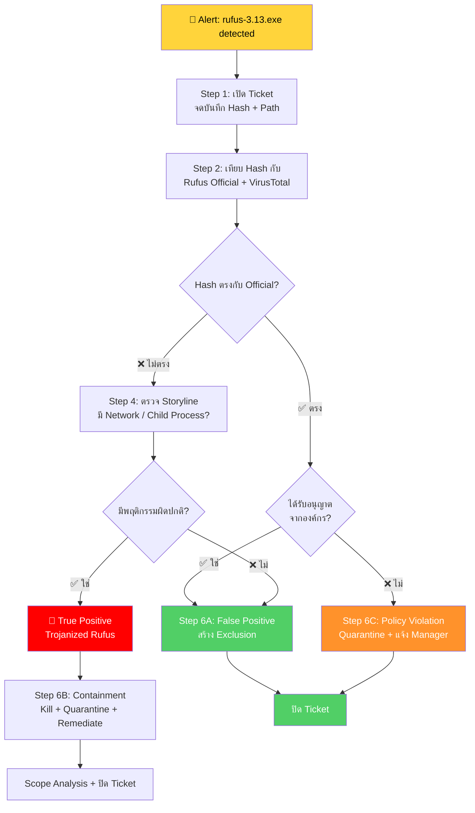

<h1 align="center">🛡️ PB-05: rufus-3.13.exe detected as Malware</h1>

  
  
  

---

## 🎯 Quick Reference

| รายการ | รายละเอียด |
|:------:|:-----------|
| **Alert** | `rufus-3.13.exe detected as Malware` |
| **ประเภท** | False Positive / Trojanized Tool / Policy Violation |
| **True Positive Rate** | ต่ำ-กลาง — Rufus เป็น Legitimate Tool |
| **SLA** | ≤ 1 ชั่วโมง |

> [!NOTE]
> **Rufus** เป็นซอฟต์แวร์ Open Source สำหรับสร้าง USB Bootable Drive ที่ **ถูกกฎหมาย**
> แต่ SentinelOne ตรวจจับเพราะมีพฤติกรรมคล้ายมัลแวร์ (เข้าถึง Disk โดยตรง, เปลี่ยน Boot Sector)
> 
> ⚠️ แม้จะเป็นซอฟต์แวร์ที่ถูกต้อง แต่ถ้า **ไม่ได้รับอนุญาตจากองค์กร** = **Policy Violation**

---

## 📊 Flowchart การตอบสนอง

---

## 📋 ขั้นตอนการตอบสนอง

### 🔹 Step 1 — รับ Alert และเปิด Incident Ticket
จดบันทึก File Path, SHA256 Hash, File Size, แหล่งที่มา

### 🔹 Step 2 — เทียบ Hash กับ Rufus Official ⭐

1. ไปที่ **[rufus.ie](https://rufus.ie)** → ดู Official Hash ของ version 3.13
2. เทียบ Hash:

| ผลการเทียบ | 🚦 ความหมาย |
|:---------|:-----------|
| ✅ Hash ตรง | FP (แต่อาจเป็น Policy Violation) |
| ❌ Hash ไม่ตรง | อาจเป็น **Trojanized** หรือมัลแวร์ปลอมตัว |

3. ตรวจ **[VirusTotal](https://www.virustotal.com)**: Detection ≤ 5 (Generic) = อาจ FP / Detection > 10 = Malicious

### 🔹 Step 3 — ตรวจสอบ File Path + แหล่งที่มา

| File Path | 📎 ที่มา |
|:---------|:--------|
| `Downloads\` | ดาวน์โหลดจาก Internet |
| `Desktop\` | Copy มา USB/Download |
| USB Drive (`D:\`, `E:\`) | จาก USB |
| Network Share | แชร์ภายในองค์กร |

> [!WARNING]
> ถ้าดาวน์โหลดจากเว็บ **ที่ไม่ใช่** `rufus.ie` → **น่าสงสัยมาก!**

### 🔹 Step 4 — ตรวจ Storyline

| พฤติกรรม | ✅ ปกติ (Rufus จริง) | ❌ ผิดปกติ |
|:---------|:-----------------|:----------|
| เข้าถึง USB/Disk | ✅ | — |
| Network Connection ภายนอก | — | ⚠️ Rufus จริงไม่ต้อง Connect |
| สร้าง Child Process | — | ⚠️ น่าสงสัยมาก |
| เปลี่ยน Registry | — | ⚠️ น่าสงสัย |

### 🔹 Step 5 — การตัดสินใจ (3 ทางเลือก)

| ผลตรวจสอบ | 🚦 วินิจฉัย | ➡️ ดำเนินการ |
|:---------|:----------|:-----------|
| Hash ตรง + ไม่มีอะไรผิดปกติ | ✅ **False Positive** | สร้าง Exclusion |
| Hash ไม่ตรง + พฤติกรรมผิดปกติ | 🔴 **True Positive** | Containment + Remediate |
| Hash ตรง แต่ไม่ได้รับอนุญาต | 🟠 **Policy Violation** | Quarantine + แจ้ง Manager |

---

## 🚨 Escalation Criteria

| สถานการณ์ | 🎬 ดำเนินการ |
|:---------|:------------|
| ยืนยัน Trojanized Rufus | 🟠 แจ้ง SOC Manager |
| พบ Rufus หลายเครื่อง | 🟠 แจ้ง SOC Manager + IT |

---

## 🛡️ แนวทางป้องกัน

- ✅ ตั้ง **Application Control** Block ซอฟต์แวร์ที่ไม่ได้รับอนุญาต
- ✅ ถ้าต้องใช้ → ดาวน์โหลดจาก **rufus.ie** เท่านั้น + Whitelist Hash
- ✅ จำกัดให้เฉพาะ **IT Team** ใช้

---

<i>📅 สร้างโดย SOC Team — อัปเดตล่าสุด: มีนาคม 2026</i>

