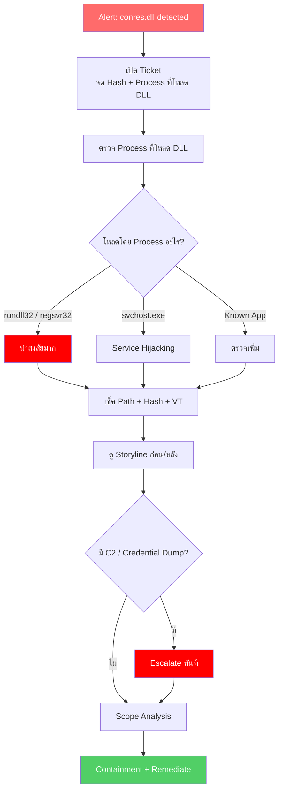

<h1 align="center">🛡️ PB-06: conres.dll detected as Malware</h1>

  
  
  

---

## สรุปสั้นๆ

| รายการ | รายละเอียด |
|:------:|:-----------|
| **Alert** | `conres.dll detected as Malware` |
| **ประเภท** | DLL Injection / DLL Hijacking |
| **True Positive Rate** | สูง — ไม่ใช่ DLL ของ Windows |
| **SLA** | 30 นาที |

> [!CAUTION]
> `conres.dll` ไม่ใช่ DLL มาตรฐานของ Windows — โอกาสเป็น True Positive สูงมาก
>
> DLL เป็นไฟล์ที่มัลแวร์ชอบใช้ เพราะไม่รันเอง ต้องถูกโหลดโดย Process อื่น ทำให้ตรวจจับยากกว่าไฟล์ .exe

---

## Flowchart ภาพรวม

---

## ขั้นตอนการทำงาน

### Step 1 — เปิด Ticket

จด File Path, Hash, และที่สำคัญที่สุดคือ **Process ไหนโหลด DLL นี้** — เพราะจะบอกได้ว่าเทคนิคอะไร

---

### Step 2 — ดูว่า Process ไหนโหลด DLL

| Process ที่โหลด | ความหมาย |
|:---------------|:---------|
| `rundll32.exe` | น่าสงสัยมาก — มัลแวร์ชอบใช้ rundll32 รัน DLL |
| `regsvr32.exe` | น่าสงสัย — Silent Registration |
| `svchost.exe` | Service Hijacking — ยึด Service ของ Windows |
| `explorer.exe` | DLL Hijacking — วาง DLL ปลอมให้ Explorer โหลด |
| ซอฟต์แวร์ที่รู้จัก | ตรวจเพิ่ม — อาจเป็น FP ก็ได้ |

---

### Step 3 — ตรวจ Path + Hash

**File Path** ที่ต้องระวัง:
- `C:\Windows\Temp\` — เสี่ยงสูง
- `C:\Users\<user>\AppData\` — เสี่ยงสูง
- `C:\ProgramData\` — เสี่ยงสูงมาก

Copy Hash ไปเช็ค [VirusTotal](https://www.virustotal.com) → ดู Detection Rate, Family Name, Behavior

---

### Step 4 — ดู Storyline (ก่อน + หลัง)

DLL Injection มักมีหลายขั้นตอน ดูทั้งก่อนและหลัง:

| ช่วง | สิ่งที่ต้องดู |
|:-----|:-----------|
| **ก่อน** DLL โหลด | มาจาก Email? Download? USB? มี Dropper วางไฟล์ก่อน? |
| **หลัง** DLL โหลด | มี Network Connection? สร้างไฟล์เพิ่ม? แก้ Registry? Dump Credentials? |

---

### Step 5-7 — กักกัน + แก้ไข

1. **Isolate เครื่อง**
2. **Kill** Process ที่โหลด DLL
3. **Quarantine** ไฟล์ `conres.dll` + Dropper (ถ้ามี)
4. **Remediate** + ลบ Persistence (Services, Registry, Scheduled Tasks)

รอ 15-30 นาที → ตรวจ Alert ใหม่ → ปลด Quarantine → ปิด Ticket

---

## เมื่อไหร่ต้องแจ้งหัวหน้า

| สถานการณ์ | แจ้งใคร |
|:---------|:--------|
| DLL เป็น Cobalt Strike Beacon | SOC Manager + IR Team **ทันที** |
| มี Data Exfiltration | SOC Manager + Management |
| มี Credential Dumping | SOC Manager + IT (Reset Passwords) |
| พบ DLL หลายเครื่อง | SOC Manager |

---

## ป้องกันไม่ให้เจออีก

- ตั้ง SentinelOne เป็น **Protect** mode
- Enable **DLL Load Monitoring** ใน Deep Visibility
- จำกัด `rundll32.exe` / `regsvr32.exe` ด้วย Application Control
- Monitor DLL ในโฟลเดอร์ `Temp`, `AppData`, `ProgramData`
- Block C2 IP/Domain ที่ **Fortigate** และ **Palo Alto**
- ตั้ง **Symantec** กรอง DLL ใน Email Attachment

---

<i>SOC Team — TW Site | อัปเดตล่าสุด: มีนาคม 2026</i>

