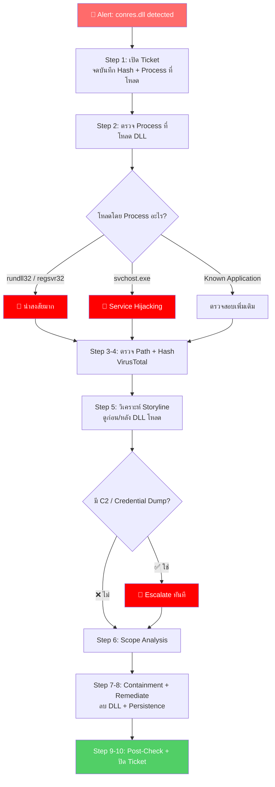

<h1 align="center">🛡️ PB-06: conres.dll detected as Malware</h1>

  
  
  

---

## 🎯 Quick Reference

| รายการ | รายละเอียด |
|:------:|:-----------|
| **Alert** | `conres.dll detected as Malware` |
| **ประเภท** | DLL Injection / DLL Hijacking |
| **True Positive Rate** | สูง — ไม่ใช่ DLL มาตรฐานของ Windows |
| **SLA** | ≤ 30 นาที |

> [!CAUTION]
> **conres.dll ไม่ใช่ DLL มาตรฐานของ Windows** → มีโอกาสสูงที่จะเป็น **True Positive**
> 
> DLL เป็นไฟล์ที่มัลแวร์ชอบใช้เพราะ: ไม่รันด้วยตัวเอง → ต้องถูกโหลดโดย Process อื่น → **ยากต่อการตรวจจับ**

---

## 📊 Flowchart การตอบสนอง

---

## 📋 ขั้นตอนการตอบสนอง

### 🔹 Step 1 — รับ Alert และเปิด Incident Ticket
จดบันทึก File Path, SHA256 Hash, **Process ที่โหลด DLL** ⭐

### 🔹 Step 2 — ตรวจสอบ Process ที่โหลด DLL ⭐

| Process ที่โหลด DLL | 🚦 ความเสี่ยง |
|:--------------------|:-------------|
| `rundll32.exe` | 🔴 **น่าสงสัยมาก** — มัลแวร์ใช้ rundll32 รัน DLL |
| `regsvr32.exe` | 🔴 **น่าสงสัย** — Silent Registration |
| `svchost.exe` | 🔴 **Service Hijacking** |
| `explorer.exe` | 🟠 **DLL Hijacking** |
| ซอฟต์แวร์ที่รู้จัก | 🟡 ตรวจสอบเพิ่ม — อาจ FP |

### 🔹 Step 3 — ตรวจสอบ File Path

| File Path | 🚦 ความเสี่ยง |
|:---------|:-------------|
| `C:\Windows\Temp\` | 🔴 **สูง** |
| `C:\Users\<user>\AppData\` | 🔴 **สูง** |
| `C:\ProgramData\` | 🔴 **สูงมาก** |
| ร่วมกับ Application ที่ติดตั้ง | 🟡 ต่ำ-กลาง |

### 🔹 Step 4 — ตรวจ Hash VirusTotal
ค้นหา Hash → ดู Detection Rate, Family Name, Behavior Tab

### 🔹 Step 5 — วิเคราะห์ Storyline (ก่อน + หลัง)

| ช่วงเวลา | สิ่งที่ต้องดู |
|:---------|:-----------|
| **ก่อน** DLL โหลด | มาจาก Email? Download? USB? มี Dropper? |
| **หลัง** DLL โหลด | Network Connection? สร้างไฟล์? Registry? Credential Dump? |

### 🔹 Step 6-8 — Containment + Remediation

| ลำดับ | การดำเนินการ |
|:-----:|:------------|
| 1️⃣ | **Network Quarantine** เครื่อง |
| 2️⃣ | **Kill** Process ที่โหลด DLL |
| 3️⃣ | **Quarantine** file `conres.dll` + Dropper |
| 4️⃣ | **Remediate** + ลบ Persistence (Services, Registry, Scheduled Tasks) |

### 🔹 Step 9-10 — Post-Check + ปิด Ticket
⏱️ รอ 15-30 นาที → ตรวจสอบ → ปลด Quarantine → ปิด Ticket

---

## 🚨 Escalation Criteria

| สถานการณ์ | 🎬 ดำเนินการ |
|:---------|:------------|
| DLL เป็น Cobalt Strike Beacon | 🔴 แจ้ง SOC Manager + **IR Team ทันที** |
| มี Data Exfiltration | 🔴 แจ้ง SOC Manager + **Management** |
| มี Credential Dumping | 🔴 แจ้ง SOC Manager + **IT (Reset Passwords)** |
| พบ DLL หลายเครื่อง | 🟠 แจ้ง SOC Manager |

---

## 🛡️ แนวทางป้องกัน

- ✅ ตั้ง SentinelOne Policy เป็น **Protect** mode
- ✅ Enable **DLL Load Monitoring** ใน Deep Visibility
- ✅ จำกัด `rundll32.exe` / `regsvr32.exe` ด้วย Application Control
- ✅ Monitor DLL ในโฟลเดอร์ `Temp`, `AppData`, `ProgramData`

---

<i>📅 สร้างโดย SOC Team — อัปเดตล่าสุด: มีนาคม 2026</i>

