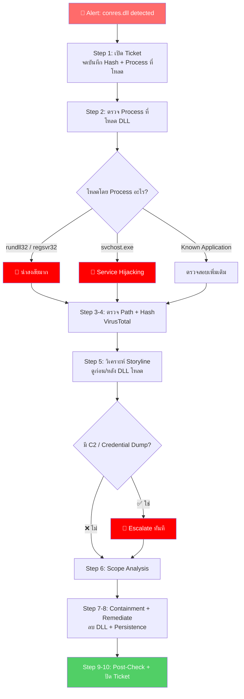

# PB-06: conres.dll detected as Malware

| รายการ | รายละเอียด |
|--------|-----------|
| **Alert Name** | conres.dll detected as Malware |
| **Severity** | 🟠 High |
| **MITRE ATT&CK** | T1574.001 (Hijack Execution Flow: DLL Search Order Hijacking), T1055.001 (Process Injection: DLL Injection) |
| **Platform** | SentinelOne EDR/XDR |
| **วันที่สร้าง** | มีนาคม 2026 |

---

## 1. ภาพรวมของ Alert

**conres.dll** เป็นไฟล์ DLL ที่ถูกตรวจพบว่าเป็น Malware  

**DLL (Dynamic Link Library)** คือไฟล์ที่ Program ต่างๆ เรียกใช้เพื่อทำงาน มัลแวร์มักใช้ DLL เพราะ:
- DLL ไม่สามารถรันด้วยตัวเอง → ต้องถูกโหลดโดย Process อื่น → **ยากต่อการตรวจจับ**
- สามารถ Inject เข้าไปใน Process ที่ถูกต้อง → **ซ่อนตัวได้ดี**
- Antivirus บางตัวไม่ Scan DLL อย่างละเอียด

**conres.dll ไม่ใช่ DLL มาตรฐานของ Windows** ดังนั้นมีโอกาสสูงที่จะเป็น **True Positive**

---

## 📊 Flowchart การตอบสนอง



---

## 2. ขั้นตอนการตอบสนอง (Response Steps)

### Step 1: รับ Alert และเปิด Incident Ticket
1. เข้า **SentinelOne Console** → **Incidents / Threats**
2. ค้นหา Alert: `conres.dll detected as Malware`
3. จดบันทึก:
   - **Endpoint Name**, **IP Address**, **Logged-in User**
   - **File Path** ของ `conres.dll`
   - **SHA256 Hash**
   - **Process ที่โหลด DLL นี้** ← **สำคัญมาก!**
   - **Timestamp**
4. เปิด Incident Ticket

### Step 2: ตรวจสอบ Process ที่โหลด conres.dll
1. เข้า **Attack Storyline** ใน SentinelOne
2. ดูว่า Process อะไร **โหลด** `conres.dll`:

| Process ที่โหลด DLL | ความหมาย |
|--------------------|---------|
| `rundll32.exe` | มัลแวร์ใช้ rundll32 เพื่อรัน DLL ≥ **น่าสงสัยมาก** |
| `regsvr32.exe` | Register DLL → **น่าสงสัย** |
| `svchost.exe` | อาจเป็น Service Hijacking → **น่าสงสัยมาก** |
| ซอฟต์แวร์ที่รู้จัก (เช่น Application XYZ) | อาจเป็น FP → ตรวจสอบเพิ่ม |
| `explorer.exe` | DLL Hijacking → **น่าสงสัย** |

3. ดู **Command Line** ที่ใช้โหลด DLL:
   - ⚠️ `rundll32.exe conres.dll,EntryPoint` → Malware ใช้ Entry Point ใน DLL
   - ⚠️ `regsvr32.exe /s conres.dll` → Silent Registration

### Step 3: ตรวจสอบ File Path
1. ดู Path ของ `conres.dll`:

| File Path | ความเสี่ยง |
|-----------|----------|
| `C:\Windows\System32\` | ตรวจสอบว่าเป็น DLL ของ Windows จริงหรือไม่ |
| `C:\Windows\Temp\` | **สูง** — มัลแวร์วาง DLL ที่นี่บ่อย |
| `C:\Users\<user>\AppData\` | **สูง** — โฟลเดอร์ที่มัลแวร์ชอบใช้ |
| `C:\ProgramData\` | **สูงมาก** — มักเป็นจุดซ่อน Malware |
| ร่วมกับ Application ที่ติดตั้ง | **ต่ำ-กลาง** — อาจเป็นส่วนหนึ่งของซอฟต์แวร์ |

### Step 4: ตรวจสอบ Hash ด้วย Threat Intelligence
1. คัดลอก **SHA256 Hash**
2. ค้นหาใน **VirusTotal**:
   - ดู Detection Rate
   - ดู **Family Name** → เช่น Agent Tesla, Emotet, Cobalt Strike Beacon
   - ดู **Behavior Tab** → ดูว่า DLL ทำอะไรใน Sandbox
3. ถ้าเป็น DLL ของซอฟต์แวร์ที่ถูกต้อง:
   - VirusTotal จะแสดง Signer / Publisher
   - Detection Rate จะต่ำมาก
4. บันทึกผล

### Step 5: ตรวจสอบ Attack Storyline อย่างละเอียด
1. ตรวจสอบ **ก่อน** `conres.dll` ถูกโหลด:
   - มาจาก Email? Download? USB?
   - มี Dropper หรือ Loader ก่อนหน้าหรือไม่
2. ตรวจสอบ **หลัง** `conres.dll` ถูกโหลด:
   - **Network Connections**: ติดต่อ C2 Server หรือไม่
   - **File Operations**: สร้างไฟล์อื่นหรือไม่
   - **Registry Changes**: แก้ไข Registry สำหรับ Persistence หรือไม่
   - **Credential Access**: พยายาม Dump Credentials หรือไม่
3. **Screenshot** Attack Storyline

### Step 6: ตรวจสอบการแพร่กระจาย
1. **Deep Visibility** → ค้นหา:
   ```
   FileName = "conres.dll"
   ```
2. ค้นหาด้วย Hash:
   ```
   FileSHA256 = "<Hash>"
   ```
3. ถ้าพบหลายเครื่อง → **Escalate**

### Step 7: Containment
1. **Network Quarantine** เครื่อง
2. **Kill** Process ที่โหลด DLL:
   - ถ้าเป็น `rundll32.exe` → Kill ปลอดภัย
   - ถ้าเป็น `svchost.exe` → Kill โดย Windows จะ Restart Service
3. **Quarantine** ไฟล์ `conres.dll`
4. ถ้ามี Dropper/Loader → Quarantine ด้วย

### Step 8: Remediation
1. **Remediate** ผ่าน SentinelOne → **"Actions"** → **"Remediate"**
2. ตรวจสอบและลบ **Persistence**:
   - **Services**: ตรวจสอบว่ามี Service ที่โหลด `conres.dll`
   - **Registry**: ดู `HKLM\SOFTWARE\Microsoft\Windows\CurrentVersion\Run`
   - **Scheduled Tasks**: ตรวจสอบ Task ที่เรียก `rundll32.exe + conres.dll`
   - **DLL Search Order Hijacking**: ตรวจสอบว่า DLL ถูกวางในที่ที่ Application จะโหลดก่อน
3. **Rollback** ถ้าจำเป็น

### Step 9: Post-Remediation Check
1. รอ 15-30 นาที
2. ตรวจสอบ:
   - ไม่มี Alert ใหม่
   - Process ที่เกี่ยวข้องไม่ทำงานอีก
   - ไม่มี Network Connection ผิดปกติ
3. ปลด Network Quarantine
4. แจ้ง End User

### Step 10: อัปเดต Verdict และปิด Incident
1. ตั้ง **Analyst Verdict**
2. สรุปใน Incident Ticket:
   - DLL ทำอะไร (Behavior)
   - มาจากไหน (Source)
   - ส่งผลกระทบอะไร (Impact)
3. ปิด Ticket

---

## 3. Escalation Criteria

| สถานการณ์ | ดำเนินการ |
|-----------|----------|
| DLL เป็น Cobalt Strike Beacon | แจ้ง SOC Manager + IR Team ทันที |
| มี Data Exfiltration | แจ้ง SOC Manager + Management |
| พบ DLL หลายเครื่อง | แจ้ง SOC Manager |
| มี Credential Dumping | แจ้ง SOC Manager + IT (Reset Passwords) |

---

## 4. แนวทางป้องกัน

- ตั้ง SentinelOne Policy เป็น **Protect** mode
- Enable **DLL Load Monitoring** ใน Deep Visibility
- จำกัด `rundll32.exe` และ `regsvr32.exe` ด้วย Application Control
- Monitor DLL ที่ถูกวางในโฟลเดอร์ `Temp`, `AppData`, `ProgramData`
- ติดตั้ง Windows Security Updates สม่ำเสมอ
