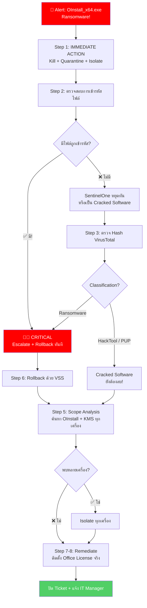

<h1 align="center">🚨 PB-07: OInstall_x64.exe detected as Ransomware</h1>

<p align="center">
  
  
  
</p>

---

## 🎯 Quick Reference

| รายการ | รายละเอียด |
|:------:|:-----------|
| **Alert** | `OInstall_x64.exe detected as Ransomware` |
| **ประเภท** | Pirated Office Installer + Ransomware/Cryptominer |
| **True Positive Rate** | สูงมาก — ไฟล์นี้ต้องถูกลบเสมอ |
| **SLA** | ≤ **15 นาที** |

> [!CAUTION]
> **OInstall_x64.exe** คือ **Office C2R Install** — เครื่องมือโจรสลัดที่ใช้ติดตั้ง Office โดยไม่มี License
> 
> 🔴 **ไม่ว่าจะเป็นอะไร → ไฟล์นี้ต้องถูกลบออก** เพราะ:
> 1. บาง Version ฝัง **Ransomware** หรือ **Cryptominer** จริง
> 2. มีพฤติกรรมคล้าย Malware (แก้ไข System Files, Disable Security)
> 3. เป็น **ซอฟต์แวร์ละเมิดลิขสิทธิ์**

---

## 📊 Flowchart การตอบสนอง



---

## 📋 ขั้นตอนการตอบสนอง

### 🔹 Step 1 — 🚨 IMMEDIATE ACTIONS (ดำเนินการทันที!)

> [!CAUTION]
> เนื่องจาก Alert เป็น **Ransomware** → ดำเนินการ **ทันที** ก่อนวิเคราะห์!

| ลำดับ | ⚡ ดำเนินการทันที | วิธีทำ |
|:-----:|:-----------------|:------|
| 1️⃣ | **Kill + Quarantine** | Actions → "Kill" → "Quarantine" |
| 2️⃣ | **Isolate เครื่อง** | Sentinels → Actions → "Disconnect from Network" |
| 3️⃣ | **เปิด Ticket** | Severity = **Critical** |

### 🔹 Step 2 — ตรวจสอบการเข้ารหัสไฟล์ ⭐

| สัญญาณ | ⚠️ ความหมาย |
|:-------|:-----------|
| File Extension เปลี่ยนเป็น `.encrypted`, `.locked` | 🔴 **Ransomware กำลังทำงาน!** |
| พบไฟล์ `HOW_TO_DECRYPT.txt` | 🔴 **Ransomware เข้ารหัสแล้ว!** |
| ไม่มีการเปลี่ยนแปลงไฟล์ | ✅ SentinelOne หยุดทัน / Cracked SW |

### 🔹 Step 3 — ตรวจ Hash VirusTotal

| Classification | ความหมาย |
|:-------------|:---------|
| Ransomware | 🔴 **Critical** — Escalate ทันที |
| HackTool / PUP | 🟠 Cracked Software — ยังอันตราย ต้องลบ |

### 🔹 Step 4-5 — Storyline + Scope Analysis

ค้นหา:
```
FileName = "OInstall_x64.exe" OR FileName Contains "KMSPico" OR FileName Contains "KMSAuto"
```

### 🔹 Step 6 — Remediation + Rollback

| การดำเนินการ | รายละเอียด |
|:------------|:----------|
| **Remediate** | Actions → "Remediate" |
| **Rollback** (ถ้ามีเข้ารหัส) | Actions → "Rollback" (VSS Snapshot) |
| **ตรวจ Persistence** | ลบ Services, Scheduled Tasks, Registry |
| **ตรวจ Defender** | ให้แน่ใจว่า Defender ถูก Enable กลับ |
| **Office License** | แจ้ง IT ติดตั้ง License ที่ถูกต้อง |

### 🔹 Step 7-8 — Post-Check + ปิด Incident

> [!IMPORTANT]
> Analyst Verdict = **True Positive เสมอ** (แม้เป็น Cracked SW ที่ไม่ใช่ Ransomware จริง)
> แจ้ง **IT Manager** เพื่อดำเนินการด้าน HR/Policy ถ้าจำเป็น

---

## 🚨 Escalation Criteria

| สถานการณ์ | 🎬 ดำเนินการ |
|:---------|:------------|
| มีการเข้ารหัสไฟล์ (Ransomware Active) | 🔴🔴 แจ้ง SOC Manager + **IR Team ทันที** |
| Rollback ไม่สำเร็จ | 🔴 แจ้ง SOC Manager + **IT Backup Team** |
| ข้อมูลสำคัญถูกเข้ารหัส | 🔴 แจ้ง SOC Manager + **Management** |
| พบหลายเครื่อง | 🟠 แจ้ง SOC Manager |

---

## 🛡️ แนวทางป้องกัน

- 🚫 **ห้ามใช้ Cracked/Pirated Software** อย่างเด็ดขาด
- ✅ ติดตั้ง **Microsoft Office License** ที่ถูกต้องให้ทุกเครื่อง
- ✅ ตั้ง **Application Control** Block `OInstall`, `KMSPico`, `KMSAuto`
- ✅ **Enable VSS** ใน SentinelOne Agent เพื่อให้ Rollback ได้
- ✅ Block Download URL ของ Cracked SW ที่ **Fortigate / Palo Alto URL Filtering**
- ✅ อบรมผู้ใช้เรื่อง **ความเสี่ยงของ Pirated Software**

---

<p align="center"><i>📅 สร้างโดย SOC Team — อัปเดตล่าสุด: มีนาคม 2026</i></p>
