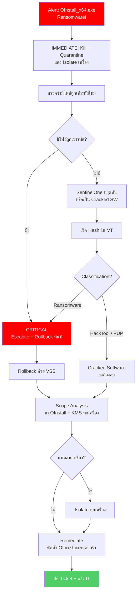

<h1 align="center">🚨 PB-07: OInstall_x64.exe detected as Ransomware</h1>

<p align="center">
  
  
  
</p>

---

## สรุปสั้นๆ

| รายการ | รายละเอียด |
|:------:|:-----------|
| **Alert** | `OInstall_x64.exe detected as Ransomware` |
| **ประเภท** | Pirated Office Installer — อาจฝัง Ransomware หรือ Cryptominer |
| **True Positive Rate** | สูงมาก — ต้องลบทุกกรณี |
| **SLA** | 15 นาที |

> [!CAUTION]
> `OInstall_x64.exe` คือ **Office C2R Install** — เครื่องมือติดตั้ง Office โดยไม่มี License (Pirated)
>
> ไม่ว่าจะเป็น Ransomware จริงหรือแค่ Cracked Software → **ต้องลบออกทุกกรณี** เพราะ:
> 1. บาง Version ฝัง Ransomware หรือ Cryptominer มาด้วย
> 2. ตัวมันเองแก้ไข System Files และปิด Security Features
> 3. เป็นซอฟต์แวร์ละเมิดลิขสิทธิ์ — มีความเสี่ยงทางกฎหมาย

---

## Flowchart ภาพรวม



---

## ขั้นตอนการทำงาน

### Step 1 — ทำทันที! ห้ามรอ

เพราะ Alert นี้เป็น **Ransomware** ให้ทำ 3 อย่างนี้ **ก่อนวิเคราะห์**:

1. **Kill + Quarantine** → Actions → "Kill" แล้ว "Quarantine"
2. **Isolate เครื่อง** → Sentinels → "Disconnect from Network"
3. **เปิด Ticket** → ตั้ง Severity = Critical

ใช้เวลาไม่ถึง 2 นาที แต่ช่วยหยุดความเสียหายได้ทั้งหมด

---

### Step 2 — ตรวจว่ามีไฟล์ถูกเข้ารหัสไหม

นี่คือจุดตัดสินว่าเป็น Ransomware ที่ทำงานจริงหรือแค่ Cracked Software:

| สัญญาณ | ความหมาย |
|:-------|:---------|
| File Extension เปลี่ยนเป็น `.encrypted`, `.locked` | **Ransomware กำลังทำงาน!** |
| พบ `HOW_TO_DECRYPT.txt` หรือ Ransom Note | **Ransomware เข้ารหัสแล้ว!** |
| ไม่มีการเปลี่ยนแปลงไฟล์ | SentinelOne หยุดทัน หรือเป็นแค่ Cracked SW |

ถ้ามีการเข้ารหัสไฟล์ → **แจ้ง SOC Manager + IR Team ทันที** อย่ารอ

---

### Step 3 — เช็ค Hash ใน VirusTotal

Copy Hash ไปเช็คแล้วดูว่า VT บอกว่าเป็นอะไร:

- **Ransomware** → ยืนยัน Critical → ทำ Rollback ด้วย (Step 6)
- **HackTool / PUP** → เป็น Cracked Software **แต่ยังต้องลบ** เพราะผิดนโยบาย

---

### Step 4-5 — ดู Storyline + หาเครื่องอื่น

ดู Attack Storyline ว่ามัลแวร์ทำอะไรบ้าง — ปิด Defender? แก้ Registry? สร้าง Scheduled Task?

แล้วค้นหาในทุกเครื่อง:
```
FileName = "OInstall_x64.exe" OR FileName Contains "KMSPico" OR FileName Contains "KMSAuto"
```

เจอหลายเครื่องไม่แปลก — เพราะถ้าคนหนึ่งใช้ อาจแชร์ให้คนอื่นด้วย

---

### Step 6 — Remediate + Rollback

| ทำอะไร | รายละเอียด |
|:------|:---------|
| **Remediate** | กด Actions → "Remediate" |
| **Rollback** (ถ้ามีเข้ารหัส) | กด "Rollback" ใช้ VSS Snapshot คืนค่าไฟล์ |
| **ตรวจ Persistence** | ลบ Services, Scheduled Tasks, Registry ที่มัลแวร์สร้าง |
| **ตรวจ Defender** | ดูว่า Defender ยังเปิดอยู่ไหม ถ้าถูกปิด → เปิดกลับ |
| **Office License** | แจ้ง IT ติดตั้ง License ที่ถูกต้อง |

---

### Step 7-8 — ตรวจซ้ำแล้วปิด Ticket

Analyst Verdict ของ Alert นี้ = **True Positive เสมอ** แม้ว่า VT จะบอกว่าเป็นแค่ HackTool

> [!IMPORTANT]
> แจ้ง **IT Manager** ด้วย — เพราะการใช้ Pirated Software อาจต้องดำเนินการทาง HR หรือ Policy
> ไม่ใช่หน้าที่ SOC ตัดสินเรื่องนี้ แต่ต้องแจ้งให้คนที่รับผิดชอบรู้

---

## เมื่อไหร่ต้องแจ้งหัวหน้า

| สถานการณ์ | แจ้งใคร |
|:---------|:--------|
| มีการเข้ารหัสไฟล์จริง | SOC Manager + IR Team **ทันที** |
| Rollback ไม่สำเร็จ | SOC Manager + IT Backup Team |
| ข้อมูลสำคัญถูกเข้ารหัส | SOC Manager + Management |
| พบหลายเครื่อง | SOC Manager |

---

## ป้องกันไม่ให้เจออีก

ปัญหารากเหง้าคือ **การใช้ซอฟต์แวร์ละเมิดลิขสิทธิ์** ดังนั้น:

- **ห้ามใช้ Cracked Software** ทุกกรณี — ต้องบังคับเป็นนโยบาย
- ติดตั้ง **Office License ที่ถูกต้อง** ให้ทุกเครื่อง
- ตั้ง **Application Control** Block ชื่อ `OInstall`, `KMSPico`, `KMSAuto`
- **Enable VSS** ใน SentinelOne Agent → ถ้าโดน Ransomware จริง Rollback ได้
- Block URL ดาวน์โหลด Cracked Software ที่ **Fortigate / Palo Alto URL Filtering**
- สื่อสารกับพนักงานว่า **ซอฟต์แวร์เถื่อนเสี่ยงทั้งมัลแวร์และกฎหมาย**

---

<p align="center"><i>SOC Team — TW Site | อัปเดตล่าสุด: มีนาคม 2026</i></p>
