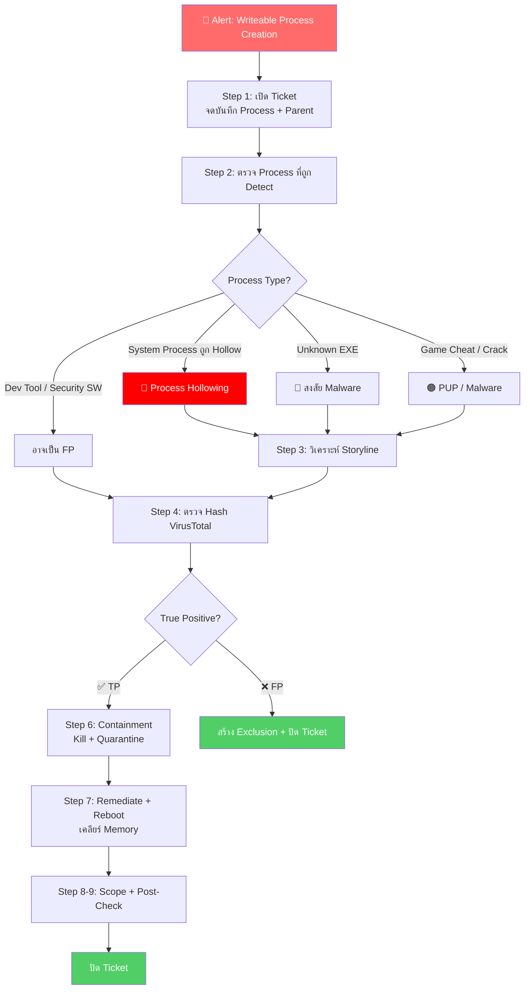

<h1 align="center">🛡️ PB-08: Writeable Process Creation detected</h1>

  
  
  

---

## 🎯 Quick Reference

| รายการ | รายละเอียด |
|:------:|:-----------|
| **Alert** | `Writeable Process Creation detected` |
| **ประเภท** | Process Hollowing / Reflective Injection / Shellcode |
| **True Positive Rate** | สูง — แต่บาง Dev Tools อาจทำให้เกิด FP |
| **SLA** | ≤ 30 นาที |

> [!CAUTION]
> **Writeable Process Creation** = Memory Region เป็น **Write+Execute (WX)** ซึ่งผิดปกติ
> 
> เทคนิคที่ใช้:
> - 💀 **Process Hollowing** — สร้าง Process ปกติ แล้วแทนที่ Code ด้วย Malware
> - 💀 **Reflective DLL Injection** — โหลด DLL เข้า Memory โดยไม่เขียนลง Disk
> - 💀 **Shellcode Execution** — รัน Payload ใน Memory โดยตรง

---

## 📊 Flowchart การตอบสนอง

---

## 📋 ขั้นตอนการตอบสนอง

### 🔹 Step 1 — รับ Alert + เปิด Ticket
จดบันทึก **Process Name**, Process Path, **Parent Process**, SHA256 Hash, Command Line

### 🔹 Step 2 — ตรวจสอบ Process ที่ถูก Detect

| Process Name | 🚦 ความเสี่ยง |
|:------------|:-------------|
| `svchost.exe`, `explorer.exe` ถูก Hollow | 🔴 **สูงมาก** — Process Hollowing |
| Unknown .exe ที่ไม่รู้จัก | 🔴 **สูง** — อาจเป็น Malware |
| Game Cheat / Crack | 🟠 **สูง** — อาจฝังมัลแวร์ |
| ซอฟต์แวร์ Security (AV อื่น) | 🟡 **กลาง** — อาจเป็น FP |
| Development Tools (IDE, Debugger) | 🟡 **กลาง** — JIT Compiler ทำให้เกิด WX |

| Parent Process | 🚦 ระดับ |
|:-------------|:--------|
| `powershell.exe`, `cmd.exe` | ⚠️ **น่าสงสัยมาก** |
| `wscript.exe`, `mshta.exe` | ⚠️ **น่าสงสัยมาก** |
| ซอฟต์แวร์ที่ Sign แล้ว | ✅ อาจเป็น FP |

### 🔹 Step 3 — วิเคราะห์ Storyline

> [!WARNING]
> **สัญญาณ Process Hollowing:**
> 1. Process ถูกสร้างในสถานะ `SUSPENDED`
> 2. มีการ `WriteProcessMemory`
> 3. มีการ `ResumeThread` หลัง Write
>
> **สัญญาณ Shellcode:**
> 1. `VirtualAlloc` ด้วย `PAGE_EXECUTE_READWRITE`
> 2. เขียน Data เข้า Memory แล้วรัน

### 🔹 Step 4 — ตรวจ Hash VirusTotal
ดู Detection Rate, Classification, Relations

### 🔹 Step 5 — ตัดสินใจ

| เงื่อนไข | 🚦 วินิจฉัย |
|:--------|:----------|
| Process Hollowing (Suspended→Write→Resume) | ✅ **True Positive** |
| Unknown Process + C2 Connection | ✅ **True Positive** |
| Game/Crack Software | ✅ **True Positive** |
| Dev Tool ที่ Sign แล้ว (JIT Compiler) | ❌ Possible **FP** |
| Security SW ทำ Runtime Protection | ❌ Possible **FP** |

### 🔹 Step 6-7 — Containment + Remediation

| ลำดับ | การดำเนินการ |
|:-----:|:------------|
| 1️⃣ | **Network Quarantine** |
| 2️⃣ | **Kill Process** |
| 3️⃣ | **Quarantine** ไฟล์ |
| 4️⃣ | **Remediate** |
| 5️⃣ | **Reboot** เครื่อง → เคลียร์ Memory ที่ถูก Inject |
| 6️⃣ | ลบ Persistence + **Full Scan** |

### 🔹 Step 8-9 — Scope + Post-Check + ปิด Ticket

---

## 🚨 Escalation Criteria

| สถานการณ์ | 🎬 ดำเนินการ |
|:---------|:------------|
| ยืนยัน Process Hollowing | 🔴 แจ้ง SOC Manager + **IR Team** |
| พบ Cobalt Strike / Meterpreter | 🔴🔴 แจ้ง SOC Manager + **IR Team ทันที** |
| Server / DC โดน | 🔴 แจ้ง SOC Manager + **IT Team ทันที** |

---

## 🛡️ แนวทางป้องกัน

- ✅ ตั้ง SentinelOne Policy เป็น **Protect** mode
- ✅ Enable **Memory Protection** Features
- ✅ จำกัดการใช้ PowerShell (Constrained Language Mode)
- ✅ Block ซอฟต์แวร์ Crack / Game Cheat

---

<i>📅 สร้างโดย SOC Team — อัปเดตล่าสุด: มีนาคม 2026</i>

