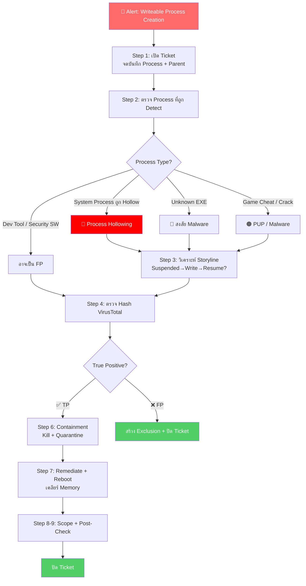

# PB-08: Writeable Process Creation detected

| รายการ | รายละเอียด |
|--------|-----------|
| **Alert Name** | Writeable Process Creation detected |
| **Severity** | 🟠 High |
| **MITRE ATT&CK** | T1055 (Process Injection), T1106 (Native API), T1027 (Obfuscated Files or Information) |
| **Platform** | SentinelOne EDR/XDR |
| **วันที่สร้าง** | มีนาคม 2026 |

---

## 1. ภาพรวมของ Alert

**Writeable Process Creation** หมายถึง การสร้าง Process ที่มี **Memory Region เป็น Writeable + Executable (WX)** ซึ่งผิดปกติ

**ทำไมถึงอันตราย?**
- ในสภาวะปกติ Memory ของ Process จะแยกเป็น **Read+Execute (RX)** สำหรับ Code, และ **Read+Write (RW)** สำหรับ Data
- ถ้า Memory เป็น **Write+Execute** พร้อมกัน → มัลแวร์สามารถ **เขียน Code ใหม่แล้วรันทันที**
- เทคนิคนี้ใช้ใน:
  - 💀 **Process Hollowing**: สร้าง Process ปกติ (เช่น `svchost.exe`) แล้วแทนที่ Code ข้างในด้วย Malware
  - 💀 **Reflective DLL Injection**: โหลด DLL เข้า Memory โดยไม่ต้องเขียนลง Disk
  - 💀 **Shellcode Execution**: รัน Payload ใน Memory โดยตรง

---

## 📊 Flowchart การตอบสนอง

---

## 2. ขั้นตอนการตอบสนอง (Response Steps)

### Step 1: รับ Alert และเปิด Incident Ticket
1. เข้า **SentinelOne Console** → **Incidents / Threats**
2. ค้นหา Alert: `Writeable Process Creation detected`
3. จดบันทึก:
   - **Endpoint Name**, **IP Address**, **Logged-in User**
   - **Process Name** ที่ถูก Detect ← สำคัญมาก!
   - **Process Path**
   - **Parent Process** ← สำคัญมาก!
   - **SHA256 Hash** ของ Process
   - **Command Line Arguments**
   - **Timestamp**
4. เปิด Incident Ticket

### Step 2: ตรวจสอบ Process ที่ถูก Detect
1. ดู **Process Name** ที่ถูก Detect:

| Process Name | ความเสี่ยง |
|-------------|----------|
| `svchost.exe`, `explorer.exe` ที่ถูก Hollow | 🔴 สูงมาก — Process Hollowing |
| Unknown .exe ที่ไม่รู้จัก | 🔴 สูง — อาจเป็น Malware |
| ซอฟต์แวร์ Security (เช่น AV อื่น) | 🟡 กลาง — อาจเป็น FP |
| Development Tools (เช่น IDE, Debugger) | 🟡 กลาง — อาจเป็น FP |
| Game Cheat / Crack | 🟠 สูง — อาจฝังมัลแวร์ |

2. ดู **Parent Process**:
   - ⚠️ Parent = `powershell.exe`, `cmd.exe` → **น่าสงสัยมาก**
   - ⚠️ Parent = `wscript.exe`, `mshta.exe` → **น่าสงสัยมาก**
   - ✅ Parent = ซอฟต์แวร์ที่รู้จักและ Sign → อาจเป็น FP

### Step 3: วิเคราะห์ Attack Storyline
1. คลิก **"Attack Storyline"**
2. ตรวจสอบ **Indicators**:
   - **Process Hollowing Indicators**:
     - Process ถูกสร้างในสถานะ `SUSPENDED`
     - มีการ `WriteProcessMemory` เข้าไปใน Process
     - มีการ `ResumeThread` หลัง Write
   - **Shellcode Indicators**:
     - มีการ `VirtualAlloc` ด้วย `PAGE_EXECUTE_READWRITE`
     - มีการเขียน Data เข้า Memory แล้วรัน
3. ดู **Network Activity**:
   - มี Connection ไปภายนอก? → สงสัย C2
   - Download ไฟล์เพิ่ม? → สงสัย Payload Download
4. ดู **File Activity**:
   - สร้างไฟล์ใหม่? Drop Malware?
   - อ่านไฟล์สำคัญ? (เช่น Credential Files)
5. **Screenshot** Storyline

### Step 4: ตรวจสอบ Hash ด้วย Threat Intelligence
1. คัดลอก **SHA256 Hash** ของ Process
2. ค้นหาใน **VirusTotal**:
   - ดู Detection Rate
   - ดู Classification → Trojan? Backdoor? HackTool?
   - ดู Relations → IP/Domain ที่เกี่ยวข้อง
3. ถ้า Hash เป็นของ Signed Application ที่ถูกต้อง → ตรวจสอบว่าเป็น FP
4. บันทึกผล

### Step 5: การตัดสินใจ

| เงื่อนไข | วินิจฉัย |
|---------|---------|
| Process Hollowing (Suspended→Write→Resume) | ✅ **True Positive** — Process Injection |
| Unknown Process + C2 Connection | ✅ **True Positive** — Malware |
| Game/Crack Software | ✅ **True Positive** — PUP/Malware |
| Development Tool ที่ Sign แล้ว (JIT Compiler) | ❌ **Possible False Positive** |
| Security Software ทำ Runtime Protection | ❌ **Possible False Positive** |

### Step 6: Containment (กรณี True Positive)
1. **Network Quarantine** เครื่อง:
   - SentinelOne → Sentinels → เลือกเครื่อง → **"Disconnect from Network"**
2. **Kill Process**:
   - Threat Details → **"Actions"** → **"Kill"**
   - ⚠️ ถ้าเป็น Process Hollowing ใน `svchost.exe` → Kill ได้ (Windows จะ Restart)
3. **Quarantine** ไฟล์ที่เกี่ยวข้อง

### Step 7: Remediation
1. **Remediate** ผ่าน SentinelOne
2. **Reboot** เครื่อง → เคลียร์ Memory ที่ถูก Inject
3. ตรวจสอบ **Persistence**:
   - Registry Run Keys
   - Scheduled Tasks
   - Windows Services
   - Startup Folder
4. **Full Scan** ด้วย SentinelOne:
   - Sentinels → เลือกเครื่อง → **"Actions"** → **"Initiate Scan"**

### Step 8: ตรวจสอบการแพร่กระจาย
1. **Deep Visibility** → ค้นหาด้วย Hash
2. ค้นหา Parent Process/Script ที่เป็นต้นตอ
3. ถ้าพบหลายเครื่อง → **Isolate ทุกเครื่อง + Escalate**

### Step 9: Post-Remediation Check & ปิด Incident
1. รอ 15-30 นาที → ตรวจสอบ Alert ใหม่
2. ตรวจสอบว่าเครื่องทำงานปกติ
3. ปลด Network Quarantine
4. ตั้ง Analyst Verdict
5. สรุปและปิด Incident Ticket

---

## 3. Escalation Criteria

| สถานการณ์ | ดำเนินการ |
|-----------|----------|
| ยืนยัน Process Hollowing | แจ้ง SOC Manager + IR Team |
| มี C2 Communication | แจ้ง SOC Manager ทันที |
| พบ Cobalt Strike / Meterpreter | 🔴 แจ้ง SOC Manager + IR Team ทันที |
| พบหลายเครื่อง | แจ้ง SOC Manager |
| Server / Domain Controller โดน | 🔴 แจ้ง SOC Manager + IT Team ทันที |

---

## 4. แนวทางป้องกัน

- ตั้ง SentinelOne Policy เป็น **Protect** mode
- Enable **Memory Protection** Features ใน SentinelOne
- ตั้ง **Anti-Exploitation** Rules
- จำกัดการใช้ PowerShell (Constrained Language Mode)
- ติดตั้ง Windows Security Updates (ลด Exploitation Surface)
- Block ซอฟต์แวร์ Crack / Game Cheat ด้วย Application Control
