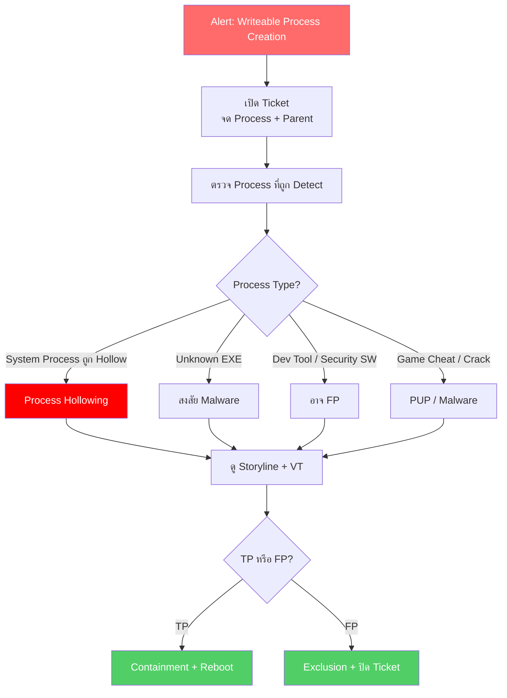

<h1 align="center">🛡️ PB-08: Writeable Process Creation detected</h1>

  
  
  

---

## สรุปสั้นๆ

| รายการ | รายละเอียด |
|:------:|:-----------|
| **Alert** | `Writeable Process Creation detected` |
| **ประเภท** | Process Hollowing / Reflective Injection / Shellcode |
| **True Positive Rate** | สูง — แต่บาง Dev Tools อาจ FP |
| **SLA** | 30 นาที |

> [!CAUTION]
> Alert นี้หมายความว่ามี Memory Region ที่เป็น **Write+Execute** ซึ่งผิดปกติ
>
> เทคนิคที่ทำให้เกิด Alert นี้:
> - **Process Hollowing** — สร้าง Process ปกติ แล้วแทนที่ Code ข้างในด้วย Malware
> - **Reflective DLL Injection** — โหลด DLL เข้า Memory แบบไม่เขียนลง Disk
> - **Shellcode Execution** — รัน Payload ใน Memory โดยตรง
>
> เทคนิคเหล่านี้เป็นของมัลแวร์ระดับสูง เช่น Cobalt Strike, Meterpreter

---

## Flowchart ภาพรวม

---

## ขั้นตอนการทำงาน

### Step 1 — เปิด Ticket

จด **Process Name**, Path, **Parent Process**, Hash, Command Line

---

### Step 2 — ดู Process ที่ถูก Detect

| Process | ความเสี่ยง |
|:--------|:---------|
| svchost / explorer ถูก Hollow | **สูงมาก** — Process Hollowing |
| Unknown .exe ที่ไม่รู้จัก | **สูง** — อาจเป็น Malware |
| Game Cheat / Crack | **สูง** — มักฝังมัลแวร์ |
| Security Software (AV อื่น) | **กลาง** — อาจ FP |
| Dev Tools (IDE, Debugger) | **กลาง** — JIT Compiler ทำให้เกิด WX Memory ได้ |

**Parent Process ที่ต้องระวัง:** `powershell.exe`, `cmd.exe`, `wscript.exe`, `mshta.exe` → ถ้ามาจากพวกนี้ **น่าสงสัยมาก**

---

### Step 3 — ดู Storyline

> [!WARNING]
> **สัญญาณ Process Hollowing:**
> 1. Process ถูกสร้างในสถานะ `SUSPENDED`
> 2. มีการ `WriteProcessMemory`
> 3. แล้ว `ResumeThread` ตามมา
>
> **สัญญาณ Shellcode:**
> 1. `VirtualAlloc` ด้วย `PAGE_EXECUTE_READWRITE`
> 2. เขียน Data เข้า Memory แล้วรัน

---

### Step 4 — เช็ค VT + ตัดสิน

| เงื่อนไข | วินิจฉัย |
|:---------|:--------|
| Process Hollowing (Suspended→Write→Resume) | **True Positive** |
| Unknown Process + C2 Connection | **True Positive** |
| Game/Crack Software | **True Positive** |
| Dev Tool ที่ Sign แล้ว (JIT Compiler) | อาจ **FP** |
| Security SW ทำ Runtime Protection | อาจ **FP** |

---

### Step 5-6 — กักกัน + แก้ไข

1. **Isolate เครื่อง**
2. **Kill Process**
3. **Quarantine ไฟล์**
4. **Remediate**
5. **Reboot เครื่อง** → สำคัญ เพราะต้องเคลียร์ Memory ที่ถูก Inject
6. ลบ Persistence + **Full Scan**

รอ 15-30 นาที → ตรวจ Alert ใหม่ → ปลด Quarantine → ปิด Ticket

---

## เมื่อไหร่ต้องแจ้งหัวหน้า

| สถานการณ์ | แจ้งใคร |
|:---------|:--------|
| ยืนยัน Process Hollowing | SOC Manager + IR Team |
| พบ Cobalt Strike / Meterpreter | SOC Manager + IR Team **ทันที** |
| Server / DC โดน | SOC Manager + IT Team **ทันที** |

---

## ป้องกันไม่ให้เจออีก

- ตั้ง SentinelOne เป็น **Protect** mode
- Enable **Memory Protection** Features
- จำกัด PowerShell (Constrained Language Mode)
- Block ซอฟต์แวร์ Crack / Game Cheat ด้วย Application Control
- Block C2 IP/Domain ที่ **Fortigate** และ **Palo Alto**

---

<i>SOC Team — TW Site | อัปเดตล่าสุด: มีนาคม 2026</i>

