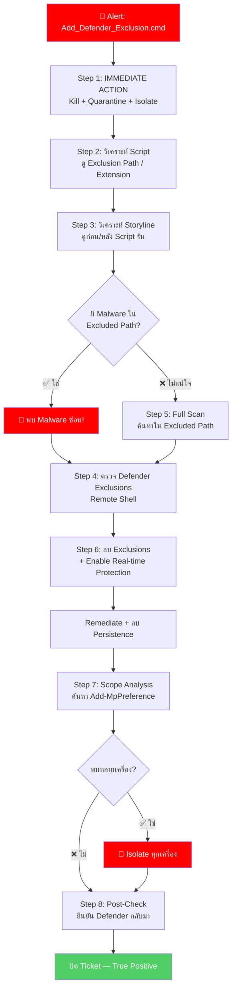

<h1 align="center">🚨 PB-09: Add_Defender_Exclusion.cmd detected as Malware</h1>

<p align="center">
  
  
  
</p>

---

## 🎯 Quick Reference

| รายการ | รายละเอียด |
|:------:|:-----------|
| **Alert** | `Add_Defender_Exclusion.cmd detected as Malware, Chair` |
| **ประเภท** | Defense Evasion — Disable/Modify Security Tools |
| **True Positive Rate** | สูงมาก — Script เปิดทางให้มัลแวร์ |
| **SLA** | ≤ **15 นาที** |

> [!CAUTION]
> **Add_Defender_Exclusion.cmd** = Script ที่ **เพิ่ม Exclusion ใน Windows Defender**
> 
> 🔴 **อันตรายมาก** เพราะบ่งชี้ว่า:
> - มัลแวร์กำลัง **เปิดประตู** ก่อนวางตัวเอง
> - **Path ที่ถูก Exclude = จุดที่มัลแวร์จะซ่อน**
> - อาจมี Ransomware, Cryptominer, หรือ Backdoor ตามมา

---

## 📊 Flowchart การตอบสนอง



---

## 📋 ขั้นตอนการตอบสนอง

### 🔹 Step 1 — 🚨 IMMEDIATE ACTIONS

| ลำดับ | ⚡ ดำเนินการทันที | วิธีทำ |
|:-----:|:-----------------|:------|
| 1️⃣ | **Kill + Quarantine** | Actions → "Kill" → "Quarantine" |
| 2️⃣ | **Isolate เครื่อง** | Actions → "Disconnect from Network" |
| 3️⃣ | จดบันทึก **Command Line** ⭐ | — |
| 4️⃣ | เปิด Ticket — **Critical** | — |

### 🔹 Step 2 — วิเคราะห์เนื้อหา Script ⭐

ดู Command Line → ค้นหาว่า Script ทำอะไร:

| สิ่งที่หา | ⚠️ ตัวอย่าง | 💀 ความหมาย |
|:---------|:----------|:-----------|
| Exclusion Path | `Add-MpPreference -ExclusionPath "C:\Users"` | **จุดซ่อนมัลแวร์** |
| Exclusion Extension | `-ExclusionExtension ".exe"` | **ประเภทไฟล์ที่ต้องการรัน** |
| Disable Monitoring | `Set-MpPreference -DisableRealtimeMonitoring $true` | **ปิด Defender ทั้งตัว** |

### 🔹 Step 3 — วิเคราะห์ Storyline

| ช่วงเวลา | สิ่งที่ต้องดู |
|:---------|:-----------|
| **ก่อน** Script รัน | Parent Process? ดาวน์โหลดมาจากไหน? |
| **หลัง** Script รัน | มี Malware ใน Excluded Path? มี Download? |

### 🔹 Step 4 — ตรวจ Defender Exclusions

ใช้ **Remote Shell**:
```powershell
Get-MpPreference | Select-Object ExclusionPath, ExclusionExtension
```

### 🔹 Step 5 — ค้นหามัลแวร์ที่ซ่อน

```
FilePath Contains "<Excluded Path>" AND EventType = "File Creation"
```

→ **Full Scan** เครื่อง: Actions → "Initiate Scan"

### 🔹 Step 6 — ลบ Exclusions + Remediation

```powershell
Remove-MpPreference -ExclusionPath "C:\Users"
Set-MpPreference -DisableRealtimeMonitoring $false
```

> [!IMPORTANT]
> ต้องยืนยันว่า:
> 1. ✅ Exclusion ถูกลบครบ
> 2. ✅ Real-time Protection เปิดอยู่
> 3. ✅ Malware ที่ซ่อนถูกลบแล้ว

### 🔹 Step 7 — Scope Analysis

```
CmdLine Contains "Add-MpPreference -ExclusionPath"
```

### 🔹 Step 8 — Post-Check + ปิด Ticket

⏱️ รอ 30 นาที → ตรวจสอบ → ปลด Quarantine → **Verdict = True Positive**

---

## 🚨 Escalation Criteria

| สถานการณ์ | 🎬 ดำเนินการ |
|:---------|:------------|
| พบ Ransomware ซ่อนใน Excluded Path | 🔴🔴 แจ้ง SOC Manager + **IR Team** |
| พบหลายเครื่อง | 🔴 แจ้ง SOC Manager |
| Defender ถูกปิดทั้งตัว | 🔴 แจ้ง SOC Manager |
| Server / DC โดน | 🔴 แจ้ง SOC Manager + **IT Team** |

---

## 🛡️ แนวทางป้องกัน

- ✅ **Enable Tamper Protection** ใน Windows Defender
- ✅ **Disable** สิทธิ์ผู้ใช้เปลี่ยน Defender Settings (Group Policy)
- ✅ จำกัด `Add-MpPreference` ผ่าน PowerShell Constrained Language Mode
- ✅ Block `.cmd`, `.bat` จาก Email Attachments
- ✅ ตั้ง SentinelOne Policy เป็น **Protect** mode

---

<p align="center"><i>📅 สร้างโดย SOC Team — อัปเดตล่าสุด: มีนาคม 2026</i></p>
