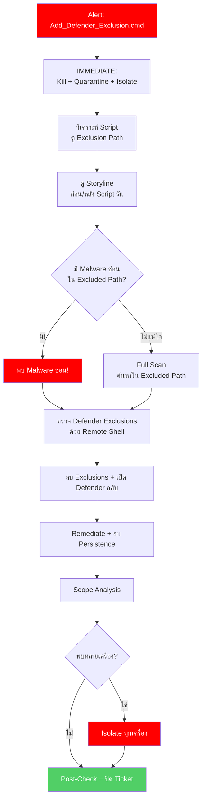

<h1 align="center">🚨 PB-09: Add_Defender_Exclusion.cmd detected</h1>

<p align="center">
  
  
  
</p>

---

## สรุปสั้นๆ

| รายการ | รายละเอียด |
|:------:|:-----------|
| **Alert** | `Add_Defender_Exclusion.cmd detected as Malware` |
| **ประเภท** | Defense Evasion — ปิด/แก้ไข Security Tool |
| **True Positive Rate** | สูงมาก |
| **SLA** | 15 นาที |

> [!CAUTION]
> Script นี้ **เพิ่ม Exclusion ใน Windows Defender** เพื่อเปิดทางให้มัลแวร์
>
> ทำไมอันตราย? เพราะ **Path ที่ถูก Exclude = จุดที่มัลแวร์จะซ่อนตัว**
> หลังจากปิด Defender แล้ว มักมี Ransomware, Cryptominer, หรือ Backdoor ตามมา
>
> พูดง่ายๆ คือ Script นี้เป็น "คนเปิดประตู" ให้มัลแวร์ตัวจริงเข้ามา

---

## Flowchart ภาพรวม



---

## ขั้นตอนการทำงาน

### Step 1 — ทำทันที! ห้ามรอ

เพราะ Alert นี้ Critical — มัลแวร์อาจถูกวางไว้แล้วหรือกำลังจะมา:

1. **Kill + Quarantine** Script ทันที
2. **Isolate เครื่อง**
3. จดบันทึก **Command Line** — สำคัญมากเพราะบอกว่า Script ทำอะไร
4. เปิด Ticket — ตั้ง Critical

---

### Step 2 — ดู Command Line ว่า Script ทำอะไร

| หาอะไร | ตัวอย่าง | ความหมาย |
|:-------|:--------|:---------|
| Exclusion Path | `Add-MpPreference -ExclusionPath "C:\Users"` | นี่คือที่มัลแวร์จะซ่อน |
| Exclusion Extension | `-ExclusionExtension ".exe"` | ไฟล์ประเภทนี้จะไม่ถูกสแกน |
| Disable Monitoring | `Set-MpPreference -DisableRealtimeMonitoring $true` | ปิด Defender ทั้งตัว |

จด Excluded Path ไว้ — จะใช้ค้นหามัลแวร์ใน Step ถัดไป

---

### Step 3 — ดู Storyline (ก่อน + หลัง)

| ช่วง | ดูอะไร |
|:-----|:------|
| **ก่อน** Script รัน | Parent Process คืออะไร? ดาวน์โหลดมาจากไหน? |
| **หลัง** Script รัน | มีมัลแวร์ถูกวางไว้ใน Excluded Path ไหม? มี Download ใหม่? |

---

### Step 4 — ตรวจ Defender Exclusions ผ่าน Remote Shell

เข้า Remote Shell แล้วรัน:
```powershell
Get-MpPreference | Select-Object ExclusionPath, ExclusionExtension
```

จด Exclusion ทั้งหมดที่พบ

---

### Step 5 — ค้นหามัลแวร์ที่ซ่อน

ใน Deep Visibility:
```
FilePath Contains "<Excluded Path>" AND EventType = "File Creation"
```

แล้ว Full Scan เครื่อง: Actions → "Initiate Scan"

---

### Step 6 — ลบ Exclusions + เปิด Defender กลับ

```powershell
Remove-MpPreference -ExclusionPath "C:\Users"
Set-MpPreference -DisableRealtimeMonitoring $false
```

> [!IMPORTANT]
> ต้องยืนยัน 3 อย่างนี้ก่อนจบ:
> 1. Exclusion ถูกลบครบ
> 2. Real-time Protection เปิดอยู่
> 3. มัลแวร์ที่ซ่อนอยู่ถูกลบแล้ว

---

### Step 7 — หาเครื่องอื่น

ค้นหา:
```
CmdLine Contains "Add-MpPreference -ExclusionPath"
```

ถ้าพบหลายเครื่อง → Isolate ทั้งหมดแล้วแจ้ง SOC Manager

---

### Step 8 — ตรวจซ้ำแล้วปิด Ticket

รอ 30 นาที → ยืนยันว่า Defender ทำงานปกติ → ปลด Quarantine → **Verdict = True Positive เสมอ**

---

## เมื่อไหร่ต้องแจ้งหัวหน้า

| สถานการณ์ | แจ้งใคร |
|:---------|:--------|
| พบ Ransomware ซ่อนใน Excluded Path | SOC Manager + IR Team **ทันที** |
| พบหลายเครื่อง | SOC Manager |
| Defender ถูกปิดทั้งตัว | SOC Manager |
| Server / DC โดน | SOC Manager + IT Team |

---

## ป้องกันไม่ให้เจออีก

- **Enable Tamper Protection** ใน Windows Defender — ป้องกันไม่ให้ Script แก้ไข Settings
- **Disable** สิทธิ์ผู้ใช้เปลี่ยน Defender Settings ผ่าน Group Policy
- จำกัด `Add-MpPreference` ด้วย PowerShell Constrained Language Mode
- ตั้ง **Symantec** Block `.cmd`, `.bat` จาก Email Attachments
- ตั้ง SentinelOne เป็น **Protect** mode
- Block C2 IP ที่ **Fortigate** และ **Palo Alto**

---

<p align="center"><i>SOC Team — TW Site | อัปเดตล่าสุด: มีนาคม 2026</i></p>
