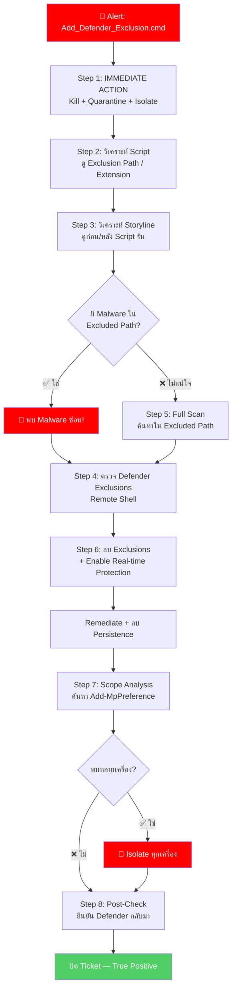

# PB-09: Add_Defender_Exclusion.cmd detected as Malware

| รายการ | รายละเอียด |
|--------|-----------|
| **Alert Name** | Add_Defender_Exclusion.cmd detected as Malware, Chair |
| **Severity** | 🔴 Critical |
| **MITRE ATT&CK** | T1562.001 (Impair Defenses: Disable or Modify Tools) |
| **Platform** | SentinelOne EDR/XDR |
| **วันที่สร้าง** | มีนาคม 2026 |

---

## 1. ภาพรวมของ Alert

**Add_Defender_Exclusion.cmd** เป็น Batch Script ที่ใช้ **เพิ่ม Exclusion ใน Windows Defender** เพื่อเปิดทางให้มัลแวร์ทำงานโดยไม่ถูกสแกน ถือเป็น **Defense Evasion** ที่อันตรายมาก เพราะบ่งชี้ว่ามีมัลแวร์อื่นกำลังจะถูกวางหรือทำงานอยู่แล้ว

---

## 📊 Flowchart การตอบสนอง



---

## 2. ขั้นตอนการตอบสนอง (Response Steps)

### Step 1: 🚨 ดำเนินการทันที
1. เข้า **SentinelOne Console** → ค้นหา Alert
2. **Kill + Quarantine** ทันที → **"Actions"** → **"Kill"** → **"Quarantine"**
3. **Network Quarantine** เครื่อง → **"Disconnect from Network"**
4. จดบันทึก: Endpoint, IP, User, File Path, **Command Line**, Hash
5. เปิด Incident Ticket — **Severity: Critical**

### Step 2: วิเคราะห์เนื้อหา Script
1. ดู Command Line ใน Threat Details ว่า Script ทำอะไร:
   - เพิ่ม Exclusion Path อะไรบ้าง (เช่น `C:\Users`, `C:\Temp`)
   - เพิ่ม Exclusion Extension อะไร (เช่น `.exe`, `.dll`)
   - ปิด Real-time Monitoring หรือไม่
2. **Path ที่ถูก Exclude = จุดที่มัลแวร์จะซ่อน**

### Step 3: วิเคราะห์ Attack Storyline
1. ดู **ก่อน** Script รัน → Parent Process คือใคร? ดาวน์โหลดมาจากไหน?
2. ดู **หลัง** Script รัน → มีการวาง Malware ใน Excluded Path หรือไม่?
3. ดู Network Connections → มี C2 หรือ Download Payload หรือไม่?
4. **Screenshot** Storyline

### Step 4: ตรวจสอบ Defender Exclusions ปัจจุบัน
1. ใช้ **Remote Shell** (SentinelOne):
   ```powershell
   Get-MpPreference | Select-Object ExclusionPath, ExclusionExtension
   ```
2. บันทึก Exclusion ที่ผิดปกติทั้งหมด

### Step 5: ค้นหามัลแวร์ที่ซ่อน
1. **Deep Visibility** → ค้นหาไฟล์ที่สร้างใน Excluded Path:
   ```
   FilePath Contains "<Excluded Path>" AND EventType = "File Creation"
   ```
2. **Full Scan** เครื่อง → **"Initiate Scan"**

### Step 6: ลบ Exclusions + Remediation
1. ลบ Exclusion ที่ถูกเพิ่ม:
   ```powershell
   Remove-MpPreference -ExclusionPath "C:\Users"
   Set-MpPreference -DisableRealtimeMonitoring $false
   ```
2. **Remediate** ผ่าน SentinelOne
3. ลบ Malware ที่ซ่อนอยู่ + ลบ Persistence
4. รัน Full Scan อีกครั้ง

### Step 7: ตรวจสอบการแพร่กระจาย
1. Deep Visibility → ค้นหา:
   ```
   CmdLine Contains "Add-MpPreference -ExclusionPath"
   ```
2. ถ้าพบหลายเครื่อง → **Isolate ทุกเครื่อง + Escalate**

### Step 8: Post-Remediation & ปิด Incident
1. รอ 30 นาที → ตรวจสอบ Alert ใหม่
2. ยืนยันว่า Defender Exclusions ถูกลบ + Real-time Protection เปิด
3. ปลด Network Quarantine
4. Analyst Verdict → **True Positive**
5. ปิด Ticket

---

## 3. Escalation Criteria

| สถานการณ์ | ดำเนินการ |
|-----------|----------|
| พบ Ransomware ซ่อนใน Excluded Path | 🔴 แจ้ง SOC Manager + IR Team |
| พบหลายเครื่อง | 🔴 แจ้ง SOC Manager |
| Defender ถูกปิดทั้งตัว | 🔴 แจ้ง SOC Manager |
| Server / DC โดน | 🔴 แจ้ง SOC Manager + IT Team |

---

## 4. แนวทางป้องกัน

- **Enable Tamper Protection** ใน Windows Defender
- **Disable** สิทธิ์ผู้ใช้ในการเปลี่ยน Defender Settings ผ่าน Group Policy
- จำกัด `Add-MpPreference` ผ่าน PowerShell Constrained Language Mode
- Block `.cmd`, `.bat` จาก Email Attachments
- ตั้ง SentinelOne Policy เป็น **Protect** mode
