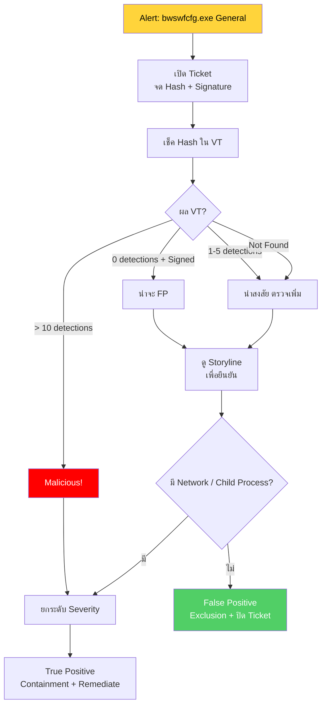

<h1 align="center">🛡️ PB-10: bwswfcfg.exe detected as General</h1>

  
  
  

---

## สรุปสั้นๆ

| รายการ | รายละเอียด |
|:------:|:-----------|
| **Alert** | `bwswfcfg.exe detected as General` |
| **ประเภท** | Unknown / PUP / อาจเป็น Zero-day |
| **True Positive Rate** | ต่ำ-กลาง |
| **SLA** | 4 ชั่วโมง |

> [!NOTE]
> "General" หมายความว่า SentinelOne ไม่ได้จัดเป็น Malware โดยตรง แต่พบ **พฤติกรรมน่าสงสัย** จาก AI/Behavioral Analysis
>
> แม้ Severity ต่ำ แต่ **อย่าละเลย** เพราะอาจเป็นภัยคุกคามจริงที่ยังไม่มี Signature (Zero-day)

---

## Flowchart ภาพรวม

---

## ขั้นตอนการทำงาน

### Step 1 — เปิด Ticket

จด Endpoint, Path, Hash, File Size, **Digital Signature** (มีหรือไม่มี Signer เป็นใคร)

Severity เบื้องต้น = Low — แต่อาจยกระดับถ้าพบว่า Malicious

---

### Step 2 — เช็ค Hash ใน VT ก่อนเลย

VirusTotal จะบอกได้เร็วที่สุดว่าควรกังวลแค่ไหน:

| ผล VT | ความหมาย | ทำอะไรต่อ |
|:------|:---------|:---------|
| 0/70 + มี Signer ที่รู้จัก | น่าจะ FP | ดู Storyline ยืนยัน |
| 1-5/70 (Generic) | น่าสงสัย | ตรวจ Storyline ละเอียด |
| > 10/70 | **Malicious** | ยกระดับ + Containment |
| Not Found | Unknown — ต้องวิเคราะห์เอง | ตรวจ Storyline ละเอียด |

---

### Step 3 — ดู Storyline

| พฤติกรรม | ปกติ (FP) | ผิดปกติ (TP) |
|:---------|:---------|:-----------|
| Network Connection | ไม่มี | มี → ไปภายนอก |
| Child Process | ไม่มี | สร้าง cmd/powershell |
| Registry Change | ไม่มี | แก้ไข Registry |
| Digital Signature | มี Signer ที่รู้จัก | ไม่มี |

---

### Step 4 — ตัดสิน

| เงื่อนไข | วินิจฉัย | ทำอะไร |
|:---------|:--------|:------|
| ไม่มีอะไรผิดปกติ + มี Signer | **FP** | สร้าง Exclusion (Hash) + ปิด Ticket |
| มี Network/Child/Registry | **TP** | ยกระดับ + Containment |
| VT > 10 | **Malicious** | ยกระดับ + Containment |

---

### Step 5A — ถ้าเป็น FP

1. Verdict → **False Positive**
2. สร้าง **Exclusion ด้วย Hash + Path** (อย่าใช้ชื่อไฟล์อย่างเดียว)
3. ปิด Ticket

### Step 5B — ถ้าเป็น TP

1. **ยกระดับ Severity** เป็น Medium/High
2. **Isolate + Kill + Quarantine**
3. **Remediate**
4. Scope Analysis → หาเครื่องอื่น
5. รอ 15-30 นาที → ปลด Quarantine → ปิด Ticket

---

## เมื่อไหร่ต้องแจ้งหัวหน้า

| สถานการณ์ | แจ้งใคร |
|:---------|:--------|
| พบว่าเป็น Zero-day Malware | SOC Manager |
| มี C2 Communication | SOC Manager + IR Team |
| พบหลายเครื่อง | SOC Manager |
| วินิจฉัยไม่ได้ | SOC Manager หรือ Senior Analyst |

---

## ป้องกันไม่ให้เจออีก

- ตั้ง SentinelOne เป็น **Protect** mode
- **Block Unknown Software** ด้วย Application Control
- ตรวจสอบ Third-party Software ก่อนอนุญาตให้ติดตั้ง
- Monitor "General" Alerts สม่ำเสมอ — อย่ามองข้ามเพราะ Severity ต่ำ

---

<i>SOC Team — TW Site | อัปเดตล่าสุด: มีนาคม 2026</i>

