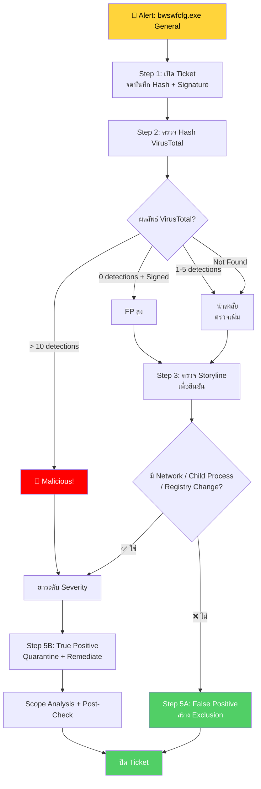

<h1 align="center">🛡️ PB-10: bwswfcfg.exe detected as General</h1>

  
  
  

---

## 🎯 Quick Reference

| รายการ | รายละเอียด |
|:------:|:-----------|
| **Alert** | `bwswfcfg.exe detected as General` |
| **ประเภท** | Unknown / PUP / Possible Zero-day |
| **True Positive Rate** | ต่ำ-กลาง — ต้องวิเคราะห์เพิ่ม |
| **SLA** | ≤ 4 ชั่วโมง |

> [!NOTE]
> **"General"** หมายความว่า SentinelOne ไม่ได้จัดเป็น Malware โดยตรง แต่พบ **พฤติกรรมน่าสงสัย** จาก AI/Behavioral Analysis
>
> ⚠️ แม้ Severity ต่ำ แต่ **ต้องตรวจสอบ** เพราะ อาจเป็นภัยคุกคามจริงที่ยังไม่มี Signature

---

## 📊 Flowchart การตอบสนอง

---

## 📋 ขั้นตอนการตอบสนอง

### 🔹 Step 1 — รับ Alert + เปิด Ticket

| ข้อมูลที่ต้องจด | ⚡ ความสำคัญ |
|:----------------|:------------|
| 🖥️ Endpoint Name / IP | ปกติ |
| 📁 File Path | สูง |
| 🔑 SHA256 Hash | ⭐ สำคัญ |
| 📏 File Size | กลาง |
| ✍️ **Digital Signature** | ⭐ สำคัญ — มี/ไม่มี, Signer เป็นใคร |

Severity เบื้องต้น: **Low**

### 🔹 Step 2 — ตรวจ Hash VirusTotal ⭐

| ผลลัพธ์ VirusTotal | 🚦 วินิจฉัย | ➡️ ถัดไป |
|:------------------|:----------|:--------|
| 0/70 + มี Signer ที่รู้จัก | **FP สูง** | ไป Step 5A |
| 1-5/70 (Generic detection) | **น่าสงสัย** | ทำ Step 3 |
| > 10/70 engines | 🔴 **Malicious** | ยกระดับ → Step 5B |
| Not Found | **Unknown** — ต้องวิเคราะห์เพิ่ม | ทำ Step 3 |

### 🔹 Step 3 — ตรวจ Storyline

| พฤติกรรม | ✅ ปกติ (FP) | ❌ ผิดปกติ (TP) |
|:---------|:----------|:-------------|
| Network Connection | ไม่มี | มี → ไปภายนอก |
| Child Process | ไม่มี | สร้าง cmd/powershell |
| Registry Change | ไม่มี | แก้ไข Registry |
| Digital Signature | มี Signer ที่รู้จัก | ไม่มี Signature |

### 🔹 Step 4 — ตัดสินใจ

| เงื่อนไข | วินิจฉัย | ดำเนินการ |
|:--------|:---------|:---------|
| ไม่มีอะไรผิดปกติ + มี Signer | ✅ **False Positive** | Step 5A |
| มี Network/Child/Registry | 🔴 **True Positive** | Step 5B |
| VirusTotal > 10 | 🔴 **Malicious** | Step 5B |

### 🔹 Step 5A — กรณี False Positive

1. Analyst Verdict → **False Positive**
2. สร้าง **Exclusion** ด้วย **SHA256 Hash + File Path**

> [!WARNING]
> อย่า Exclude ด้วย Filename อย่างเดียว — ต้องใช้ Hash ด้วยเสมอ!

3. ปิด Ticket

### 🔹 Step 5B — กรณี True Positive

| ลำดับ | การดำเนินการ |
|:-----:|:------------|
| 1️⃣ | **ยกระดับ Severity** เป็น Medium/High |
| 2️⃣ | **Network Quarantine** |
| 3️⃣ | **Kill + Quarantine** |
| 4️⃣ | **Remediate** |
| 5️⃣ | Scope Analysis |
| 6️⃣ | Post-Check (15-30 นาที) |
| 7️⃣ | ปลด Quarantine + ปิด Ticket |

---

## 🚨 Escalation Criteria

| สถานการณ์ | 🎬 ดำเนินการ |
|:---------|:------------|
| พบว่าเป็น Zero-day Malware | 🟠 แจ้ง SOC Manager |
| มี C2 Communication | 🔴 แจ้ง SOC Manager + **IR Team** |
| พบหลายเครื่อง | 🟠 แจ้ง SOC Manager |
| ไม่สามารถวินิจฉัยได้ | 🟡 แจ้ง SOC Manager / **Senior Analyst** |

---

## 🛡️ แนวทางป้องกัน

- ✅ ตั้ง SentinelOne Policy เป็น **Protect** mode
- ✅ **Block Unknown Software** ใน Application Control
- ✅ ตรวจสอบ Third-party Software ก่อนอนุญาตให้ติดตั้ง
- ✅ Monitor "General" Alerts สม่ำเสมอ — **อย่าละเลย!**
- ✅ สร้าง Dashboard ใน SentinelOne สำหรับ "General" category

---

<i>📅 สร้างโดย SOC Team — อัปเดตล่าสุด: มีนาคม 2026</i>

