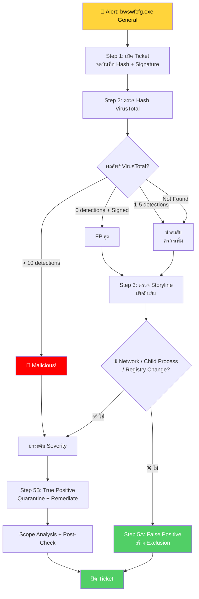

# PB-10: bwswfcfg.exe detected as General

| รายการ | รายละเอียด |
|--------|-----------|
| **Alert Name** | bwswfcfg.exe detected as General |
| **Severity** | 🟢 Low / Informational |
| **MITRE ATT&CK** | T1036 (Masquerading), T1588 (Obtain Capabilities) |
| **Platform** | SentinelOne EDR/XDR |
| **วันที่สร้าง** | มีนาคม 2026 |

---

## 1. ภาพรวมของ Alert

**bwswfcfg.exe** ถูก SentinelOne ตรวจจับในระดับ **"General"** ซึ่งหมายความว่า:
- SentinelOne ไม่ได้จัดเป็น Malware หรือ Ransomware โดยตรง
- แต่พบ **พฤติกรรมหรือลักษณะที่น่าสงสัย** จากการวิเคราะห์ AI/Behavioral

**ไฟล์นี้อาจเป็น:**
- ซอฟต์แวร์ที่ถูกต้องแต่ไม่เป็นที่รู้จัก (Unknown / PUP)
- มัลแวร์ที่ยังไม่มี Signature (Zero-day)
- ส่วนหนึ่งของซอฟต์แวร์ที่ติดตั้งจาก Third-party

> ⚠️ แม้จะเป็น Severity ต่ำ แต่ **ต้องตรวจสอบ** เพราะ "General" อาจเป็นภัยคุกคามจริงที่ AV ยังจับไม่ได้

---

## 📊 Flowchart การตอบสนอง



---

## 2. ขั้นตอนการตอบสนอง (Response Steps)

### Step 1: รับ Alert และเปิด Incident Ticket
1. เข้า **SentinelOne Console** → **Incidents / Threats**
2. ค้นหา Alert: `bwswfcfg.exe detected as General`
3. จดบันทึก:
   - **Endpoint Name**, **IP Address**, **Logged-in User**
   - **File Path**
   - **SHA256 Hash**
   - **File Size**
   - **Digital Signature** (มีหรือไม่มี, Signer เป็นใคร)
   - **Timestamp**
4. เปิด Incident Ticket — Severity: **Low** (เบื้องต้น)

### Step 2: ตรวจสอบ Hash ด้วย Threat Intelligence
1. คัดลอก **SHA256 Hash**
2. ค้นหาใน **VirusTotal**:

| ผลลัพธ์ VirusTotal | วินิจฉัย | ขั้นตอนถัดไป |
|-------------------|---------|-------------|
| 0/70 engines + มี Signer ที่รู้จัก | **False Positive** สูง | ไป Step 5A |
| 1-5/70 engines (Generic detection) | **น่าสงสัย** | ทำ Step 3 ต่อ |
| > 10/70 engines | **Malicious** | ยกระดับ → ไป Step 4 |
| ไม่พบใน VirusTotal (Not Found) | **Unknown** — ต้องวิเคราะห์เพิ่ม | ทำ Step 3 ต่อ |

3. ถ้าพบใน VirusTotal → ดู **Behavior Tab** และ **Relations Tab**

### Step 3: ตรวจสอบ Attack Storyline
1. คลิก **"Attack Storyline"**
2. ตรวจสอบ:
   - **Parent Process**: ใครรัน `bwswfcfg.exe`
   - **Network Connections**: มีการติดต่อภายนอกหรือไม่
   - **File Operations**: สร้าง/แก้ไขไฟล์อื่นหรือไม่
   - **Registry Changes**: แก้ไข Registry หรือไม่
   - **Child Processes**: สร้าง Process อื่นหรือไม่
3. ดู **ที่มา**:
   - ดาวน์โหลดจาก Internet?
   - มาพร้อมกับ USB?
   - ส่วนหนึ่งของซอฟต์แวร์ที่ติดตั้ง?
4. **Screenshot** Storyline

### Step 4: การตัดสินใจ

| พฤติกรรม | วินิจฉัย | ดำเนินการ |
|---------|---------|----------|
| ไม่มี Network + ไม่มี File Change + มี Signer | FP สูง | ไป Step 5A |
| มี Network Connection ไปภายนอก | น่าสงสัย | ไป Step 5B |
| สร้าง Child Process (cmd/powershell) | True Positive | ไป Step 5B |
| แก้ไข Registry / สร้าง Persistence | True Positive | ไป Step 5B |
| VirusTotal > 10 detections | Malicious | ไป Step 5B |

### Step 5A: กรณี False Positive
1. ตั้ง **Analyst Verdict** → **False Positive**
2. สร้าง **Exclusion**:
   - ใช้ **SHA256 Hash + File Path** เป็นเงื่อนไข
   - ⚠️ อย่า Exclude ด้วย Filename อย่างเดียว
3. บันทึกใน Ticket ว่าเป็น FP พร้อมเหตุผล
4. ปิด Ticket

### Step 5B: กรณี True Positive / Suspicious
1. **ยกระดับ Severity** เป็น Medium หรือ High
2. **Network Quarantine** เครื่อง
3. **Kill + Quarantine** ไฟล์
4. **Remediate**
5. ตรวจสอบการแพร่กระจาย:
   ```
   FileName = "bwswfcfg.exe" OR FileSHA256 = "<Hash>"
   ```
6. ตรวจสอบหลัง Remediation (15-30 นาที)
7. ปลด Network Quarantine
8. Analyst Verdict → **True Positive**
9. สรุปและปิด Ticket

---

## 3. Escalation Criteria

| สถานการณ์ | ดำเนินการ |
|-----------|----------|
| พบว่าเป็น Zero-day Malware | แจ้ง SOC Manager |
| มี C2 Communication | แจ้ง SOC Manager + IR Team |
| พบหลายเครื่อง | แจ้ง SOC Manager |
| ไม่สามารถวินิจฉัยได้ | แจ้ง SOC Manager / Senior Analyst |

---

## 4. แนวทางป้องกัน

- ตั้ง SentinelOne Policy เป็น **Protect** mode
- **Block Unknown Software** ใน Application Control
- ตรวจสอบ Third-party Software ก่อนอนุญาตให้ติดตั้ง
- Monitor "General" Alerts อย่างสม่ำเสมอ — อย่าละเลย
- สร้าง Dashboard ใน SentinelOne สำหรับ "General" category
